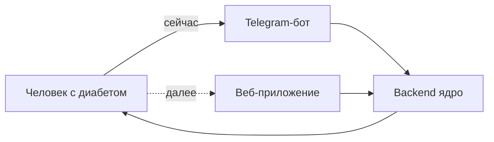
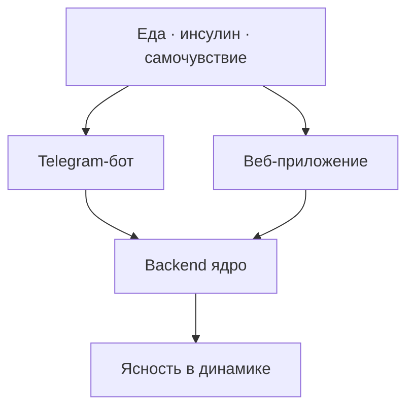
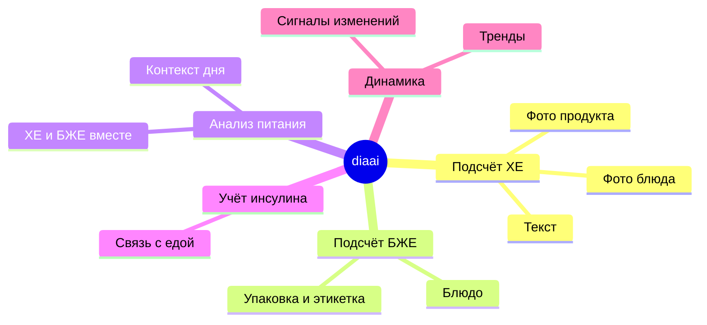
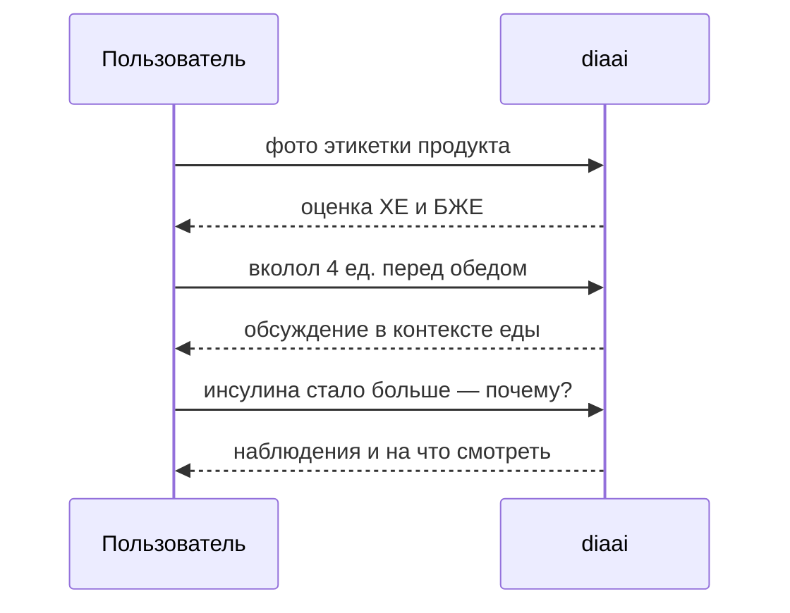

# diaai

**Система сопровождения диабетиков** — помогает осмыслять питание, инсулин и самочувствие, замечать изменения в состоянии и принимать более взвешенные решения.

Telegram-бот — **первый интерфейс** продукта, не весь продукт. **Backend** — **ядро системы**: данные, логика и аналитика, общие для всех клиентов. Далее — **единый веб-интерфейс** для обзора состояния и трендов.

> Справочная поддержка, **не замена врачу**. Система не назначает дозы инсулина.

Подробнее: [docs/idea.md](docs/idea.md)

---

## Для кого

Люди с диабетом, которым нужен понятный спутник на каждый день — без перегруза на старте, но с перспективой увидеть свою динамику целиком.



---

## Какую задачу решает

- снижает нагрузку на ручной подсчёт **ХЕ**, **БЖЕ** и «держать всё в голове»;
- связывает еду, инсулин и контекст дня в осмысленную картину;
- **фиксирует динамику состояния** — улучшения и ухудшения (рост инсулина, сдвиги в питании);
- даёт опору для разговора с врачом на основе наблюдений.



---

## Как устроен продукт

| Слой | Роль |
|------|------|
| **Backend** (ядро) | данные, логика сопровождения, аналитика, рекомендации |
| **Telegram-бот** (сейчас) | первый клиент: диалог, ХЕ/БЖЕ, фото |
| **Веб-приложение** (далее) | клиент: аналитика, тренды, роль доктора |

---

## Сценарии пользы



**В боте (сейчас)**

| Сценарий | Что делает |
|----------|------------|
| **Подсчёт ХЕ** | по описанию, фото блюда или **фото продукта** |
| **Подсчёт БЖЕ** | белково-жировые единицы для блюда или продукта, в т.ч. по фото |
| **Анализ питания** | разбор приёма пищи, ХЕ и БЖЕ в одной картине |
| **Учёт инсулина** | фиксация и обсуждение в связке с едой |
| **Ответы на вопросы** | диабет, питание, самоконтроль |

**В системе (далее)** — динамика состояния, сигналы изменений, обзор для решений.

---

## Примеры запросов

- «Сколько ХЕ в этом обеде?» *(фото тарелки)*
- «Сфотографировал упаковку йогурта — сколько здесь ХЕ и БЖЕ?»
- «По фото этикетки: посчитай хлебные и белково-жировые единицы на порцию»
- «Я съел борщ и кусок хлеба — сколько это в ХЕ и БЖЕ?»
- «За две недели инсулина стало уходить больше — на что обратить внимание?»



---

## Быстрый старт

1. Токены — [docs/how-to-get-tokens.md](docs/how-to-get-tokens.md)
2. Конфиг:

   ```bash
   cp .env.example .env
   ```

3. Запуск:

   ```bash
   make install
   make run
   ```

Напишите боту `/start` в Telegram.

---

## Документация

| Файл | Содержание |
|------|------------|
| [docs/idea.md](docs/idea.md) | идея и продуктовая логика |
| [docs/vision.md](docs/vision.md) | техническое видение |
| [docs/how-to-get-tokens.md](docs/how-to-get-tokens.md) | получение токенов |

**Ценность:** меньше хаоса в голове — больше ясности в динамике.
