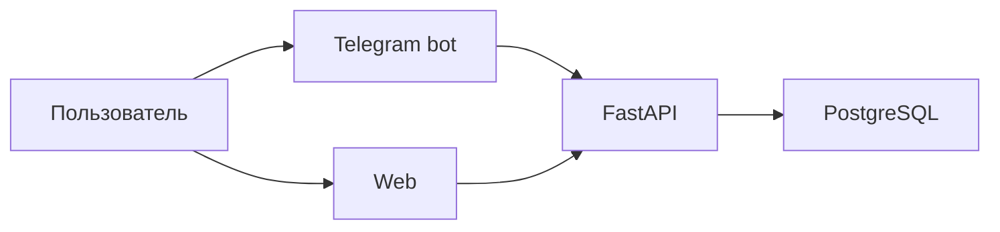

# diaai

Система ежедневного сопровождения людей с сахарным диабетом: учёт питания и инсулина, диалог с ассистентом, аналитика в web.

> Справочная поддержка, **не замена врачу**. Система не назначает дозы инсулина.

## О проекте

Диабет требует постоянного учёта еды, инсулина и контекста дня. **diaai** помогает фиксировать события, видеть динамику и готовиться к разговору с врачом через **Telegram-бот**, **backend API** и **web** (dashboard, leaderboard, chat, voice, Text-to-SQL).

## Архитектура



Бот и web — **тонкие клиенты** backend. Полная схема, слои, API и потоки: **[docs/architecture.md](docs/architecture.md)**.

## Статус

| # | Этап | Статус |
|---|------|--------|
| 1 | MVP Telegram-бота | ✅ Done |
| 2 | Backend-ядро и БД | ✅ Done |
| 3 | Миграция бота на backend | ✅ Done |
| 4 | Analytics REST (`/api/v1/analytics/*`) | 📋 contract ✅, impl 🚧 |
| 5 | Web-интерфейс | ✅ Done |

Дорожная карта: [docs/plan.md](docs/plan.md).

## Prerequisites

| Инструмент | Версия | Проверка |
|------------|--------|----------|
| Python | 3.12+ | `python3 --version` |
| [uv](https://docs.astral.sh/uv/) | latest | `uv --version` |
| Docker | Desktop / engine | `docker compose version` |
| Node | 20+ (рекоменд. 24) | `node --version` |
| pnpm | 11.6 | `corepack enable && pnpm --version` |
| make, curl | — | для команд ниже |

Новому участнику: **[docs/onboarding.md](docs/onboarding.md)** · smoke: **[docs/smoke-test.md](docs/smoke-test.md)**.

## Быстрый старт

### Docker stack (demo / onboarding)

```bash
git clone <repo-url> diaai && cd diaai
cp .env.example .env
# BACKEND_SERVICE_TOKEN, OPENROUTER_API_KEY — docs/how-to-get-tokens.md

make stack-init        # db-reset + postgres + backend + web
make stack-health
# http://localhost:3000/login → ivan_p
```

Подробнее: **[docs/devops/docker-compose-local.md](docs/devops/docker-compose-local.md)**.

### Host dev (hot reload, pytest)

```bash
git clone <repo-url> diaai && cd diaai

cp .env.example .env
cp web/.env.example web/.env.local
# Заполнить BACKEND_SERVICE_TOKEN (не change-me), OPENROUTER_API_KEY

make install && make web-install
make db-reset              # PostgreSQL :5433 + migrate + seed
make backend-run             # терминал 1 → :8000
make web-dev                 # терминал 2 → :3000
make run                     # терминал 3 → bot (нужен TELEGRAM_BOT_TOKEN)
```

**Проверка:**

```bash
curl -s http://127.0.0.1:8000/health
# {"status":"ok","version":"1.0.0"}

make db-inspect              # users, food_events > 0
```

Web: http://localhost:3000/login → `ivan_p` → `/dashboard`. Demo: `@ivan_p`, `@doctor_ivanov`.

## Переменные окружения

Корень `.env` (образец: [.env.example](.env.example)):

| Переменная | Обязательна | Назначение |
|------------|-------------|------------|
| `BACKEND_SERVICE_TOKEN` | да | Bearer bot/BFF → backend |
| `DATABASE_URL` | да | PostgreSQL (default `:5433`) |
| `OPENROUTER_API_KEY` | да для LLM/STT/analytics | OpenRouter |
| `TELEGRAM_BOT_TOKEN` | да для bot | Telegram Bot API |
| `BACKEND_URL` | нет | default `http://127.0.0.1:8000` |
| `LLM_MODEL`, `LLM_*` | нет | assistant |
| `STT_*`, `ANALYTICS_QUERY_*` | нет | voice, Text-to-SQL |

Web: `web/.env.local` — `BACKEND_URL`, `BACKEND_SERVICE_TOKEN` (server-only). Подробнее: [backend/README.md](backend/README.md).

## Make-команды

| Команда | Назначение |
|---------|------------|
| `make install` | uv sync (bot + backend deps) |
| `make run` | Telegram bot |
| `make db-reset` | чистая PG + migrate + seed |
| `make stack-up` / `stack-down` / `stack-health` | полный Docker stack |
| `make stack-init` | db-reset + stack-up |
| `make db-inspect` | counts без ПДн |
| `make backend-run` | FastAPI :8000 + reload |
| `make backend-migrate` | Alembic upgrade head |
| `make web-install` / `web-dev` / `web-build` / `web-lint` | Next.js |
| `make lint` / `make format` | ruff (src, backend, tests) |
| `make test` | pytest (backend + bot) |

Полный список: [Makefile](Makefile).

## Тесты

```bash
make test
# 84 passed (67 backend + 17 bot)
```

Только backend: `make backend-test`. Web: `make web-lint && make web-build`.

## Документация

| Документ | Назначение |
|----------|------------|
| **[docs/architecture.md](docs/architecture.md)** | компоненты, API, данные |
| [docs/onboarding.md](docs/onboarding.md) | гайд нового разработчика |
| [docs/smoke-test.md](docs/smoke-test.md) | one-session проверка |
| [docs/plan.md](docs/plan.md) | product roadmap |
| [docs/vision.md](docs/vision.md) | продуктовое видение |
| [docs/doc-audit.md](docs/doc-audit.md) | аудит docs |
| [backend/README.md](backend/README.md) | backend dev |
| [src/diaai/README.md](src/diaai/README.md) | bot dev |
| [web/README.md](web/README.md) | web dev |
| [docs/api/](docs/api/) | REST контракты, OpenAPI |
| [docs/tasks/](docs/tasks/) | tasklists по областям |
