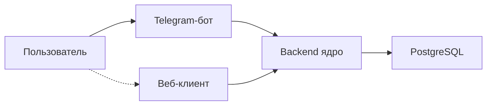

# diaai

Система ежедневного сопровождения людей с сахарным диабетом — питание, инсулин, динамика состояния.

> Справочная поддержка, **не замена врачу**. Система не назначает дозы инсулина.

## О проекте

Диабет требует постоянного учёта еды, инсулина и контекста дня — это утомляет и легко теряется в голове. diaai помогает осмыслять события, замечать изменения и готовиться к разговору с врачом. Сейчас — Telegram-бот и backend API; веб — следующий этап.

## Архитектура



MVP-бот — тонкий клиент backend API (история в PostgreSQL). Подробнее: [vision.md](docs/vision.md).

## Статус

| # | Этап | Статус |
|---|------|--------|
| 1 | MVP Telegram-бота | ✅ Done |
| 2 | Backend-ядро и БД | ✅ Done |
| 3 | Миграция бота на backend | ✅ Done |
| 4 | Аналитика и динамика | 📋 Planned |
| 5 | Веб-интерфейс | 📋 Planned |

Дорожная карта: [plan.md](docs/plan.md).

## Документация

- [Идея продукта](docs/idea.md)
- [Архитектурное видение](docs/vision.md)
- [Модель данных](docs/data-model.md)
- [Интеграции](docs/integrations.md)
- [Backend (dev)](backend/README.md)
- [API](docs/api/) — [контракт v1](docs/api/api-contract.md)
- [План](docs/plan.md)
- [Задачи](docs/tasks/)

## Быстрый старт

**Telegram-бот:** токены — [how-to-get-tokens.md](docs/how-to-get-tokens.md); `cp .env.example .env` (`TELEGRAM_BOT_TOKEN`, `BACKEND_URL`, `BACKEND_SERVICE_TOKEN`).

1. Backend + БД: `make db-reset` (PostgreSQL + migrate + seed) → `make backend-run` — подробнее [backend/README.md](backend/README.md)
2. Бот: `make install && make run` (в отдельном терминале)

Проверка данных: `make db-inspect`.

## Quality

```bash
make lint    # ruff: src, backend, tests
make test    # 51 tests (36 backend + 15 bot)
```
