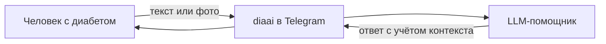
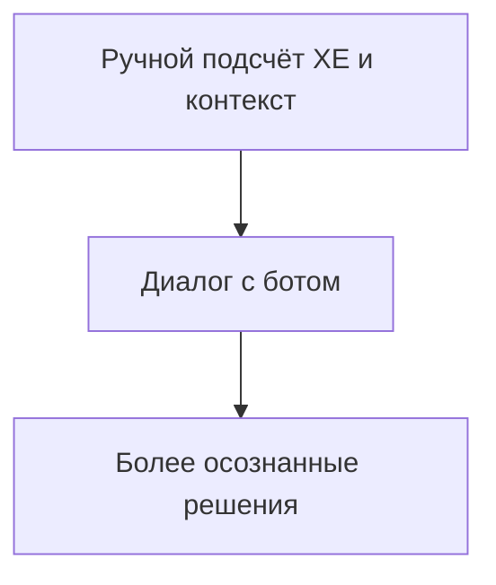
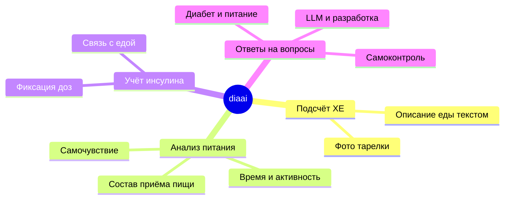
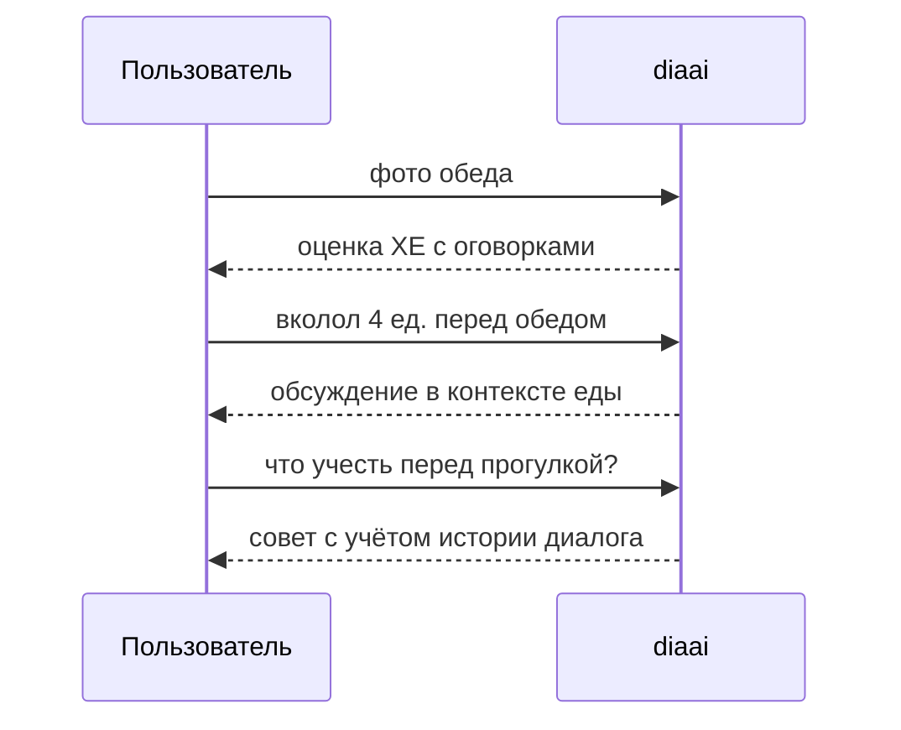

# diaai

Telegram-бот с LLM для сопровождения диабетиков — простой ежедневный помощник в мессенджере: учёт питания, инсулина и ответы на бытовые вопросы по самоконтролю.

> Справочная информация, **не замена врачу**. Бот не назначает дозы инсулина.

---

## Для кого

Люди с сахарным диабетом, которым нужен понятный собеседник в Telegram — без отдельного приложения и сложных форм.



---

## Какую задачу решает

Снижает нагрузку на ручной подсчёт и помогает принимать более осознанные решения в течение дня. Бот ведёт диалог, отвечает на вопросы и помогает оценивать еду и инсулин — в том числе по фото блюда.



---

## Сценарии пользы



| Сценарий | Что делает бот |
|----------|----------------|
| **Подсчёт ХЕ** | помогает оценить хлебные единицы по описанию или фото |
| **Анализ питания** | разбирает приём пищи, напоминает учитывать углеводы и контекст |
| **Учёт инсулина** | фиксирует и обсуждает инсулин в связке с едой |
| **Ответы на вопросы** | по диабету, питанию, самоконтролю; по LLM — из знаний модели |

Роль и тон общения задаются системным промптом.

---

## Примеры вопросов

- «Сколько ХЕ в этом обеде?» *(с фото тарелки)*
- «Я съел борщ и кусок хлеба — сколько это в ХЕ?»
- «Перед обедом вколол 4 единицы — нормально ли для такой еды?»
- «Что учесть, если планирую прогулку после ужина?»
- «Как лучше записывать инсулин и еду, чтобы не путаться?»
- «Что такое системный промпт и зачем он боту?»
- «Как LLM может оценить еду по фотографии?»



---

## Быстрый старт

1. Получите токены — [docs/how-to-get-tokens.md](docs/how-to-get-tokens.md)
2. Настройте окружение:

   ```bash
   cp .env.example .env
   # TELEGRAM_BOT_TOKEN, OPENROUTER_API_KEY (или LLM_API_KEY), LLM_MODEL
   ```

3. Запустите:

   ```bash
   make install
   make run
   ```

Напишите боту `/start` в Telegram.

---

## Документация

| Файл | Содержание |
|------|------------|
| [docs/idea.md](docs/idea.md) | идея проекта |
| [docs/vision.md](docs/vision.md) | техническое видение и архитектура |
| [docs/how-to-get-tokens.md](docs/how-to-get-tokens.md) | получение токенов |
