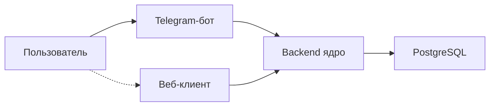

# diaai

Система ежедневного сопровождения людей с сахарным диабетом — питание, инсулин, динамика состояния.

> Справочная поддержка, **не замена врачу**. Система не назначает дозы инсулина.

## О проекте

Диабет требует постоянного учёта еды, инсулина и контекста дня — это утомляет и легко теряется в голове. diaai помогает осмыслять события, замечать изменения и готовиться к разговору с врачом. Сейчас — Telegram-бот; ядро (backend) и веб — следующие этапы.

## Архитектура

MVP-бот работает автономно (LLM напрямую, история в RAM). Целевая схема — все клиенты через backend. Подробнее: [vision.md](docs/vision.md).

## Статус

| # | Этап | Статус |
|---|------|--------|
| 1 | MVP Telegram-бота | ✅ Done |
| 2 | Backend-ядро и БД | 📋 Planned |
| 3 | Миграция бота на backend | 📋 Planned |
| 4 | Аналитика и динамика | 📋 Planned |
| 5 | Веб-интерфейс | 📋 Planned |

Дорожная карта: [plan.md](docs/plan.md).

## Документация

- [Идея продукта](docs/idea.md)
- [Архитектурное видение](docs/vision.md)
- [Модель данных](docs/data-model.md)
- [Интеграции](docs/integrations.md)
- [План](docs/plan.md)
- [Задачи](docs/tasks/)

## Быстрый старт

**MVP-бот (итерация 1):** токены — [how-to-get-tokens.md](docs/how-to-get-tokens.md); `cp .env.example .env`; `make install && make run`.

**Backend и полный стенд:** инструкция появится после реализации итерации 2 ([tasklist-backend](docs/tasks/tasklist-backend.md)).
