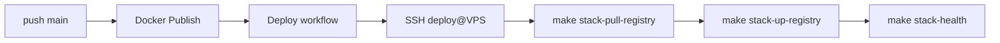

# Server deploy layout (VPS)

Production path: **`/opt/diaai`** на VPS (user `deploy`).

Связь: [server/README.md](../server/README.md) · [ghcr-stack.md](../../docs/devops/ghcr-stack.md) · inventory [server/inventory.example.md](../server/inventory.example.md).

---

## Layout на сервере

```
/opt/diaai/
├── docker-compose.yml      # из git
├── Makefile
├── devops/
├── compose.override.yml    # postgres → 127.0.0.1 only (см. ниже)
└── .env                    # НЕ в git, chmod 600, owner deploy
```

---

## 1. Bootstrap (если ещё не делали)

См. [server/README.md § Bootstrap](../server/README.md#bootstrap-task-13-).

---

## 2. Клонировать репозиторий

На VPS под `root` или через `deploy`:

```bash
ssh -i ~/.ssh/diaai-admin root@201.51.4.34

# пустой /opt/diaai уже создан bootstrap
sudo -u deploy git clone https://github.com/zatulik2606/diaai.git /opt/diaai
cd /opt/diaai
```

Обновление кода (до CD iter 4):

```bash
sudo -u deploy git -C /opt/diaai pull --ff-only
```

---

## 3. Server override (postgres не наружу)

```bash
sudo -u deploy cp devops/deploy/compose.server.override.yml /opt/diaai/compose.override.yml
```

`!override` заменяет порты postgres (иначе compose **дублирует** `5433` из base + override).

Файл привязывает PostgreSQL к `127.0.0.1:5433` — порт 5433 **не** открыт в ufw.

---

## 4. `.env` на сервере

**Не коммитить.** Скопировать с dev-машины или собрать из `.env.example`:

```bash
# с локальной машины (пример)
scp -i ~/.ssh/diaai-admin .env root@201.51.4.34:/opt/diaai/.env
ssh -i ~/.ssh/diaai-admin root@201.51.4.34 \
  'chown deploy:deploy /opt/diaai/.env && chmod 600 /opt/diaai/.env'
```

Обязательные переменные:

| Variable | Назначение |
|----------|------------|
| `BACKEND_SERVICE_TOKEN` | не `change-me` |
| `OPENROUTER_API_KEY` | backend LLM |
| `TELEGRAM_BOT_TOKEN` | только если profile `bot` |

Compose подставляет `DATABASE_URL` и `BACKEND_URL` для контейнеров — см. `docker-compose.yml`.

---

## 5. `docker login ghcr.io` — **выполняет пользователь**

> Агент **не** выполняет login. Сначала pull **без login** — packages public.

### Проверка pull (шаг 1)

```bash
docker pull ghcr.io/zatulik2606/diaai-backend:main
```

OK → login не нужен. `denied` → шаг 2.

### Login (шаг 2, если нужен)

PAT (classic), scope **`read:packages`**. Password = **PAT**, не пароль GitHub. Username: **`zatulik2606`**.

```bash
ssh -i ~/.ssh/diaai-deploy deploy@201.51.4.34

read -s GITHUB_PAT
echo "$GITHUB_PAT" | docker login ghcr.io -u zatulik2606 --password-stdin
unset GITHUB_PAT
```

### Pull снова (шаг 3)

```bash
docker pull ghcr.io/zatulik2606/diaai-backend:main
```

Полная инструкция: **[devops/ci/ghcr-login.md](../ci/ghcr-login.md)**.

---

## 6. SSH deploy user

Bootstrap уже создал `deploy` с ключом `~/.ssh/diaai-deploy.pub`.

```bash
ssh -i ~/.ssh/diaai-deploy deploy@201.51.4.34 'id && docker compose version'
```

GitHub Secret `DEPLOY_SSH_KEY` (iter 4) — **private** ключ `diaai-deploy`, не admin.

---

## 7. Первый stack (task 15)

```bash
ssh -i ~/.ssh/diaai-deploy deploy@201.51.4.34
cd /opt/diaai
make stack-pull-registry
make stack-up-registry

# demo seed (один раз; нужен uv на сервере)
curl -LsSf https://astral.sh/uv/install.sh | sh
export PATH="$HOME/.local/bin:$PATH"
uv sync --frozen && make db-seed

make stack-health
```

URLs (production VPS):

| URL | Сервис |
|-----|--------|
| http://201.51.4.34:3000 | web |
| http://201.51.4.34:8000/health | backend |

Demo seed: `make db-reset` требует `uv` на хосте — см. [ghcr-stack.md § Server](../../docs/devops/ghcr-stack.md).

---

## Обязательная проверка (DoD iter 3)

После bootstrap + layout + первого stack — три критерия. Выполнять под `deploy@VPS` из `/opt/diaai`, если не указано иное.

### 1. Docker и Compose; bootstrap воспроизводим

```bash
ssh -i ~/.ssh/diaai-deploy deploy@201.51.4.34 'docker --version && docker compose version'
```

Ожидание: версии Docker Engine и Compose plugin (bootstrap: [server/README.md § Bootstrap](../server/README.md#bootstrap-task-13-)).

На **новом** сервере: `bootstrap.sh` + [§1–4](#1-bootstrap-если-ещё-не-делали) этого README — без ручных правок compose кроме `compose.override.yml`.

### 2. Pull образов без ошибок

> **Не** `docker compose pull` без env — подтянет `diaai-*:local` и упадёт. Используйте Makefile:

```bash
ssh -i ~/.ssh/diaai-deploy deploy@201.51.4.34 'cd /opt/diaai && make stack-pull-registry'
```

Ожидание: `Pulled` для `ghcr.io/.../diaai-backend:main` и `diaai-web:main`, exit 0.

При `denied` — [ghcr-login.md](../ci/ghcr-login.md).

### 3. Stack поднят; health и web по public IP

На VPS:

```bash
ssh -i ~/.ssh/diaai-deploy deploy@201.51.4.34 'cd /opt/diaai && make stack-health'
```

С локальной машины (замените IP):

```bash
curl -sf http://201.51.4.34:8000/health
curl -sf -o /dev/null -w '%{http_code}\n' http://201.51.4.34:3000/
```

Ожидание: `{"status":"ok",...}` и HTTP `200` или `307` (redirect на login) для web.

| Критерий | Команда | Статус (prod) |
|----------|---------|---------------|
| Docker + Compose | `docker compose version` | ✅ 29.6 / v5.2 |
| Pull GHCR | `make stack-pull-registry` | ✅ |
| Backend | `http://201.51.4.34:8000/health` | ✅ |
| Web | `http://201.51.4.34:3000` | ✅ |
| stack-health | `make stack-health` | ✅ all passed |

---

## 8. CD — GitHub Actions (iter 4)



| Файл | Назначение |
|------|------------|
| `.github/workflows/docker-publish.yml` | build → GHCR |
| `.github/workflows/deploy.yml` | SSH → `/opt/diaai` |
| [github-secrets.md](github-secrets.md) | `DEPLOY_*`, `GLITCHTIP_*` DSN (manual) |

Trigger: **Deploy** после успешного **Docker Publish** на `main`, или `workflow_dispatch`.

---

## 9. Observability (MVP)

ADR: [adr-005-observability.md](../../docs/adr/adr-005-observability.md) · guide: [monitoring/README.md](../monitoring/README.md)

### На VPS после деплоя

```bash
ssh deploy@201.51.4.34 'cd /opt/diaai && make monitoring-up && make monitoring-ps'
```

`.env` на сервере должен содержать `TELEGRAM_ALARM_*`, `GLITCHTIP_*`, опционально `GLITCHTIP_WEBHOOK_SECRET`.

**GlitchTip ingest (task 01)** — обязательные переменные в `/opt/diaai/.env`:

| Variable | Назначение |
|----------|------------|
| `GLITCHTIP_DSN` | backend → проект `diaai-backend` |
| `GLITCHTIP_WEB_DSN`, `NEXT_PUBLIC_GLITCHTIP_DSN` | web server + browser → `diaai-web` |
| `GLITCHTIP_URL` | `https://eu.glitchtip.com` |
| `GLITCHTIP_ENVIRONMENT` | `production` на prod |
| `GLITCHTIP_DEBUG_TOKEN` | Bearer для debug smoke (не в git) |
| `DIAAI_WEB_IMAGE` | `ghcr.io/zatulik2606/diaai-web:main` |

Smoke на VPS (после `docker compose up -d backend web`):

```bash
TOKEN=$(grep ^GLITCHTIP_DEBUG_TOKEN= /opt/diaai/.env | cut -d= -f2)
curl -sf -H "Authorization: Bearer $TOKEN" http://127.0.0.1:8000/debug/glitchtip-test
curl -sf -H "Authorization: Bearer $TOKEN" -H "Accept: application/json" \
  http://127.0.0.1:3000/api/debug/glitchtip-test
```

Ожидание: HTTP 200 + 2 issue в eu.glitchtip.com (backend + web). См. [monitoring/README.md § GlitchTip smoke](../monitoring/README.md#glitchtip-smoke-task-01--ingest).

**ufw:** порт **8080** открыт для GlitchTip webhook; Dozzle **8888** только localhost (см. `compose.server.override.yml`).

### Acceptance checklist

| # | Критерий | Как проверить | Статус |
|---|----------|---------------|--------|
| 1 | GlitchTip ingest | debug curl выше → issue в eu.glitchtip.com (backend + web) | ☐ |
| 2 | Bridge health | `curl -sf http://127.0.0.1:8080/health` на VPS | ☐ |
| 3 | GlitchTip → Telegram | POST `/webhook` или новый issue в GlitchTip | ☐ |
| 4 | UptimeRobot backend | monitor `http://IP:8000/health` keyword `"status":"ok"` Up | ☐ |
| 5 | UptimeRobot web | monitor `http://IP:3000/` Up | ☐ |
| 6 | Dozzle | `ssh -L 8888:127.0.0.1:8888 deploy@IP` → UI логов | ☐ |

UptimeRobot setup: [monitoring/uptimerobot.md](../monitoring/uptimerobot.md)

---

## Troubleshoot

| Симптом | Решение |
|---------|---------|
| `denied` при pull | [ghcr-login.md](../ci/ghcr-login.md) — `docker login ghcr.io -u USER -p PAT` или `--password-stdin` |
| `permission denied` на docker | user в группе `docker`; re-login SSH |
| postgres снаружи | проверить `compose.override.yml` |
| `.env` 401 | `BACKEND_SERVICE_TOKEN` совпадает с backend |
