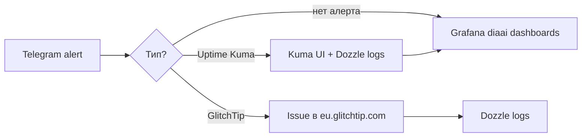

# Ключевые метрики — runbook при инциденте

Справочник для prod MVP: **куда смотреть первым**, пороги и типичные симптомы.

Связь: [README.md](README.md) · [uptime-kuma.md](uptime-kuma.md) · [ADR-005](../../docs/adr/adr-005-observability.md) · [deploy §9](../deploy/README.md#9-observability-mvp)

---

## Быстрый чеклист (5 мин)

1. **Telegram** — определить тип алерта по префиксу:
   - `[Uptime Kuma] …` → доступность (Kuma)
   - `GlitchTip: …` → ошибка в коде
2. **Uptime Kuma** — какой monitor Down (`diaai-backend`, `diaai-frontend`, `diaai-postgres`)?
3. **GlitchTip** — новый issue / regression? ([eu.glitchtip.com](https://eu.glitchtip.com))
4. **Grafana** → folder **diaai** → `diaai Backend RED`, затем `diaai VPS Host`
5. **Логи** — Dozzle (live) или Grafana **Explore → Loki** (см. [§ Loki Explore](#loki-explore-backend-5xx))



---

## 1. Availability (Uptime Kuma)

**Что мониторим:** доступность backend (в т.ч. БД), frontend, PostgreSQL.

| Monitor | Проверка | Down означает |
|---------|----------|---------------|
| `diaai-backend` | `GET /health`, keyword `"status":"ok"` | backend не отвечает или **503** (БД недоступна) |
| `diaai-frontend` | `GET /` web | Next.js не отвечает |
| `diaai-postgres` | `SELECT 1` на `postgres:5432` | PostgreSQL недоступен |

**Где смотреть:** Uptime Kuma UI — SSH tunnel `:13002` (см. [uptime-kuma.md](uptime-kuma.md)).

**Алерт:** Telegram через bridge, текст `[Uptime Kuma] <monitor>: …`.

**Типичные симптомы:**

| Симптом | Вероятная причина |
|---------|-------------------|
| Только `diaai-postgres` Down | контейнер postgres остановлен / OOM |
| `diaai-backend` Down, postgres Up | backend crash, порт 8000 занят |
| Все три Down | VPS недоступен, Docker daemon, сеть |
| Backend Down после deploy | старый образ, миграция, env |

**Действия:** Kuma → History → время Down; Dozzle → логи `diaai-backend-1` / `diaai-postgres-1`; на VPS: `make stack-health`, `docker ps`.

---

## 2. Errors (GlitchTip)

**Что мониторим:** необработанные исключения backend и web.

| Проект | Ingest |
|--------|--------|
| `diaai-backend` | `GLITCHTIP_DSN` |
| `diaai-web` | `GLITCHTIP_WEB_DSN`, `NEXT_PUBLIC_GLITCHTIP_DSN` |

**Где смотреть:**

- UI: [eu.glitchtip.com](https://eu.glitchtip.com) — issue, stack trace, frequency
- Telegram: `GlitchTip: <title>` (webhook → bridge `:8080`)
- Email (если настроен): `:8000/webhooks/glitchtip/email`

**Типичные симптомы:**

| Симптом | Действие |
|---------|----------|
| Один новый issue после deploy | regression → rollback / hotfix |
| Spike частоты одного issue | Dozzle backend/web; Grafana RED (5xx, latency) |
| Issue только в `diaai-web` | browser/React; проверить web-контейнер |

Подробнее: [alerts-telegram.md](../glitchtip/alerts-telegram.md).

> MVP: бот **не назначает дозы инсулина** — только обсуждение в контексте.

---

## 3. Backend RED (Grafana)

**Dashboard:** `diaai Backend RED` (folder **diaai**, uid `diaai-backend-red`).

**Доступ:** Grafana через tunnel `:13001` — см. [README § Prometheus + Grafana](README.md#prometheus--grafana-task-08).

### Пороги (согласованы с dashboard)

| Метрика | Жёлтый | Красный | Панель |
|---------|--------|---------|--------|
| 5xx rate % | > 1% | > 5% | stat «5xx rate %» |
| p95 latency | > 0.5 s | > 2 s | stat «p95 latency» |
| RPS | резкий drop или spike | — | stat «RPS» + graph by handler |

**Grafana alerts** (→ Telegram `[Grafana]`): 5xx rate **> 5%** for **5m**; p95 **> 2s** for **5m**. Silence после smoke — Alerting → Silences.

### PromQL (Explore / Prometheus)

```promql
# RPS
sum(rate(http_requests_total{job="diaai-backend"}[5m]))

# 5xx rate (instrumentator: status="5xx")
sum(rate(http_requests_total{job="diaai-backend",status="5xx"}[5m]))

# p95 latency
histogram_quantile(0.95, sum(rate(http_request_duration_seconds_bucket{job="diaai-backend"}[5m])) by (le))
```

**Типичные симптомы:**

| Паттерн | Вероятная причина |
|---------|-------------------|
| 5xx ↑, p95 ↑ | ошибки в handler, БД timeout |
| RPS → 0, Kuma Up | нет трафика (не инцидент) или routing |
| p95 ↑ без 5xx | медленные запросы (LLM, БД) |
| Spike на одном handler | конкретный route — Dozzle + GlitchTip |

**Примечание:** `/health` и `/metrics` **исключены** из RED-метрик (`excluded_handlers`).

---

## 4. VPS / Host (Grafana)

**Dashboard:** `diaai VPS Host` (uid `diaai-vps-host`).

### Пороги

| Метрика | Жёлтый | Красный | Панель |
|---------|--------|---------|--------|
| Host CPU % | > 80% | > 95% | stat «Host CPU %» |
| Host memory % | > 85% | > 95% | stat «Host memory %» |
| Root disk `/dev/sda1` | > 80% | > 90% | stat «Root disk %» |

**Типичные симптомы:**

| Паттерн | Действие |
|---------|----------|
| RAM > 85% | `docker stats`; перезапуск тяжёлых контейнеров; проверить OOM в Dozzle; на prod есть **swap 2 GB** (`swapon --show`)
| CPU > 80% sustained | кто грузит — cgroup panels; LLM spike на backend |
| Disk > 90% | `df -h`; docker system prune; логи postgres |

**Нюанс prod:** cAdvisor не отдаёт docker-имена контейнеров — панели «Container CPU/RAM» показывают **cgroup `id`**, не `diaai-backend-1`. Host CPU/RAM/disk работают нормально.

Prometheus targets: http://127.0.0.1:19090/targets (tunnel `:19090`).

---

## 5. PostgreSQL (post-MVP)

**Сейчас:** только Uptime Kuma monitor `diaai-postgres` (`SELECT 1`). Prometheus **не** scrape PG metrics.

**При подозрении на БД:**

```bash
# на VPS
curl -sf http://127.0.0.1:8000/health   # "database":"ok" или 503
docker logs diaai-postgres-1 --tail 100
make stack-health
```

Post-MVP: pg_exporter, connections, slow queries — вне scope MVP.

---

## 6. GlitchTip traces

**Default:** `GLITCHTIP_TRACES_SAMPLE_RATE=0.01` (1% transactions).

| Когда | Действие |
|-------|----------|
| Расследуешь latency spike или 5xx без явного stack trace | поднять до `0.1` в prod `.env`, redeploy backend/web |
| Инцидент закрыт | вернуть `0.01` |

Traces в GlitchTip UI — performance tab проекта. Не заменяют Grafana RED для host/PG.

---

## Loki Explore (backend 5xx)

Labels Promtail: `service`, `container`, `project`, `stream` — **нет** `level` и `status`.

При необработанном исключении backend пишет **WARNING** `unhandled_error=…` и uvicorn `"500 Internal Server Error"` — **не** `status=500` в access-log middleware.

| Запрос LogQL | Что находит |
|--------------|-------------|
| `{service="backend"} \|= "unhandled_error"` | необработанное исключение (→ GlitchTip) |
| `{service="backend"} \|= "500 Internal Server Error"` | uvicorn access line с 5xx |
| `{service="backend"} \|= "error_code"` | AppError с 5xx (middleware WARNING) |
| `{service="backend", stream="stderr"}` | traceback / uvicorn stderr |

**Не работает:** `{level="error"}`, `{service="backend"} \|= "status=5"` — для unhandled 500.

**Smoke 500 (prod, token):** `GET /debug/error-test` с `Authorization: Bearer $GLITCHTIP_DEBUG_TOKEN` → HTTP 500, строки в Loki за ~1 мин.

---

## Приложение: SSH tunnels (prod)

Порты на VPS bind **127.0.0.1** — не открывать в ufw. С Mac:

```bash
ssh -i ~/.ssh/diaai-deploy deploy@201.51.4.34
```

| UI | Local URL | Tunnel flag |
|----|-----------|-------------|
| Dozzle | http://127.0.0.1:18888 | `-L 18888:127.0.0.1:8888` |
| Uptime Kuma | http://127.0.0.1:13002 | `-L 13002:127.0.0.1:3002` |
| Grafana | http://127.0.0.1:13001 | `-L 13001:127.0.0.1:3001` |
| Prometheus | http://127.0.0.1:19090 | `-L 19090:127.0.0.1:9090` |

Один tunnel для Grafana + Prometheus:

```bash
ssh -i ~/.ssh/diaai-deploy -N \
  -L 13001:127.0.0.1:3001 \
  -L 19090:127.0.0.1:9090 \
  deploy@201.51.4.34
```

Grafana login: `admin` / `GRAFANA_ADMIN_PASSWORD` из `/opt/diaai/.env`.

---

## Связанные команды

| Команда | Назначение |
|---------|------------|
| `make monitoring-ps` | статус monitoring stack |
| `make stack-health` | health backend/web/postgres на VPS |
| `make monitoring-logs SVC=grafana` | логи сервиса |
