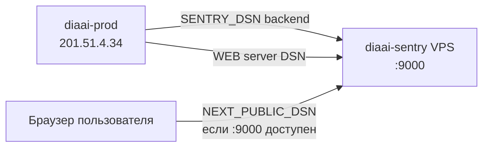

# Self-hosted Sentry на Timeweb Cloud

Чеклист деплоя **отдельного VPS** под Sentry для diaai (backend + web).  
Для РФ — альтернатива недоступному [sentry.io](https://sentry.io).

Связь: [README.md](README.md) · [inventory.example.md](inventory.example.md) · diaai-prod [deploy/README.md](../deploy/README.md).

**Не поднимайте Sentry на diaai-prod** (`201.51.4.34`, 4 GB) — только отдельная VM.

---

## Архитектура



| Компонент | VPS | Порты |
|-----------|-----|-------|
| diaai stack | `diaai-prod` | 3000, 8000 |
| Sentry self-hosted | `diaai-sentry` | 9000 (UI + ingest) |

---

## Фаза 0 — Подготовка

- [ ] Timeweb API: `twc whoami` OK · [twc-cli.md](../../docs/devops/twc-cli.md)
- [ ] SSH-ключ admin: `~/.ssh/diaai-admin`
- [ ] Решение по **browser errors**: Sentry `:9000` доступен с интернета **или** только server-side web (без `NEXT_PUBLIC_SENTRY_DSN`)

---

## Фаза 1 — VPS Timeweb

### 1.1 Выбор preset

```bash
twc server list-presets --region ru-3
# или ru-1 / ru-2
```

| Требование | Значение |
|------------|----------|
| RAM | **≥ 8 GB** (лучше 16 GB) |
| Disk | ≥ 50 GB NVMe |
| IPv4 | обязателен (без `--no-public-ip`) |

### 1.2 Создание сервера

```bash
twc server create \
  --name diaai-sentry \
  --image ubuntu-24.04 \
  --preset-id PRESET_ID \
  --region ru-3 \
  --ssh-key diaai-admin \
  --disable-ssh-password-auth
```

- [ ] Сервер создан, статус `on`
- [ ] IPv4 записан → [inventory.example.md](inventory.example.md)

```bash
twc server list
twc server get SERVER_ID
export SENTRY_IP=YOUR.SENTRY.IP
```

### 1.3 SSH

```bash
ssh -i ~/.ssh/diaai-admin root@${SENTRY_IP} 'uname -a'
```

- [ ] Вход по ключу без пароля

---

## Фаза 2 — Bootstrap (Docker + ufw)

```bash
scp devops/sentry/bootstrap-timeweb.sh root@${SENTRY_IP}:/tmp/

# YOUR_HOME_IP — ваш текущий IP для UI; DIAAPP_IP — diaai-prod
ssh -i ~/.ssh/diaai-admin root@${SENTRY_IP} \
  'DIAAPP_IP=201.51.4.34 ADMIN_IP=YOUR_HOME_IP bash /tmp/bootstrap-timeweb.sh'
```

- [ ] Docker + Compose установлены
- [ ] Swap 4 GB (скрипт по умолчанию)
- [ ] ufw: 22; `:9000` с `201.51.4.34` (+ ваш IP для UI)

Проверка:

```bash
ssh root@${SENTRY_IP} 'docker compose version && free -h && ufw status'
```

---

## Фаза 3 — Self-hosted Sentry

### 3.1 Clone + install (на VPS)

```bash
ssh -i ~/.ssh/diaai-admin root@${SENTRY_IP}

export SENTRY_DIR=/opt/sentry-self-hosted
git clone --depth 1 https://github.com/getsentry/self-hosted.git "${SENTRY_DIR}"
cd "${SENTRY_DIR}"
./install.sh
# создать admin user, подтвердить версию
docker compose up -d
```

Или с локальной машины (clone в репо, затем rsync) — проще через git на сервере.

- [ ] `./install.sh` завершился без OOM
- [ ] `docker compose ps` — сервисы healthy / up
- [ ] UI: `http://${SENTRY_IP}:9000` (с вашего IP, если ufw ограничен)

### 3.2 Организация

- [ ] Первый вход → org **`diaai`** (slug `diaai`)

---

## Фаза 4 — Проекты и DSN

### Вариант A — UI (рекомендуется в РФ)

1. **Projects → Create Project**
2. `diaai-backend` → **FastAPI**
3. `diaai-web` → **Next.js**
4. **Settings → Client Keys (DSN)** — скопировать оба DSN

### Вариант B — API (на VPS или с VPN)

```bash
export SENTRY_URL=http://${SENTRY_IP}:9000
export SENTRY_AUTH_TOKEN=sntrys_...   # UI → Settings → Auth Tokens
export SENTRY_ORG=diaai
bash devops/sentry/scripts/create-projects.sh
# локально: OUT_FILE=devops/sentry/dsn.local.env
```

- [ ] DSN backend сохранён
- [ ] DSN web сохранён
- [ ] Шаблон: [dsn.env.example](dsn.env.example)

Пример DSN (подставьте IP и ключи):

```bash
SENTRY_URL=http://SENTRY_IP:9000
SENTRY_DSN=http://KEY@${SENTRY_IP}:9000/2
WEB_SENTRY_DSN=http://KEY@${SENTRY_IP}:9000/3
NEXT_PUBLIC_SENTRY_DSN=http://KEY@${SENTRY_IP}:9000/3
```

> **Browser:** `NEXT_PUBLIC_SENTRY_DSN` работает только если пользователь достучится до `:9000`. Иначе оставьте client DSN пустым — ошибки React только server-side.

---

## Фаза 5 — Подключение diaai-prod

На **diaai-prod** (`deploy@201.51.4.34`), файл `/opt/diaai/.env`:

```bash
ssh -i ~/.ssh/diaai-deploy deploy@201.51.4.34
nano /opt/diaai/.env
```

Добавить (значения из фазы 4):

```bash
SENTRY_DSN=http://...@SENTRY_IP:9000/...
WEB_SENTRY_DSN=http://...@SENTRY_IP:9000/...
NEXT_PUBLIC_SENTRY_DSN=http://...@SENTRY_IP:9000/...
SENTRY_ENVIRONMENT=production
SENTRY_TRACES_SAMPLE_RATE=0.1
```

- [ ] `.env` chmod 600
- [ ] **Пересборка web** (NEXT_PUBLIC embed at build):

```bash
cd /opt/diaai
make stack-pull-registry   # или stack-up-registry после pull
make stack-up-registry     # rebuild если build profile локально
# CD: push main → Deploy workflow
```

Или ручной rebuild web с build args — см. [deploy/README.md](../deploy/README.md).

Проверка с diaai-prod:

```bash
ssh deploy@201.51.4.34 "curl -sf http://SENTRY_IP:9000/_health/ || curl -sf -o /dev/null -w '%{http_code}' http://SENTRY_IP:9000/"
```

- [ ] diaai-prod → Sentry `:9000` доступен (ufw)

---

## Фаза 6 — Приёмка

| # | Проверка | Команда / ожидание |
|---|----------|-------------------|
| 1 | Sentry stack up | `ssh root@${SENTRY_IP} 'cd /opt/sentry-self-hosted && docker compose ps'` |
| 2 | UI | браузер → `http://${SENTRY_IP}:9000` |
| 3 | Backend event | ошибка API → issue в `diaai-backend` |
| 4 | Web event | server/client error → `diaai-web` |
| 5 | diaai health | `curl http://201.51.4.34:8000/health` OK |

Тест backend (временно, dev):

```python
# или curl endpoint который падает в dev
import sentry_sdk; sentry_sdk.capture_message("diaai sentry test")
```

---

## Обязательный чеклист (DoD)

- [ ] **Отдельный VPS** ≥ 8 GB RAM, публичный IP
- [ ] **Bootstrap** `bootstrap-timeweb.sh`, Docker, ufw
- [ ] **Self-hosted** install green, org `diaai`
- [ ] **Два проекта** + DSN в secure storage
- [ ] **diaai-prod `.env`** обновлён, web пересобран при client DSN
- [ ] **События** видны в UI

---

## Troubleshooting

| Симптом | Решение |
|---------|---------|
| OOM при `install.sh` | preset 16 GB; swap; `docker compose` по частям |
| UI 403 / timeout | ufw `ADMIN_IP`; ваш IP сменился — обновить ufw |
| Backend не шлёт events | DSN; ufw allow from `201.51.4.34`; DSN host = `SENTRY_IP` не `127.0.0.1` |
| Web client silent | `NEXT_PUBLIC_*` + rebuild; или убрать client DSN |
| Disk full | Sentry retention: Settings → Organization → Stats / cleanup |

Docs: [develop.sentry.dev/self-hosted](https://develop.sentry.dev/self-hosted/)

---

## Make (локально)

| Команда | Действие |
|---------|----------|
| `make sentry-install` | clone self-hosted в `devops/sentry/self-hosted` (dev) |
| `make sentry-up` | локальный docker compose up |

Production install — на VPS в `/opt/sentry-self-hosted` (см. фаза 3).
