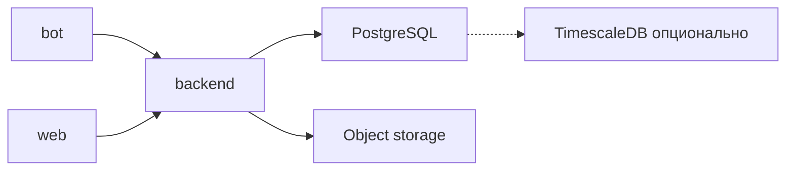
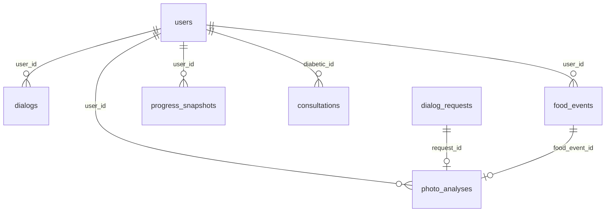

# ADR-001: Выбор СУБД — PostgreSQL

| | |
|---|---|
| **Статус** | Принято |
| **Дата** | 2026-06-07 |
| **Контекст** | Первое архитектурное решение по слою данных |

## Контекст

**diaai** — multi-component система: Telegram-бот, backend (ядро), веб-приложение. Backend централизует данные для всех клиентов.

Нужна персистентность для:

- пользователей (диабетик, доктор);
- диалогов и запросов;
- событий питания (ХЕ, БЖЕ, БЖУ) и инсулина;
- анализа фото по составу;
- снимков прогресса и рекомендаций;
- консультаций.

**Текущее состояние:** backend использует PostgreSQL (`001_initial_schema`: users, dialogs, events). Целевая физическая схема — 9 таблиц, [schema-er.md](../spec/schema-er.md) (database iter 2).

**Требования к СУБД:**

- реляционные связи между сущностями (см. [data-model.md](../data-model.md));
- поддержка semi-structured данных (ответы LLM, метаданные фото);
- один стек для MVP backend и масштабирования без смены технологии;
- совместимость с несколькими сервисами, обращающимися к одному слою данных;
- возможность аналитики по временным рядам (ХЕ / БЖЕ / БЖУ / инсулин).

## Рассмотренные альтернативы

### 1. PostgreSQL ✅ выбрано

**Плюсы**

- зрелая реляционная модель: пользователи, события, консультации, FK и транзакции;
- **JSONB** — гибкое хранение payload LLM и метаданных без раздувания схемы;
- экосистема: миграции, ORM, мониторинг, managed-облако;
- расширяемость: **TimescaleDB** для временных рядов без отдельной СУБД;
- read-replica для аналитики;
- de-facto стандарт для Python-backend.

**Минусы**

- для очень больших объёмов медиа нужен отдельный object storage (не минус PostgreSQL — общая практика);
- горизонтальный шардинг на старте не нужен и усложнил бы MVP.

### 2. MySQL / MariaDB

**Плюсы:** реляционная модель, зрелость, managed-хостинг.

**Минусы:** JSON-поддержка слабее и менее идиоматична, чем JSONB в PostgreSQL; для нашего кейса (LLM-ответы, гибкие метаданные) PostgreSQL предпочтительнее; меньше экосистемных решений под Timescale-подобные сценарии в одном стеке.

**Вердикт:** отклонено — нет преимущества над PostgreSQL для diaai.

### 3. MongoDB

**Плюсы:** гибкая document-модель, удобна для вложенных JSON.

**Минусы:** связи диабетик ↔ события ↔ консультации выражены слабее, чем в SQL; риск дублирования и рассинхронизации при multi-service доступе; команда и модель данных ([data-model.md](../data-model.md)) ориентированы на реляционную схему; две парадигмы (SQL + document) без явной выгоды.

**Вердикт:** отклонено — избыточная сложность на старте.

### 4. SQLite

**Плюсы:** нулевая инфраструктура, идеален для локальной разработки и прототипов.

**Минусы:** один writer, слабая модель для bot + web + backend с concurrent-запросами; не целевая СУБД для production multi-client системы.

**Вердикт:** допустим **только для локальной разработки** backend; production — PostgreSQL.

### 5. Отдельная time-series БД (InfluxDB и аналоги)

**Плюсы:** оптимизация под метрики и временные ряды.

**Минусы:** второй стек данных, синхронизация с основными сущностями, операционная нагрузка; объём данных на старте не оправдывает split.

**Вердикт:** отклонено на MVP; при росте — **TimescaleDB** как расширение PostgreSQL, не отдельная СУБД.

## Решение

**Основная СУБД проекта — PostgreSQL.**

| Аспект | Выбор |
|--------|--------|
| Production / staging | PostgreSQL |
| Локальная разработка | PostgreSQL (Docker / local); SQLite — опционально для быстрых экспериментов |
| Медиа (фото) | object storage (S3-совместимое); в PostgreSQL — ссылки и метаданные |
| Временные ряды (позже) | TimescaleDB или материализованные представления поверх PostgreSQL |
| Аналитика (позже) | read-replica PostgreSQL |

## Последствия

### Положительные

- единый источник истины для bot, web и backend;
- предсказуемая эволюция схемы через миграции;
- JSONB закрывает вариативность LLM без NoSQL;
- путь масштабирования без смены СУБД.

### Отрицательные / ограничения

- нужна инфраструктура PostgreSQL (Docker / managed) — позже, чем RAM в MVP-боте;
- фото не храним в БД — отдельный компонент (object storage);
- при очень высокой нагрузке на аналитику потребуется read-replica или кэш — закладываем заранее, не на MVP.

### Что не входит в это решение

- ORM / query builder, миграционный инструмент — database iter 3 ([tasklist-database.md](../tasks/tasklist-database.md));
- детали endpoint'ов — [api-contract.md](../api/api-contract.md).

## Целевая физическая схема (database iter 2)

Детальная спецификация: [schema-er.md](../spec/schema-er.md) · review: [schema-review.md](../spec/schema-review.md).

| Аспект | Выбор |
|--------|--------|
| Таблицы | 9: `users`, `dialogs`, `dialog_requests`, `food_events`, `insulin_events`, `photo_analyses`, `progress_snapshots`, `recommendations`, `consultations` |
| PK / FK | `UUID`; все FK колонки проиндексированы |
| Время | `TIMESTAMPTZ` для событий; `DATE` для границ периода |
| Числа | `NUMERIC(10,2)` для ХЕ/БЖЕ/доз/агрегатов |
| Enum-like | `TEXT` + `CHECK`, не PG ENUM |
| Semi-structured | `dialog_requests.media` (JSON/JSONB) — метаданные фото; структурированный анализ — `photo_analyses` |
| Целостность | FK + CHECK (role, status, period, trend); UNIQUE на снимках прогресса; partial UNIQUE на `telegram_id` |
| Миграции | MVP `001` → целевая `002` — impl database iter 5 |

## Связанные документы

- [idea.md](../idea.md) — продуктовая логика
- [vision.md](../vision.md) — архитектура системы
- [data-model.md](../data-model.md) — доменные сущности
- [schema-er.md](../spec/schema-er.md) — ER и физическая схема PostgreSQL
- [schema-review.md](../spec/schema-review.md) — design review по PostgreSQL best practices
