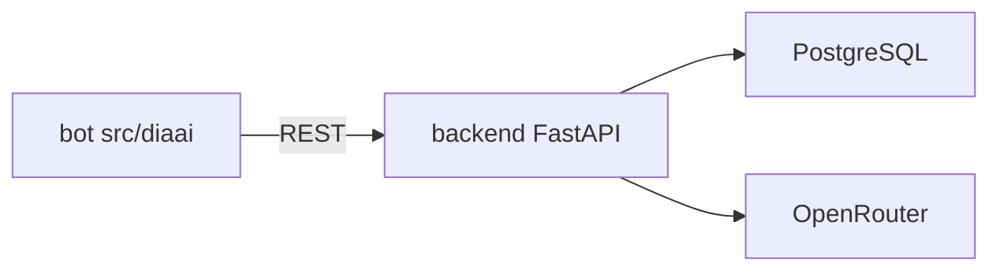

# ADR-002: Стек backend — FastAPI

| | |
|---|---|
| **Статус** | Принято |
| **Дата** | 2026-06-07 |
| **Контекст** | Итерация 2 — backend-ядро и БД |

## Контекст

**diaai** переходит от MVP-бота (aiogram + OpenRouter напрямую, RAM) к multi-component архитектуре: bot/web → **backend** → PostgreSQL ([ADR-001](adr-001-database.md)).

Backend должен:

- отдавать REST API для двух базовых сценариев (вопрос ассистенту, фиксация события);
- хранить данные в PostgreSQL;
- вызывать OpenRouter (LLM, multimodal);
- использовать тот же язык и инструменты, что MVP-бот (Python, uv, ruff).

## Рассмотренные альтернативы

### 1. FastAPI + SQLAlchemy + Alembic ✅ выбрано

**Плюсы**

- единый язык с ботом; команда уже на Python 3.12 + uv;
- нативный OpenAPI/Swagger — task-02 (контракты) и task-06 (документация);
- async, Pydantic, DI из коробки;
- SQLAlchemy 2 + Alembic — стандарт для PostgreSQL и миграций;
- лёгкий каркас без «enterprise»-обвязки.

**Минусы**

- два процесса (bot + backend) на этапе миграции;
- нужна дисциплина структуры пакетов (не раздувать слои).

### 2. Django + DRF

**Плюсы:** ORM, admin, зрелая экосystem.

**Минусы:** тяжелее FastAPI для API-only ядра; избыточен для KISS-MVP backend; другая парадигма конфигурации и деплоя.

**Вердикт:** отклонено — лишняя сложность.

### 3. Flask + extensions

**Плюсы:** минимализм, знакомость.

**Минусы:** OpenAPI и async — через дополнения; менее выразительный DI; больше ручной сборки.

**Вердикт:** отклонено — FastAPI закрывает API-first кейс лучше.

### 4. Node.js (NestJS / Express)

**Плюсы:** популярен для REST.

**Минусы:** второй язык в монорепо; LLM-клиент и бот уже на Python; дублирование компетенций.

**Вердикт:** отклонено — сохраняем Python end-to-end.

## Решение

**Backend-стек diaai:**

| Компонент | Выбор |
|-----------|--------|
| Язык | Python 3.12+ |
| Зависимости | `uv` (единый lock с ботом) |
| HTTP API | **FastAPI** |
| ASGI-сервер | **Uvicorn** |
| СУБД | **PostgreSQL** ([ADR-001](adr-001-database.md)) |
| ORM | **SQLAlchemy 2.x** |
| Миграции | **Alembic** |
| Конфиг | **pydantic-settings**, env |
| LLM | **openai**-клиент → OpenRouter (как в боте) |
| Тесты | **pytest**, **httpx** (AsyncClient) |
| Линт / формат | **ruff** |
| Автоматизация | **Makefile** (`backend-run`, `backend-test`, …) |

### Структура каталога `backend/`

KISS — без DDD-слоёв на MVP; один модуль — одна ответственность:

```
backend/
├── main.py              # FastAPI app, lifespan
├── config.py            # Settings из env
├── api/
│   └── v1/              # routers по доменам
├── services/            # LLM, доменная логика
├── repositories/        # SQLAlchemy queries
└── models/              # ORM-модели
```

Промпты LLM — в корневом `prompts/` (общие для bot и backend на переходный период).



## Последствия

### Положительные

- OpenAPI генерируется из кода — меньше рассинхрона с `docs/api/`;
- общий pyproject/uv с ботом;
- путь к task-03 (каркас) и task-05 (impl) предсказуем.

### Отрицательные / ограничения

- SQLAlchemy + Alembic добавляют обучение; не вводим лишние абстракции (реpositories — тонкие);
- на task-07 bot и backend — два процесса локально;
- web-стек — отдельное решение (не в этом ADR).

### Что не входит в это решение

- детальные API-контракты — task-02, `docs/api/`;
- схема таблиц — [data-model.md](../data-model.md), task-05;
- auth для web — позже; на MVP — идентификация по `telegram_id`.

## Связанные документы

- [adr-001-database.md](adr-001-database.md)
- [vision.md](../vision.md)
- [tasklist-backend.md](../tasks/tasklist-backend.md)
