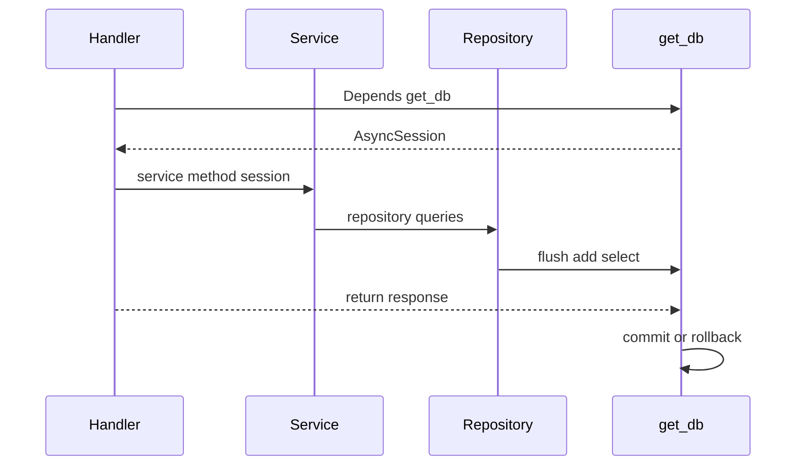

# ADR-003: Слой доступа к данным — SQLAlchemy 2 async + Alembic

| | |
|---|---|
| **Статус** | Принято |
| **Дата** | 2026-06-07 |
| **Контекст** | Database iter 3 — практика миграций и доступа к PostgreSQL |

## Контекст

**diaai** использует PostgreSQL ([ADR-001](adr-001-database.md)) через FastAPI backend ([ADR-002](adr-002-backend-stack.md)). Bot и будущий web обращаются к одному слою данных через REST API.

**Текущее состояние (backend MVP ✅):**

- миграция [`001_initial_schema.py`](../../alembic/versions/001_initial_schema.py) — 5 таблиц;
- async SQLAlchemy 2 + `asyncpg`, Alembic async в [`alembic/env.py`](../../alembic/env.py);
- паттерн **handler → service → repository → `get_db`**;
- целевая схема 9 таблиц — [schema-er.md](../spec/schema-er.md); impl миграции `002_*` — database iter 5.

Нужно зафиксировать **как** работать с БД: сессии, транзакции, миграции, соглашения — без дублирования выбора СУБД (ADR-001) и HTTP-стека (ADR-002).

## Рассмотренные альтернативы

### 1. SQLAlchemy 2 async + Alembic ✅ выбрано

**Плюсы**

- уже интегрирован в backend; единый `Base.metadata` для ORM и Alembic;
- `asyncpg` — нативный async для FastAPI handlers;
- repositories — тонкие, без generic CRUD ([backend-structure.md](../tech/backend-structure.md));
- путь к миграции `002` из [schema-er §6](../spec/schema-er.md#6-appendix-draft-migration-002).

**Минусы**

- кривая обучения async SQLAlchemy; дисциплина слоёв.

### 2. Raw SQL (asyncpg напрямую)

**Плюсы:** минимум абстракций, полный контроль SQL.

**Минусы:** дублирование схемы; нет единого metadata для Alembic autogenerate; SQL размазан по коду.

**Вердикт:** отклонено — против KISS при наличии ORM.

### 3. SQLAlchemy sync + `run_in_executor`

**Плюсы:** больше примеров в документации.

**Минусы:** thread pool для каждого запроса; лишняя сложность при async FastAPI.

**Вердикт:** отклонено.

### 4. Django ORM / Tortoise / SQLModel

**Плюсы:** альтернативные ORM.

**Минусы:** второй стек; ADR-002 — FastAPI без Django; SQLAlchemy уже в production.

**Вердикт:** отклонено.

### 5. BaseRepository / generic CRUD

**Плюсы:** меньше boilerplate.

**Минусы:** скрывает доменные запросы; over-engineering для MVP.

**Вердикт:** отклонено на MVP — простые классы `*Repository` per entity.

## Решение

### Стек доступа к данным

| Аспект | Выбор |
|--------|--------|
| ORM | SQLAlchemy 2.x, `DeclarativeBase`, `Mapped[]` |
| Driver | `asyncpg` (`postgresql+asyncpg://`) |
| Session factory | `async_sessionmaker`, `expire_on_commit=False` |
| DI | FastAPI `Depends(get_db)` |
| Транзакция | граница = один HTTP-запрос: commit при успехе, rollback при исключении |
| Миграции | Alembic async; revisions в `alembic/versions/` |
| Metadata | `backend.database.Base`; модели импортируются в `alembic/env.py` |
| Слои | handler → service → repository |
| Модели | один файл на таблицу в `backend/models/` |
| Именование | `snake_case` таблиц/колонок = [schema-er.md](../spec/schema-er.md) |
| Тесты | sqlite in-memory + `app.dependency_overrides[get_db]` |

### Соглашения

| Правило | Где |
|---------|-----|
| **Без SQL в handlers** | `backend/api/v1/*.py` — только DI, вызов service |
| **Бизнес-логика в service** | ownership, валидация домена, orchestration |
| **Repository — только queries** | `select`, `add`, `flush`; без `AppError`, без HTTP |
| **`flush()` в repository** | когда нужен PK/generated поле до commit |
| **Commit/rollback** | только в `get_db()` — services не вызывают `commit()` |
| **Новая таблица** | schema-er → Alembic revision → model → register → repo/service — см. [database-access.md](../tech/database-access.md) |
| **Autogenerate** | опционально; для `002` — ручная правка по draft DDL |
| **Логирование** | не логировать промпты, тексты сообщений, токены — [conventions.mdc](../../.cursor/rules/conventions.mdc) |

### Жизненный цикл сессии

Реализация в [`backend/database.py`](../../backend/database.py):

- `init_db()` / `dispose_db()` — lifespan в `main.py`;
- `get_db()` — yield session → commit on success, rollback on exception.

Alembic ([`alembic/env.py`](../../alembic/env.py)):

- `target_metadata = Base.metadata`;
- импорт всех моделей для autogenerate;
- async migrations через `async_engine_from_config`.

## Последствия

### Положительные

- единый источник схемы (ORM metadata + Alembic);
- предсказуемые транзакции на границе запроса;
- onboarding: [database-access.md](../tech/database-access.md) — 5 шагов для новой таблицы;
- согласовано с целевой PG-схемой iter 2.

### Отрицательные / ограничения

- async SQLAlchemy требует `await` везде в цепочке;
- один commit на запрос — multi-step saga вне scope MVP;
- тесты на sqlite ≠ полная PG-совместимость (CHECK, JSONB) — интеграция через docker PG.

### Что не входит в это решение

- `make db-*`, seed, inspect scripts — database iter 4;
- impl миграции `002_*`, новые models/repos — database iter 5;
- Row-Level Security, read-replica, connection pooling tuning — backlog;
- web-auth sessions — post-MVP.

## Связанные документы

- [adr-001-database.md](adr-001-database.md) — PostgreSQL
- [adr-002-backend-stack.md](adr-002-backend-stack.md) — FastAPI стек
- [database-access.md](../tech/database-access.md) — практический guide
- [backend-structure.md](../tech/backend-structure.md) — структура каталогов
- [schema-er.md](../spec/schema-er.md) — целевая физическая схема
- [data-model.md](../data-model.md) — доменная модель
