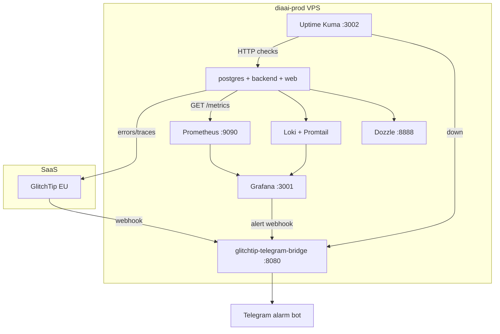

# ADR-005: Observability stack для MVP (production)

| | |
|---|---|
| **Статус** | Принято |
| **Дата** | 2026-06-07 |
| **Контекст** | Prod VPS `201.51.4.34`, CD green, нужно узнавать о сбоях раньше пользователей |

## Контекст

**diaai** развёрнут на Timeweb VPS: Docker Compose (`postgres` + `backend` + `web`, опционально `bot`), CI/CD через GitHub Actions ([`devops/deploy/README.md`](../../devops/deploy/README.md)).

Внутренние healthchecks и `make stack-health` проверяют стек **локально на сервере** и **сразу после деплоя**. Они **не будят** при падении VPS ночью, зависшем контейнере после деплоя или недоступности снаружи.

Нужны четыре категории сопровождения:

| Категория | Вопрос |
|-----------|--------|
| Error tracking | Сколько ошибок, где, что предшествовало? |
| Uptime | Приложение отвечает прямо сейчас? |
| Logs | Логи всех контейнеров в одном месте? |
| Metrics | Нагрузка, задержки, error rate? |

**Baseline на момент решения:** GlitchTip EU hosted подключён к backend/web (`GLITCHTIP_*`); `@diaaialarm_bot` настроен; внешний uptime и централизованные логи — нет.

## Рассмотренные альтернативы

### 1. Error tracking (исключения, stack trace)

| Вариант | Тип | Плюсы | Минусы |
|---------|-----|-------|--------|
| **GlitchTip EU hosted** ✅ | SaaS | уже подключён; доступен из РФ; free 1000 events/mo | Telegram — через bridge |
| Sentry.io | SaaS | лучший UX | часто 403 из РФ |
| GlitchTip self-hosted | Self-hosted | контроль данных | отдельный VPS ≥2 GB, не на diaai-prod |

### 2. Uptime / availability

| Вариант | Тип | Плюсы | Минусы |
|---------|-----|-------|--------|
| **UptimeRobot** ✅ | SaaS | free, 0 RAM на VPS, Telegram/email | данные у третьей стороны |
| Hetrixtools | SaaS | ping из регионов | менее популярен |
| Uptime Kuma | Self-hosted | свой UI | ~150 MB RAM на prod |

Проверки: `GET :8000/health` → `"status":"ok"`; `GET :3000/` → HTTP 200/307.

### 3. Log aggregation

| Вариант | Тип | Плюсы | Минусы |
|---------|-----|-------|--------|
| **Dozzle** ✅ | Self-hosted | ~20 MB, live tail всех контейнеров | без search/retention |
| **Loki + Promtail** ✅ (iter 3) | Self-hosted | LogQL в Grafana Explore, 7d retention | ~100–200 MB RAM |
| Grafana Cloud (Loki) | SaaS | search, retention | лимиты free |

### 4. Metrics / performance (RED)

| Вариант | Тип | Плюсы | Минусы |
|---------|-----|-------|--------|
| **Prometheus + Grafana + cAdvisor** ✅ (iter 3) | Self-hosted | RED, host/container, alerting | ~500 MB RAM на 4 GB VPS |
| **GlitchTip traces 1%** ✅ | SaaS | уже есть, без новой инфры | не host/PG metrics |
| Grafana Cloud free | SaaS | Prometheus dashboards | лимиты |

## Решение

### Финальный MVP-стек (prod verified 2026-06-26)

| Категория | Инструмент | Где | Алерт |
|-----------|------------|-----|-------|
| Ошибки в коде | **GlitchTip EU** | SaaS | Telegram (bridge) |
| Доступность | **Uptime Kuma** | compose profile `monitoring` | Telegram (bridge) |
| Логи (live) | **Dozzle** | compose profile `monitoring` | — |
| Логи (search) | **Loki + Promtail** | compose profile `monitoring` | — |
| Метрики RED | **Prometheus + Grafana + cAdvisor** | compose profile `monitoring` | Grafana rules → bridge |
| Трейсы (sample) | **GlitchTip traces 1%** | SaaS | GlitchTip |
| Канал алертов | **@diaaialarm_bot** | `.env` | GlitchTip · Kuma · Grafana |

### Docker Compose (profile `monitoring`)

| Сервис | Порт (prod, localhost) | Назначение |
|--------|--------------------------|------------|
| `dozzle` | `8888` | live tail логов контейнеров |
| `glitchtip-telegram-bridge` | `:8080` (public для webhooks) | GlitchTip / Grafana / Kuma → Telegram |
| `uptime-kuma` | `3002` | HTTP monitors + alerts (iter 2) |
| `prometheus` | `9090` | scrape backend `/metrics`, cAdvisor |
| `grafana` | `3001` | dashboards + alerting + Loki Explore |
| `loki` | `3100` | log storage (7d) |
| `promtail` | — | Docker logs → Loki |
| `cadvisor` | `8082` | container CPU/RAM |

SSH tunnels (prod): Grafana **13001**, Prometheus **19090**, Dozzle **18888**, Kuma **13002**.

Файлы: [`devops/monitoring/compose.yml`](../../devops/monitoring/compose.yml) · guide: [`devops/monitoring/README.md`](../../devops/monitoring/README.md) · runbook: [`key-metrics.md`](../../devops/monitoring/key-metrics.md).

**Не поднимать на diaai-prod (4 GB):** self-hosted GlitchTip, ELK.

### Env (prod `.env`)

| Variable | Назначение |
|----------|------------|
| `GLITCHTIP_DSN`, `GLITCHTIP_WEB_DSN`, `NEXT_PUBLIC_GLITCHTIP_DSN` | ingest ошибок |
| `GLITCHTIP_TRACES_SAMPLE_RATE=0.01` | 1% transactions (поднять до `0.1` при расследовании) |
| `TELEGRAM_ALARM_BOT_TOKEN`, `TELEGRAM_ALARM_CHAT_ID` | алерты |
| `GLITCHTIP_WEBHOOK_SECRET` | опционально, защита POST `/webhook` |

## Последствия

- **Uptime (iter 2):** Uptime Kuma — 3 monitors (backend, web, postgres); alerts → bridge — см. [`devops/monitoring/uptime-kuma.md`](../../devops/monitoring/uptime-kuma.md)
- UptimeRobot (SaaS) — альтернатива из первоначального ADR; не используется на prod — см. [`uptimerobot.md`](../../devops/monitoring/uptimerobot.md)
- GlitchTip: Alert receiver → Webhook URL `http://201.51.4.34:8080/webhook` (с secret при необходимости)
- Prod: `make monitoring-up` после `stack-up-registry`; UI — SSH tunnels (см. [key-metrics.md](../../devops/monitoring/key-metrics.md))
- **Iter 3:** Prometheus + Grafana + Loki + dashboards (RED, FastAPI Observability, VPS host) — provisioned JSON в `grafana/`
- **Grafana alerting (iter 3):** provisioned rules `Backend 5xx rate > 5%`, `Backend p95 latency > 2s` → contact point **diaai-telegram** → bridge (префикс `[Grafana]`); smoke: `GET /debug/error-test`
- **Loki Explore:** `{service="backend"} |= "500 Internal Server Error"` (не label `status=500` — см. [key-metrics.md](../../devops/monitoring/key-metrics.md))
- `stack-health` остаётся для CD; не заменяет Kuma uptime

## Отложено (post-MVP)

- Observability stack на отдельной VM или Grafana Cloud (разгрузка 4 GB VPS)
- Self-hosted GlitchTip / Sentry
- FastAPI endpoint для алертов в backend (вместо bridge-контейнера)
- UptimeRobot как внешний SaaS-check (Kuma уже на prod)

## Связанные документы

- [architecture.md](../architecture.md) · [devops/glitchtip/hosted.md](../../devops/glitchtip/hosted.md) · [devops/glitchtip/alerts-telegram.md](../../devops/glitchtip/alerts-telegram.md) · [devops/deploy/README.md](../../devops/deploy/README.md) · [devops/monitoring/key-metrics.md](../../devops/monitoring/key-metrics.md)
