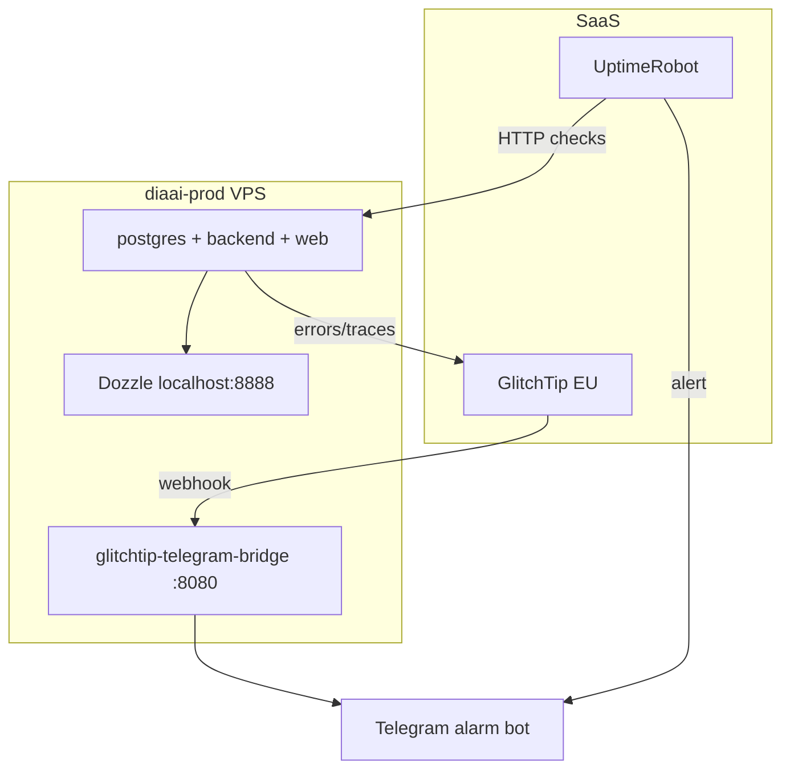

# ADR-005: Observability stack для MVP (production)

| | |
|---|---|
| **Статус** | Принято |
| **Дата** | 2026-06-07 |
| **Контекст** | Prod VPS `201.51.4.34`, CD green, нужно узнавать о сбоях раньше пользователей |

## Контекст

**diaai** развёрнут на Timeweb VPS: Docker Compose (`postgres` + `backend` + `web`, опционально `bot`), CI/CD через GitHub Actions ([`devops/deploy/README.md`](../../devops/deploy/README.md)).

Внутренние healthchecks и `make stack-health` проверяют стек **локально на сервере** и **сразу после деплоя**. Они **не будят** при падении VPS ночью, зависшем контейнере после деплоя или недоступности снаружи.

Нужны четыре категории сопровождения:

| Категория | Вопрос |
|-----------|--------|
| Error tracking | Сколько ошибок, где, что предшествовало? |
| Uptime | Приложение отвечает прямо сейчас? |
| Logs | Логи всех контейнеров в одном месте? |
| Metrics | Нагрузка, задержки, error rate? |

**Baseline на момент решения:** GlitchTip EU hosted подключён к backend/web (`GLITCHTIP_*`); `@diaaialarm_bot` настроен; внешний uptime и централизованные логи — нет.

## Рассмотренные альтернативы

### 1. Error tracking (исключения, stack trace)

| Вариант | Тип | Плюсы | Минусы |
|---------|-----|-------|--------|
| **GlitchTip EU hosted** ✅ | SaaS | уже подключён; доступен из РФ; free 1000 events/mo | Telegram — через bridge |
| Sentry.io | SaaS | лучший UX | часто 403 из РФ |
| GlitchTip self-hosted | Self-hosted | контроль данных | отдельный VPS ≥2 GB, не на diaai-prod |

### 2. Uptime / availability

| Вариант | Тип | Плюсы | Минусы |
|---------|-----|-------|--------|
| **UptimeRobot** ✅ | SaaS | free, 0 RAM на VPS, Telegram/email | данные у третьей стороны |
| Hetrixtools | SaaS | ping из регионов | менее популярен |
| Uptime Kuma | Self-hosted | свой UI | ~150 MB RAM на prod |

Проверки: `GET :8000/health` → `"status":"ok"`; `GET :3000/` → HTTP 200/307.

### 3. Log aggregation

| Вариант | Тип | Плюсы | Минусы |
|---------|-----|-------|--------|
| **Dozzle** ✅ | Self-hosted | ~20 MB, один UI, 1 контейнер | без search/retention |
| Grafana Cloud (Loki) | SaaS | search, retention | лимиты free |
| Loki + Promtail + Grafana | Self-hosted | полный контроль | тяжело для 4 GB VPS |

### 4. Metrics / performance (RED)

| Вариант | Тип | Плюсы | Минусы |
|---------|-----|-------|--------|
| **GlitchTip traces 1%** ✅ | SaaS | уже есть, без новой инфры | не host/PG metrics |
| Grafana Cloud free | SaaS | Prometheus dashboards | лимиты |
| Prometheus + Grafana + cAdvisor | Self-hosted | полный контроль | ~500 MB–1 GB; не на prod MVP |

## Решение

### Финальный MVP-стек

| Категория | Инструмент | Где | Алерт |
|-----------|------------|-----|-------|
| Ошибки в коде | **GlitchTip EU** | SaaS | Telegram (bridge) |
| Доступность | **UptimeRobot** | SaaS | Telegram / email |
| Логи | **Dozzle** | compose profile `monitoring` | — |
| Метрики/latency | **GlitchTip traces 1%** + UptimeRobot response time | SaaS | GlitchTip / UptimeRobot |
| Канал алертов | **@diaaialarm_bot** | `.env` | единая точка |

### Docker Compose (profile `monitoring`)

| Сервис | Порт (prod) | Назначение |
|--------|-------------|------------|
| `dozzle` | `127.0.0.1:8888` | UI логов контейнеров |
| `glitchtip-telegram-bridge` | `:8080` (public для GlitchTip webhook) | GlitchTip JSON → Telegram |

Файлы: [`devops/monitoring/compose.yml`](../../devops/monitoring/compose.yml) · guide: [`devops/monitoring/README.md`](../../devops/monitoring/README.md).

**Не поднимать на diaai-prod (4 GB):** self-hosted GlitchTip, ELK, full Prometheus stack.

### Env (prod `.env`)

| Variable | Назначение |
|----------|------------|
| `GLITCHTIP_DSN`, `GLITCHTIP_WEB_DSN`, `NEXT_PUBLIC_GLITCHTIP_DSN` | ingest ошибок |
| `GLITCHTIP_TRACES_SAMPLE_RATE=0.01` | 1% transactions (поднять до `0.1` при расследовании) |
| `TELEGRAM_ALARM_BOT_TOKEN`, `TELEGRAM_ALARM_CHAT_ID` | алерты |
| `GLITCHTIP_WEBHOOK_SECRET` | опционально, защита POST `/webhook` |

## Последствия

- UptimeRobot: 2 HTTP monitors (`/health`, `:3000`) — см. [`devops/monitoring/uptimerobot.md`](../../devops/monitoring/uptimerobot.md)
- GlitchTip: Alert receiver → Webhook URL `http://201.51.4.34:8080/webhook` (с secret при необходимости)
- Prod: `make monitoring-up` после `stack-up-registry`; Dozzle — SSH tunnel `8888`
- `stack-health` остаётся для CD; не заменяет внешний uptime

## Отложено (post-MVP)

- Prometheus + Grafana на отдельной VM или Grafana Cloud
- Loki / полноценный log search
- Self-hosted GlitchTip / Sentry
- FastAPI endpoint для алертов внутри backend (вместо bridge-контейнера)

## Связанные документы

- [architecture.md](../architecture.md) · [devops/glitchtip/hosted.md](../../devops/glitchtip/hosted.md) · [devops/glitchtip/alerts-telegram.md](../../devops/glitchtip/alerts-telegram.md) · [devops/deploy/README.md](../../devops/deploy/README.md)
