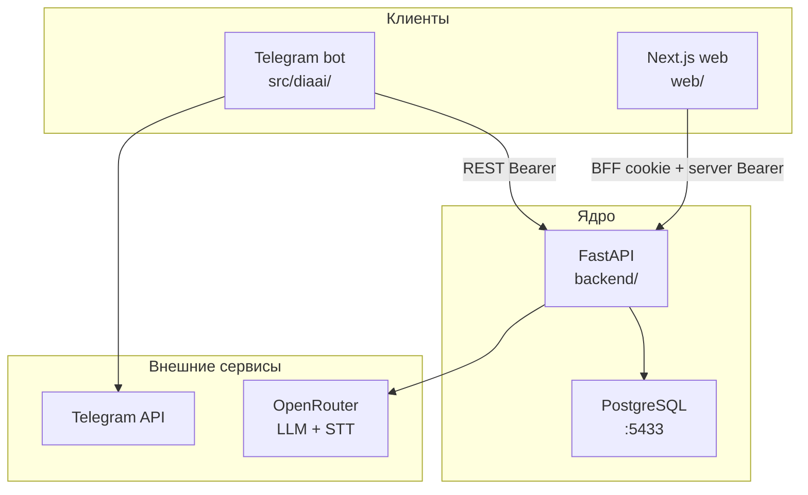
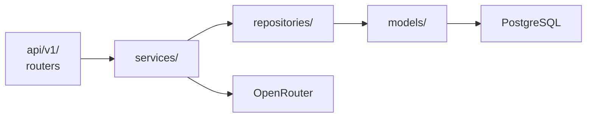
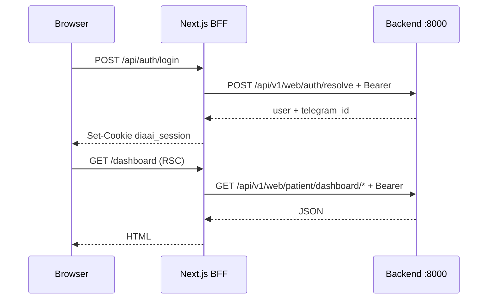
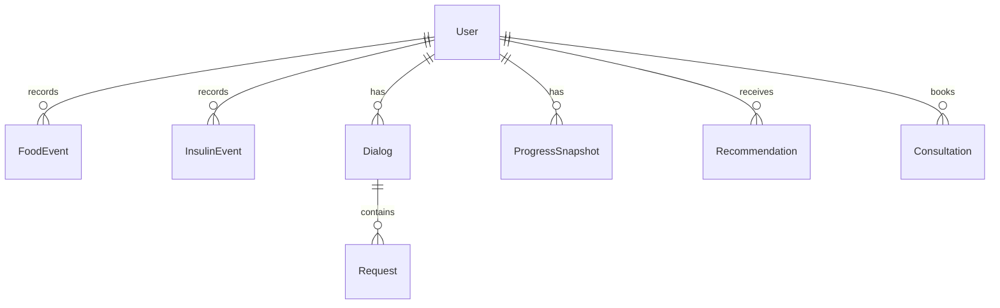

# Архитектура diaai

Высокоуровневое описание системы. Продуктовый контекст — [idea.md](idea.md) · [vision.md](vision.md) · [plan.md](plan.md). Детали API — [api/api-contract.md](api/api-contract.md).

> Справочная поддержка при диабете. **Не назначаем дозы инсулина.**

---

## Принцип

**Backend — ядро.** Telegram-бот и web — тонкие клиенты: ввод, отображение, BFF. Бизнес-логика, LLM, PostgreSQL — в `backend/`.

---

## Компоненты

| Компонент | Путь | Роль | Порт (local) |
|-----------|------|------|--------------|
| **Backend** | `backend/` | REST API, services, repos, Alembic | 8000 |
| **PostgreSQL** | Docker `docker-compose.yml` | 9 таблиц, seed, миграции | 5433→5432 |
| **Telegram bot** | `src/diaai/` | aiogram 3, polling → backend | — |
| **Web** | `web/` | Next.js App Router, shadcn, BFF routes | 3000 |
| **Промпты** | `prompts/` | `system.txt`, `analytics_sql.txt` | — |
| **Документация** | `docs/` | spec, API, tasklists, ADR | — |

### Backend (слои)

| Слой | Примеры |
|------|---------|
| `backend/api/v1/` | `assistant.py`, `events.py`, `media.py`, `web/*` |
| `backend/services/` | `assistant_service`, `llm_service`, `web_patient_service`, `analytics_query_service` |
| `backend/repositories/` | `food_event`, `user`, `progress_snapshot`, … |
| `backend/models/` | SQLAlchemy 2 ORM |
| `alembic/versions/` | `001` → `003` |

Точка входа: `backend/main.py` → `create_app()` · `make backend-run`.

### Web (BFF)

Браузер **не** видит `BACKEND_SERVICE_TOKEN`. Cookie `diaai_session` (httpOnly) + Route Handlers проксируют backend.

BFF routes: `web/app/api/auth/*`, `assistant/*`, `analytics/query`.

### Bot

| Handler | Backend |
|---------|---------|
| Text / photo | `POST /api/v1/assistant/messages` |
| Voice | `POST /api/v1/media/transcribe` → assistant |

Код: `src/diaai/handlers.py` → `backend_client.py`. OpenRouter **только** на backend.

---

## Поверхности API

| Префикс | Клиент | Статус | Назначение |
|---------|--------|--------|------------|
| `/health` | любой | ✅ | health check |
| `/api/v1/assistant/*` | bot, web (FAB) | ✅ | диалог LLM (D2) |
| `/api/v1/events/*` | bot | ✅ | питание, инсулин (D1) |
| `/api/v1/media/transcribe` | bot, web | ✅ | STT |
| `/api/v1/web/*` | web BFF | ✅ | dashboard, leaderboard, chat history, Text-to-SQL |
| `/api/v1/analytics/*` | bot (целевой) | 📋 contract; impl iter 4 task 10–11 | progress, signals, recommendations |

**Не путать:**

- `/api/v1/web/analytics/query` — Text-to-SQL (doctor/diabetic viewer), ADR-004
- `/api/v1/analytics/progress` — unified analytics REST (контракт ✅, код 📋)

Карта endpoint'ов: [api-contract.md](api/api-contract.md) · [openapi.yaml](api/openapi.yaml).

---

## Данные

- **Миграции:** `make db-migrate` (Alembic `001` → `003`)
- **Seed:** `data/progress-import.v1.json` → `make db-seed` (входит в `make db-reset`)
- **Demo users:** `@ivan_p` (900000001), `@doctor_ivanov` (162684825)

Подробнее: [data-model.md](data-model.md) · [spec/schema-er.md](spec/schema-er.md) · [tech/database-access.md](tech/database-access.md).

---

## Интеграции

| Сервис | Использование | Env |
|--------|---------------|-----|
| PostgreSQL | все persist данные | `DATABASE_URL` |
| OpenRouter | assistant, STT, Text-to-SQL | `OPENROUTER_API_KEY` |
| Telegram | bot polling | `TELEGRAM_BOT_TOKEN` |

[integrations.md](integrations.md) · [how-to-get-tokens.md](how-to-get-tokens.md).

---

## Стек

| Область | Технологии |
|---------|------------|
| Backend | Python 3.12+, FastAPI, SQLAlchemy 2, Alembic, uv, ruff, pytest |
| Bot | aiogram 3, httpx |
| Web | Next.js (App Router), TypeScript, shadcn/ui, Tailwind, pnpm |
| DB | PostgreSQL 16 (Docker) |

ADR: [adr-001-database.md](adr/adr-001-database.md) · [adr-002-backend-stack.md](adr/adr-002-backend-stack.md) · [adr-004-text-to-sql.md](adr/adr-004-text-to-sql.md).

---

## Области разработки (tasklists)

| Область | Tasklist | Статус |
|---------|----------|--------|
| backend | [tasklist-backend.md](tasks/tasklist-backend.md) | 9/12 (iter 4 🚧) |
| frontend | [tasklist-frontend.md](tasks/tasklist-frontend.md) | 10/10 ✅ |
| database | [tasklist-database.md](tasks/tasklist-database.md) | 5/5 ✅ |
| bot | [tasklist-bot.md](tasks/tasklist-bot.md) | MVP + backend + voice ✅ |

Workflow: [templates/workflow.md](templates/workflow.md).

---

## Связанные документы

| Документ | Содержание |
|----------|------------|
| [vision.md](vision.md) | границы продукта, роли, эволюция MVP |
| [tech/backend-structure.md](tech/backend-structure.md) | структура `backend/`, тесты |
| [tech/api-contracts.md](tech/api-contracts.md) | design review REST |
| [onboarding.md](onboarding.md) | гайд нового разработчика |
| [smoke-test.md](smoke-test.md) | one-session проверка |
| [doc-audit.md](doc-audit.md) | аудит документации |
