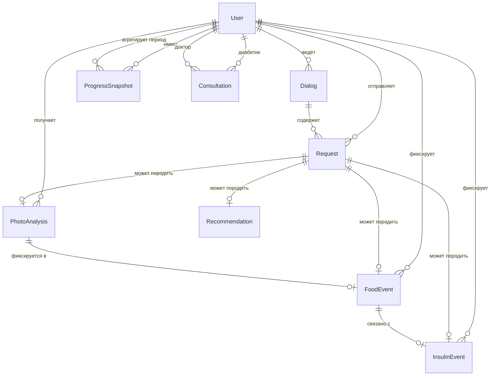

# Модель данных

Продуктовая основа: [idea.md](idea.md). Архитектура: [vision.md](vision.md).

Базовый перечень сущностей **на согласование** — минимальный набор для сопровождения диабетика: пользователи (диабетик, доктор), диалоги, запросы, **анализ фото по составу (ХЕ, БЖЕ, БЖУ)**, события питания и инсулина, рекомендации, снимки прогресса, консультации.

## Соответствие продуктовым сценариям

| Сценарий из idea.md | Сущности |
|---------------------|----------|
| Диалог в боте / web | Диалог, Запрос |
| Подсчёт ХЕ / БЖЕ / анализ фото | Запрос, Анализ фото, Событие питания |
| Учёт инсулина | Событие инсулина (+ связь с Событием питания) |
| Динамика и тренды | Снимок прогресса |
| Рекомендации и прогноз | Рекомендация |
| Запись к доктору | Консультация, Пользователь (доктор) |
| Вопрос ассистенту (API) | Диалог, Запрос — [assistant-question.md](api/scenarios/assistant-question.md) |
| Фиксация питания / инсулина (API) | Событие питания, Событие инсулина — [event-record.md](api/scenarios/event-record.md) |

---

## API-поля (v1)

Маппинг домен → JSON REST API: [api-contract.md](api/api-contract.md) · [openapi.yaml](api/openapi.yaml):

| Домен | API JSON | Примечание |
|-------|----------|------------|
| хе | `xe` | number, ≥ 0 |
| бже | `bje` | number, ≥ 0 |
| белки / жиры / углеводы | `proteins`, `fats`, `carbs` | nullable |
| Telegram chat.id | `telegram_id` | integer в теле/query |
| доза инсулина | `dose` | фиксация факта, не назначение |
| источник события питания | `source` | `text`, `photo_dish`, `photo_product` |
| время события | `recorded_at`, `injected_at` | ISO 8601 UTC |

---

## Основные сущности

### Пользователь

**Назначение:** участник системы с ролью и доступом к данным.

| Поле | Описание | Тип (предполагаемый) |
|------|----------|----------------------|
| идентификатор | уникальный ID | UUID |
| роль | диабетик / доктор | enum |
| имя / отображаемое имя | для интерфейса | строка |
| контакт | Telegram ID, email и т.п. | строка |
| дата регистрации | когда создан профиль | datetime |
| активен | доступен ли аккаунт | boolean |

---

### Диалог

**Назначение:** сессия общения диабетика с системой (бот или web); контекст для последующих ответов и фиксаций.

| Поле | Описание | Тип |
|------|----------|-----|
| идентификатор | ID диалога | UUID |
| пользователь | ссылка на диабетика | UUID |
| канал | telegram / web | enum |
| начало / конец | границы сессии | datetime |
| статус | активен / завершён | enum |

---

### Запрос

**Назначение:** обращение пользователя к системе — текст, фото, вопрос; основа для анализа и ответа LLM.

| Поле | Описание | Тип |
|------|----------|-----|
| идентификатор | ID запроса | UUID |
| диалог | ссылка на сессию | UUID |
| пользователь | кто отправил | UUID |
| тип | текст / фото / смешанный | enum |
| содержание | текст вопроса | текст |
| медиа | ссылка на фото (если есть) | строка (URL) |
| категория | ХЕ / БЖЕ / БЖУ / инсулин / общий | enum |
| время | момент запроса | datetime |

---

### Анализ фото (состав)

**Назначение:** результат распознавания блюда или продукта по фото — оценка ХЕ, БЖЕ и макросостава **БЖУ** (белки, жиры, углеводы). Источник: vision-модель через LLM.

| Поле | Описание | Тип |
|------|----------|-----|
| идентификатор | ID анализа | UUID |
| запрос | исходный запрос с фото | UUID |
| пользователь | диабетик | UUID |
| тип объекта | блюдо / продукт / этикетка | enum |
| медиа | ссылка на фото | строка (URL) |
| хе | хлебные единицы (оценка) | decimal, nullable |
| бже | белково-жировые единицы (оценка) | decimal, nullable |
| белки | граммы или доля | decimal, nullable |
| жиры | граммы или доля | decimal, nullable |
| углеводы | граммы или доля | decimal, nullable |
| уверенность | насколько надёжна оценка | enum / decimal, nullable |
| комментарий | пояснение и оговорки LLM | текст, nullable |
| время | когда выполнен анализ | datetime |

> Оценки справочные; при низкой уверенности система может запросить уточнение у пользователя.

---

### Событие питания

**Назначение:** фиксация приёма пищи или продукта с оценкой ХЕ, БЖЕ и при необходимости БЖУ (из текста или **анализа фото**).

| Поле | Описание | Тип |
|------|----------|-----|
| идентификатор | ID события | UUID |
| пользователь | диабетик | UUID |
| запрос | исходный запрос (если из диалога) | UUID, nullable |
| анализ фото | результат vision-анализа (если по фото) | UUID, nullable |
| описание | что съедено | текст |
| хе | хлебные единицы (оценка) | decimal |
| бже | белково-жировые единицы (оценка) | decimal |
| белки | БЖУ: белки | decimal, nullable |
| жиры | БЖУ: жиры | decimal, nullable |
| углеводы | БЖУ: углеводы | decimal, nullable |
| источник | текст / фото блюда / фото продукта | enum |
| время | когда зафиксировано | datetime |
| комментарий | пояснение LLM или пользователя | текст, nullable |

---

### Событие инсулина

**Назначение:** фиксация введения инсулина и связь с контекстом еды.

| Поле | Описание | Тип |
|------|----------|-----|
| идентификатор | ID события | UUID |
| пользователь | диабетик | UUID |
| событие питания | связанный приём пищи (если есть) | UUID, nullable |
| доза | количество единиц | decimal |
| время введения | когда подколот | datetime |
| окно действия | справочно: в течение какого времени учитывать | строка / интервал, nullable |
| комментарий | контекст от LLM или пользователя | текст, nullable |

---

### Рекомендация

**Назначение:** справочный вывод системы по запросу или на основе накопленных данных (без назначения доз).

| Поле | Описание | Тип |
|------|----------|-----|
| идентификатор | ID рекомендации | UUID |
| пользователь | кому выдана | UUID |
| запрос | исходный запрос | UUID, nullable |
| текст | содержание рекомендации | текст |
| тип | питание / инсулин / динамика / прогноз | enum |
| время | когда сформирована | datetime |

---

### Снимок прогресса

**Назначение:** фиксация состояния диабетика за период — база для отслеживания улучшений и ухудшений.

| Поле | Описание | Тип |
|------|----------|-----|
| идентификатор | ID снимка | UUID |
| пользователь | диабетик | UUID |
| период | день / неделя / месяц | enum |
| дата начала / конца | границы периода | date |
| сумма хе | агрегат за период | decimal |
| сумма бже | агрегат за период | decimal |
| сумма белков / жиров / углеводов | агрегаты БЖУ за период | decimal, nullable |
| сумма инсулина | агрегат за период | decimal |
| тренд | улучшение / стабильно / ухудшение | enum |
| комментарий | краткий вывод системы | текст, nullable |

---

### Консультация

**Назначение:** запись и проведение приёма у доктора (онлайн / офлайн).

| Поле | Описание | Тип |
|------|----------|-----|
| идентификатор | ID консультации | UUID |
| диабетик | кто записался | UUID |
| доктор | у кого приём | UUID |
| формат | online / offline | enum |
| время | слот приёма | datetime |
| статус | запланирована / проведена / отменена | enum |
| комментарий доктора | итог приёма | текст, nullable |

---

## Связи между сущностями

- **Пользователь (диабетик)** → много **Диалогов**, **Запросов**, **Анализов фото**, **Событий питания**, **Событий инсулина**, **Снимков прогресса**, **Консультаций**, **Рекомендаций**
- **Пользователь (доктор)** → много **Консультаций**
- **Диалог** → много **Запросов**
- **Запрос** → опционально порождает **Анализ фото**, **Событие питания**, **Событие инсулина**, **Рекомендацию**
- **Анализ фото** → опционально переносится в **Событие питания** (ХЕ, БЖЕ, БЖУ)
- **Событие питания** ↔ опционально **Событие инсулина** (связь еда–инсулин)
- **Снимок прогресса** агрегирует **События питания** и **События инсулина** за период
- **Рекомендация** может опираться на **Запрос** и историю событий

---

## Выбор СУБД

**Принятое решение:** PostgreSQL — см. [adr-001-database.md](adr/adr-001-database.md).

| Критерий | Почему PostgreSQL |
|----------|-------------------|
| Реляционная модель | пользователи, события, консультации — чёткие связи |
| JSONB | ответы LLM, метаданные фото |
| Multi-service | единый слой данных для bot, web, backend |
| Масштабирование | read-replica, TimescaleDB — без смены СУБД |

На этапе MVP-бота (RAM, без backend) БД не используется — см. [vision.md](vision.md).

---

## Что вне scope этого документа

- Детали endpoint'ов — [api-contract.md](api/api-contract.md) · [docs/api/](api/)
- детали интеграций — см. [integrations.md](integrations.md)

---

## SQL-схема MVP (task-05)

Миграция: [`alembic/versions/001_initial_schema.py`](../alembic/versions/001_initial_schema.py)

| Таблица | Назначение | Ключевые FK |
|---------|------------|-------------|
| `users` | пользователь по `telegram_id` | — |
| `dialogs` | сессия (channel=`telegram`) | `user_id` → users |
| `dialog_requests` | запрос + reply LLM | `dialog_id`, `user_id` |
| `food_events` | событие питания | `user_id`, optional `request_id` |
| `insulin_events` | событие инсулина | `user_id`, optional `food_event_id` |

PhotoAnalysis, Recommendation, ProgressSnapshot — post-MVP (iteration 4+).
