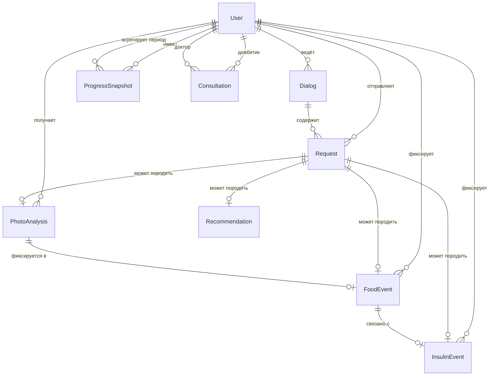

# Модель данных

Продуктовая основа: [idea.md](idea.md). Архитектура: [vision.md](vision.md).

Базовый перечень сущностей — минимальный набор для сопровождения диабетика: пользователи (диабетик, доктор), диалоги, запросы, **анализ фото по составу (ХЕ, БЖЕ, БЖУ)**, события питания и инсулина, рекомендации, снимки прогресса, консультации. Физическая схема PostgreSQL — [schema-er.md](spec/schema-er.md) (database iter 2).

## Соответствие продуктовым сценариям

| Сценарий из idea.md | Сущности |
|---------------------|----------|
| Диалог в боте / web | Диалог, Запрос |
| Подсчёт ХЕ / БЖЕ / анализ фото | Запрос, Анализ фото, Событие питания |
| Учёт инсулина | Событие инсулина (+ связь с Событием питания) |
| Динамика и тренды | Снимок прогресса |
| Рекомендации и прогноз | Рекомендация |
| Запись к доктору | Консультация, Пользователь (доктор) |
| Вопрос ассистенту (API) | Диалог, Запрос — [assistant-question.md](api/scenarios/assistant-question.md) |
| Фиксация питания / инсулина (API) | Событие питания, Событие инсулина — [event-record.md](api/scenarios/event-record.md) |

Детальные сценарии UI и read/write — [docs/spec/](spec/) ([user-scenarios.md](spec/user-scenarios.md), [data-requirements.md](spec/data-requirements.md)).

---

## Требования из сценариев

Источник: database iter 1 — [data-requirements.md](spec/data-requirements.md).

| Сценарий | Сущности |
|----------|----------|
| D1 Дневник | FoodEvent, InsulinEvent |
| D2 Вопрос ассистенту | Dialog, Request, User |
| D3 Динамика | ProgressSnapshot, FoodEvent, InsulinEvent |
| D4 Рекомендации | Recommendation |
| D5–D6 Консультации | Consultation, User (doctor) |
| D7 Анализ фото | PhotoAnalysis, Request, FoodEvent |
| Doc1–Doc4 Доктор | User, ProgressSnapshot, Consultation, события пациента |

---

## Gap analysis: MVP schema → целевая модель

Текущие миграции: [`001_initial_schema.py`](../alembic/versions/001_initial_schema.py), [`002_full_data_layer.py`](../alembic/versions/002_full_data_layer.py) (database iter 5 ✅). Спецификация — [schema-er.md](spec/schema-er.md).

| Доменная сущность | В `001` | Целевая таблица | Статус |
|-------------------|---------|-----------------|--------|
| User | `users` | `users` (+ display_name, email) | ✅ `002` |
| Dialog | `dialogs` | `dialogs` | ✅ |
| Request | `dialog_requests` | `dialog_requests` | ✅ |
| FoodEvent | `food_events` | `food_events` | ✅ |
| InsulinEvent | `insulin_events` | `insulin_events` | ✅ |
| PhotoAnalysis | нет | `photo_analyses` | ✅ `002` |
| ProgressSnapshot | нет | `progress_snapshots` | ✅ `002` |
| Recommendation | нет | `recommendations` | ✅ `002` |
| Consultation | нет | `consultations` | ✅ `002` |

Решения open questions iter 1: таблица `photo_analyses`, persist `progress_snapshots`, doctor в `users`, связь patient–doctor через `consultations` — [schema-er.md §1](spec/schema-er.md#1-логическая-модель).

---

## API-поля (v1)

Маппинг домен → JSON REST API: [api-contract.md](api/api-contract.md) · [openapi.yaml](api/openapi.yaml):

| Домен | API JSON | Примечание |
|-------|----------|------------|
| хе | `xe` | number, ≥ 0 |
| бже | `bje` | number, ≥ 0 |
| белки / жиры / углеводы | `proteins`, `fats`, `carbs` | nullable |
| Telegram chat.id | `telegram_id` | integer в теле/query |
| доза инсулина | `dose` | фиксация факта, не назначение |
| источник события питания | `source` | `text`, `photo_dish`, `photo_product` |
| время события | `recorded_at`, `injected_at` | ISO 8601 UTC |

---

## Основные сущности

> **PostgreSQL-типы и ограничения** — в целевой схеме [schema-er.md](spec/schema-er.md). Ниже — доменное описание; колонка «PG (целевая)» — маппинг по skill [postgresql-table-design](../.agents/skills/postgresql-table-design/SKILL.md).

### Пользователь → `users`

**Назначение:** участник системы с ролью и доступом к данным.

| Поле | Описание | Домен | PG (целевая) |
|------|----------|-------|--------------|
| идентификатор | уникальный ID | UUID | `UUID` PK |
| роль | диабетик / доктор | enum | `TEXT NOT NULL CHECK (role IN ('diabetic','doctor'))` |
| имя / отображаемое имя | для интерфейса | строка | `display_name TEXT` |
| контакт | Telegram ID, email | строка | `telegram_id BIGINT` partial UNIQUE; `email TEXT` |
| дата регистрации | когда создан профиль | datetime | `created_at TIMESTAMPTZ NOT NULL DEFAULT now()` |
| активен | доступен ли аккаунт | boolean | `is_active BOOLEAN NOT NULL` |

---

### Диалог → `dialogs`

**Назначение:** сессия общения диабетика с системой (бот или web); контекст для последующих ответов и фиксаций.

| Поле | Описание | Домен | PG (целевая) |
|------|----------|-------|--------------|
| идентификатор | ID диалога | UUID | `UUID` PK |
| пользователь | ссылка на диабетика | UUID | `user_id UUID NOT NULL` FK → users |
| канал | telegram / web | enum | `channel TEXT NOT NULL` |
| начало | граница сессии | datetime | `started_at TIMESTAMPTZ NOT NULL` |
| статус | активен / завершён | enum | `status TEXT NOT NULL` |
| конец | граница сессии | datetime | *(не persist; backlog)* |

---

### Запрос → `dialog_requests`

**Назначение:** обращение пользователя к системе — текст, фото, вопрос; основа для анализа и ответа LLM.

| Поле | Описание | Домен | PG (целевая) |
|------|----------|-------|--------------|
| идентификатор | ID запроса | UUID | `UUID` PK |
| диалог | ссылка на сессию | UUID | `dialog_id UUID NOT NULL` FK |
| пользователь | кто отправил | UUID | `user_id UUID NOT NULL` FK |
| тип | текст / фото / смешанный | enum | `type TEXT NOT NULL` |
| содержание | текст вопроса | текст | `content TEXT` |
| ответ LLM | reply ассистента | текст | `reply TEXT NOT NULL` |
| медиа | метаданные фото | JSON | `media JSON` *(001)* / JSONB *(опц.)* |
| время | момент запроса | datetime | `created_at TIMESTAMPTZ NOT NULL` |
| категория | ХЕ / БЖЕ / … | enum | *(не persist; вывод LLM / backlog)* |

---

### Анализ фото → `photo_analyses`

**Назначение:** результат распознавания блюда или продукта по фото — оценка ХЕ, БЖЕ и макросостава **БЖУ**. Источник: vision-модель через LLM.

| Поле | Описание | Домен | PG (целевая) |
|------|----------|-------|--------------|
| идентификатор | ID анализа | UUID | `UUID` PK |
| запрос | исходный запрос с фото | UUID | `request_id UUID NOT NULL` FK |
| пользователь | диабетик | UUID | `user_id UUID NOT NULL` FK |
| событие питания | если зафиксировано | UUID | `food_event_id UUID` FK nullable |
| тип объекта | блюдо / продукт / этикетка | enum | `object_type TEXT CHECK (...)` |
| медиа | ссылка на фото | URL | в `dialog_requests.media` JSON |
| хе, бже, БЖУ | оценки | decimal | `NUMERIC(10,2)` nullable |
| уверенность | надёжность оценки | decimal | `confidence NUMERIC(3,2) CHECK 0..1` |
| комментарий | оговорки LLM | текст | `comment TEXT` |
| время | когда выполнен | datetime | `created_at TIMESTAMPTZ NOT NULL` |

> Оценки справочные; при низкой уверенности система может запросить уточнение у пользователя.

---

### Событие питания → `food_events`

**Назначение:** фиксация приёма пищи с оценкой ХЕ, БЖЕ и при необходимости БЖУ.

| Поле | Описание | Домен | PG (целевая) |
|------|----------|-------|--------------|
| идентификатор | ID события | UUID | `UUID` PK |
| пользователь | диабетик | UUID | `user_id UUID NOT NULL` FK |
| запрос | если из диалога | UUID | `request_id UUID` FK nullable |
| анализ фото | если по фото | UUID | связь через `photo_analyses.food_event_id` *(обратный FK)* |
| описание | что съедено | текст | `description TEXT NOT NULL` |
| хе, бже, БЖУ | оценки | decimal | `xe`, `bje` `NUMERIC(10,2) NOT NULL`; proteins/fats/carbs nullable |
| источник | text / photo_dish / … | enum | `source TEXT NOT NULL` |
| время | когда зафиксировано | datetime | `recorded_at TIMESTAMPTZ NOT NULL` |
| комментарий | пояснение | текст | `comment TEXT` |

---

### Событие инсулина → `insulin_events`

**Назначение:** фиксация введения инсулина и связь с контекстом еды.

| Поле | Описание | Домен | PG (целевая) |
|------|----------|-------|--------------|
| идентификатор | ID события | UUID | `UUID` PK |
| пользователь | диабетик | UUID | `user_id UUID NOT NULL` FK |
| событие питания | связанный приём | UUID | `food_event_id UUID` FK nullable |
| доза | количество единиц | decimal | `dose NUMERIC(10,2) NOT NULL` |
| время введения | когда подколот | datetime | `injected_at TIMESTAMPTZ NOT NULL` |
| время записи | когда зафиксировано | datetime | `recorded_at TIMESTAMPTZ NOT NULL` |
| окно действия | справочно | интервал | *(не persist; backlog)* |
| комментарий | контекст | текст | `comment TEXT` |

---

### Рекомендация → `recommendations`

**Назначение:** справочный вывод системы (без назначения доз).

| Поле | Описание | Домен | PG (целевая) |
|------|----------|-------|--------------|
| идентификатор | ID | UUID | `UUID` PK |
| пользователь | кому выдана | UUID | `user_id UUID NOT NULL` FK |
| запрос | исходный запрос | UUID | `request_id UUID` FK nullable |
| текст | содержание | текст | `text TEXT NOT NULL` |
| тип | nutrition / insulin / … | enum | `type TEXT CHECK (...)` |
| время | когда сформирована | datetime | `created_at TIMESTAMPTZ NOT NULL` |

---

### Снимок прогресса → `progress_snapshots`

**Назначение:** фиксация состояния диабетика за период — база для динамики (D3).

| Поле | Описание | Домен | PG (целевая) |
|------|----------|-------|--------------|
| идентификатор | ID | UUID | `UUID` PK |
| пользователь | диабетик | UUID | `user_id UUID NOT NULL` FK |
| период | day / week / month | enum | `period TEXT CHECK (...)` |
| дата начала / конца | границы | date | `period_start`, `period_end DATE NOT NULL`; CHECK `start <= end` |
| суммы хе, бже, инсулина, БЖУ | агрегаты | decimal | `sum_* NUMERIC(10,2)` |
| тренд | improving / stable / … | enum | `trend TEXT CHECK (...)` |
| комментарий | вывод системы | текст | `comment TEXT` |
| время создания | persist | datetime | `created_at TIMESTAMPTZ NOT NULL` |

---

### Консультация → `consultations`

**Назначение:** запись и проведение приёма у доктора.

| Поле | Описание | Домен | PG (целевая) |
|------|----------|-------|--------------|
| идентификатор | ID | UUID | `UUID` PK |
| диабетик | кто записался | UUID | `diabetic_id UUID NOT NULL` FK |
| доктор | у кого приём | UUID | `doctor_id UUID NOT NULL` FK; CHECK `!= diabetic_id` |
| формат | online / offline | enum | `format TEXT CHECK (...)` |
| время | слот приёма | datetime | `scheduled_at TIMESTAMPTZ NOT NULL` |
| статус | scheduled / completed / … | enum | `status TEXT CHECK (...)` |
| комментарий доктора | итог приёма | текст | `doctor_comment TEXT` |
| время создания | запись | datetime | `created_at TIMESTAMPTZ NOT NULL` |

---

## Связи между сущностями

- **Пользователь (диабетик)** → много **Диалогов**, **Запросов**, **Анализов фото**, **Событий питания**, **Событий инсулина**, **Снимков прогресса**, **Консультаций**, **Рекомендаций**
- **Пользователь (доктор)** → много **Консультаций**
- **Диалог** → много **Запросов**
- **Запрос** → опционально порождает **Анализ фото**, **Событие питания**, **Событие инсулина**, **Рекомендацию**
- **Анализ фото** → опционально переносится в **Событие питания** (ХЕ, БЖЕ, БЖУ)
- **Событие питания** ↔ опционально **Событие инсулина** (связь еда–инсулин)
- **Снимок прогресса** агрегирует **События питания** и **События инсулина** за период
- **Рекомендация** может опираться на **Запрос** и историю событий

---

## Выбор СУБД

**Принятое решение:** PostgreSQL — см. [adr-001-database.md](adr/adr-001-database.md).

| Критерий | Почему PostgreSQL |
|----------|-------------------|
| Реляционная модель | пользователи, события, консультации — чёткие связи |
| JSONB | ответы LLM, метаданные фото |
| Multi-service | единый слой данных для bot, web, backend |
| Масштабирование | read-replica, TimescaleDB — без смены СУБД |

На этапе MVP backend PostgreSQL уже используется (`001_initial_schema`); целевая схема — [schema-er.md](spec/schema-er.md).

---

## PostgreSQL design review

Проверка по skill [postgresql-table-design](../.agents/skills/postgresql-table-design/SKILL.md) · детали физики — [schema-er.md](spec/schema-er.md) · [schema-review.md](spec/schema-review.md).

### Итог

| Статус | Кол-во | Суть |
|--------|--------|------|
| **Pass** | 18 | Типы, FK+индексы, TIMESTAMPTZ, NUMERIC, TEXT+CHECK, 3NF, JSON для media |
| **Warn** | 5 | UUID PK; JSON→JSONB; FK ON DELETE на `001`; доменные поля без колонки; CHECK `xe >= 0` |
| **Fix** | 0 | — |

### Checklist (skill → data-model)

| # | Правило skill | Статус | Комментарий |
|---|---------------|--------|-------------|
| 1 | PK на reference tables | **Pass** | 9 таблиц, UUID PK |
| 2 | BIGINT IDENTITY vs UUID | **Warn** | UUID — совместимость с `001`, opaque API IDs |
| 3 | NOT NULL семантически обязательных | **Pass** | См. колонки «PG (целевая)» выше |
| 4 | TIMESTAMPTZ, не TIMESTAMP | **Pass** | Все event time; domain «datetime» → TIMESTAMPTZ |
| 5 | NUMERIC для xe/bje/dose | **Pass** | `NUMERIC(10,2)`; не float/money |
| 6 | TEXT, не VARCHAR/CHAR | **Pass** | Строки и enum-like — TEXT |
| 7 | TEXT+CHECK, не PG ENUM | **Pass** | role, status, period, trend |
| 8 | FK columns indexed | **Pass** | [schema-er §3.10](spec/schema-er.md#310-сводка-fk-on-delete-и-ограничения-целостности) |
| 9 | ON DELETE явно | **Warn** | Optional FK в `001` — NO ACTION; целевое SET NULL в iter 5 |
| 10 | Partial / composite indexes | **Pass** | Лента D1, snapshots, partial UNIQUE telegram_id |
| 11 | JSONB для semi-structured | **Warn** | `media` — JSON в `001`; JSONB + GIN опционально |
| 12 | Normalize (3NF) | **Pass** | PhotoAnalysis отдельно; агрегаты в progress_snapshots |
| 13 | UNIQUE для upsert snapshots | **Pass** | `(user_id, period, period_start)` |
| 14 | CHECK целостности | **Pass** | period bounds, diabetic≠doctor, confidence 0..1 |
| 15 | snake_case | **Pass** | Таблицы/колонки |
| 16 | Домен ↔ PG согласован | **Pass** | Маппинг в секции «Основные сущности» |
| 17 | Доменные поля без колонки | **Warn** | Dialog.end, Request.category, InsulinEvent.окно — backlog |
| 18 | CHECK xe/bje/dose ≥ 0 | **Warn** | API требует ≥ 0; DB CHECK — опционально iter 5 |
| 19 | Роль doctor на FK | **Warn** | `consultations.doctor_id` — enforcement в приложении |
| 20 | Связь FoodEvent↔PhotoAnalysis | **Pass** | Обратный FK `photo_analyses.food_event_id` (не дублировать) |

### Доменные поля без persist (backlog)

| Сущность | Поле | Причина |
|----------|------|---------|
| Dialog | конец сессии | достаточно `status`; `ended_at` — backlog |
| Request | категория (ХЕ/БЖЕ/…) | классификация в LLM/reply |
| InsulinEvent | окно действия | справочно, не для аналитики MVP |
| User | last_activity (Doc1) | computed query, не колонка |

### Warn — принятые отклонения

См. [schema-review.md](spec/schema-review.md#warn-принятые-отклонения). Дополнительно для data-model: домен historically использовал абстрактные «enum/datetime» — в iter 2 заменено колонкой **PG (целевая)**.

---

## Что вне scope этого документа

- Детали endpoint'ов — [api-contract.md](api/api-contract.md) · [docs/api/](api/)
- Физическая схема PostgreSQL — [schema-er.md](spec/schema-er.md); review — [schema-review.md](spec/schema-review.md)
- детали интеграций — [integrations.md](integrations.md)

---

## SQL-схема MVP (`001`)

Миграция: [`alembic/versions/001_initial_schema.py`](../alembic/versions/001_initial_schema.py). Для новых фич — целевая схема iter 2 ниже.

| Таблица | Назначение | Ключевые FK |
|---------|------------|-------------|
| `users` | пользователь по `telegram_id` | — |
| `dialogs` | сессия (channel=`telegram`) | `user_id` → users |
| `dialog_requests` | запрос + reply LLM | `dialog_id`, `user_id` |
| `food_events` | событие питания | `user_id`, optional `request_id` |
| `insulin_events` | событие инсулина | `user_id`, optional `food_event_id` |

---

## SQL-схема целевая (database iter 2)

Полная спецификация: [schema-er.md](spec/schema-er.md) · review: [schema-review.md](spec/schema-review.md). Impl миграции `002_*` — database iter 5.

| Таблица | Назначение | Ключевые FK / индексы |
|---------|------------|------------------------|
| `users` | диабетик / доктор | `display_name`, `email`; partial UNIQUE `telegram_id` |
| `dialogs` | сессия бота/web | `user_id` |
| `dialog_requests` | запрос + reply LLM, media JSON | `dialog_id`, `user_id` |
| `food_events` | событие питания | `user_id`, `request_id`; `(user_id, recorded_at DESC)` |
| `insulin_events` | событие инсулина | `user_id`, `food_event_id`; `(user_id, injected_at DESC)` |
| `photo_analyses` | vision-анализ фото (D7) | `user_id`, `request_id`, `food_event_id` |
| `progress_snapshots` | агрегаты за период (D3) | `user_id`, UNIQUE `(user_id, period, period_start)` |
| `recommendations` | справочные рекомендации (D4) | `user_id`, optional `request_id` |
| `consultations` | приём у доктора (D5–D6) | `diabetic_id`, `doctor_id` |
