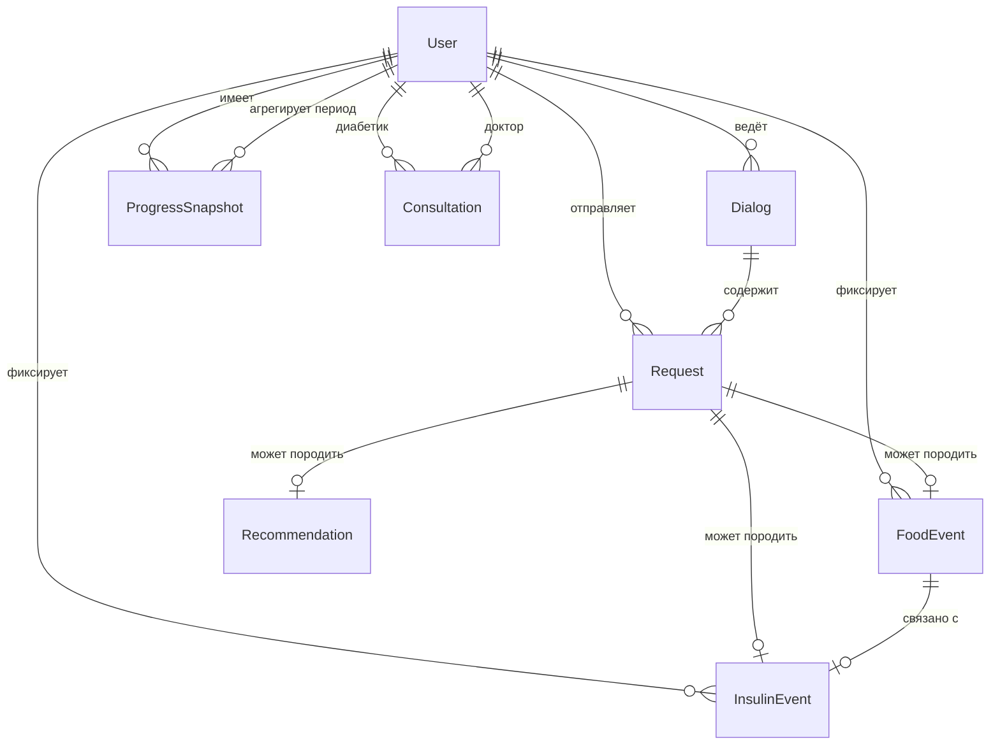

# Модель данных

Опирается на [idea.md](idea.md) и [vision.md](vision.md).

Базовый перечень сущностей **на согласование** — минимальный набор для сопровождения диабетика: пользователи, диалоги, фиксация событий (еда, инсулин, запросы), прогресс и аналитика.

---

## Основные сущности

### Пользователь

**Назначение:** участник системы с ролью и доступом к данным.

| Поле | Описание | Тип (предполагаемый) |
|------|----------|----------------------|
| идентификатор | уникальный ID | UUID |
| роль | диабетик / доктор | enum |
| имя / отображаемое имя | для интерфейса | строка |
| контакт | Telegram ID, email и т.п. | строка |
| дата регистрации | когда создан профиль | datetime |
| активен | доступен ли аккаунт | boolean |

---

### Диалог

**Назначение:** сессия общения диабетика с системой (бот или web); контекст для последующих ответов и фиксаций.

| Поле | Описание | Тип |
|------|----------|-----|
| идентификатор | ID диалога | UUID |
| пользователь | ссылка на диабетика | UUID |
| канал | telegram / web | enum |
| начало / конец | границы сессии | datetime |
| статус | активен / завершён | enum |

---

### Запрос

**Назначение:** обращение пользователя к системе — текст, фото, вопрос; основа для анализа и ответа LLM.

| Поле | Описание | Тип |
|------|----------|-----|
| идентификатор | ID запроса | UUID |
| диалог | ссылка на сессию | UUID |
| пользователь | кто отправил | UUID |
| тип | текст / фото / смешанный | enum |
| содержание | текст вопроса | текст |
| медиа | ссылка на фото (если есть) | строка (URL) |
| категория | ХЕ / БЖЕ / инсулин / общий | enum |
| время | момент запроса | datetime |

---

### Событие питания

**Назначение:** фиксация приёма пищи или продукта с оценкой ХЕ и БЖЕ.

| Поле | Описание | Тип |
|------|----------|-----|
| идентификатор | ID события | UUID |
| пользователь | диабетик | UUID |
| запрос | исходный запрос (если из диалога) | UUID, nullable |
| описание | что съедено | текст |
| хе | хлебные единицы (оценка) | decimal |
| бже | белково-жировые единицы (оценка) | decimal |
| источник | текст / фото блюда / фото продукта | enum |
| время | когда зафиксировано | datetime |
| комментарий | пояснение LLM или пользователя | текст, nullable |

---

### Событие инсулина

**Назначение:** фиксация введения инсулина и связь с контекстом еды.

| Поле | Описание | Тип |
|------|----------|-----|
| идентификатор | ID события | UUID |
| пользователь | диабетик | UUID |
| событие питания | связанный приём пищи (если есть) | UUID, nullable |
| доза | количество единиц | decimal |
| время введения | когда подколот | datetime |
| окно действия | справочно: в течение какого времени учитывать | строка / интервал, nullable |
| комментарий | контекст от LLM или пользователя | текст, nullable |

---

### Рекомендация

**Назначение:** справочный вывод системы по запросу или на основе накопленных данных (без назначения доз).

| Поле | Описание | Тип |
|------|----------|-----|
| идентификатор | ID рекомендации | UUID |
| пользователь | кому выдана | UUID |
| запрос | исходный запрос | UUID, nullable |
| текст | содержание рекомендации | текст |
| тип | питание / инсулин / динамика / прогноз | enum |
| время | когда сформирована | datetime |

---

### Снимок прогресса

**Назначение:** фиксация состояния диабетика за период — база для отслеживания улучшений и ухудшений.

| Поле | Описание | Тип |
|------|----------|-----|
| идентификатор | ID снимка | UUID |
| пользователь | диабетик | UUID |
| период | день / неделя / месяц | enum |
| дата начала / конца | границы периода | date |
| сумма хе | агрегат за период | decimal |
| сумма бже | агрегат за период | decimal |
| сумма инсулина | агрегат за период | decimal |
| тренд | улучшение / стабильно / ухудшение | enum |
| комментарий | краткий вывод системы | текст, nullable |

---

### Консультация

**Назначение:** запись и проведение приёма у доктора (онлайн / офлайн).

| Поле | Описание | Тип |
|------|----------|-----|
| идентификатор | ID консультации | UUID |
| диабетик | кто записался | UUID |
| доктор | у кого приём | UUID |
| формат | online / offline | enum |
| время | слот приёма | datetime |
| статус | запланирована / проведена / отменена | enum |
| комментарий доктора | итог приёма | текст, nullable |

---

## Связи между сущностями

- **Пользователь (диабетик)** → много **Диалогов**, **Запросов**, **Событий питания**, **Событий инсулина**, **Снимков прогресса**, **Консультаций**
- **Пользователь (доктор)** → много **Консультаций**
- **Диалог** → много **Запросов**
- **Запрос** → опционально порождает **Событие питания**, **Событие инсулина**, **Рекомендацию**
- **Событие питания** ↔ опционально **Событие инсулина** (связь еда–инсулин)
- **Снимок прогресса** агрегирует **События питания** и **События инсулина** за период
- **Рекомендация** может опираться на **Запрос** и историю событий

---

## Выбор СУБД

### MVP (первый backend + БД)

**PostgreSQL**

| Критерий | Почему подходит |
|----------|-----------------|
| Реляционная модель | пользователи, события, консультации — чёткие связи |
| JSONB | гибкое хранение ответов LLM, метаданных фото без жёсткой схемы |
| Зрелость | стандарт для multi-service backend |
| Простота | один инстанс на старте, без лишней инфраструктуры |

На этапе MVP бота (RAM, без backend) БД не используется — см. [vision.md](vision.md).

### Дальнейшее развитие

**PostgreSQL** остаётся основной СУБД:

- read-replica для аналитики и отчётов;
- при росте временных рядов (ХЕ/БЖЕ/инсулин по дням) — **TimescaleDB** (расширение PostgreSQL) или материализованные представления;
- object storage (S3-совместимое) — для фото вне БД, в PostgreSQL только ссылки.

Альтернативы (MongoDB, отдельная TS-БД) **не предлагаем** на старте: усложняют модель без выигрыша для текущего объёма связей.

---

## Что вне scope этого документа

- SQL-схемы, индексы, миграции
- API контракты
- детали интеграций — см. [integrations.md](integrations.md)
