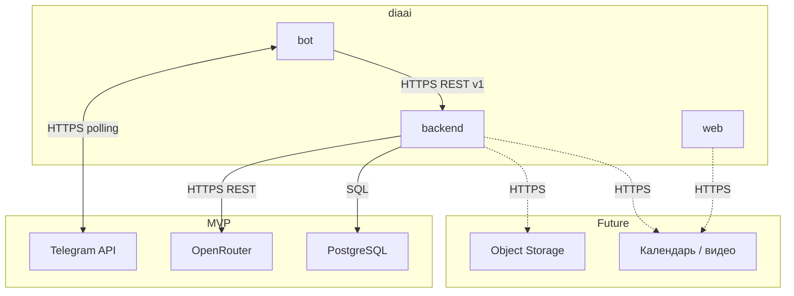
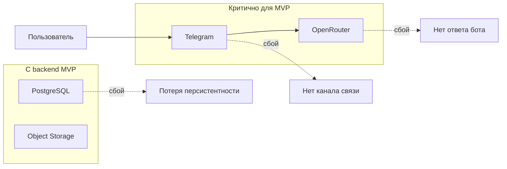

# Внешние интеграции

Опирается на [idea.md](idea.md), [vision.md](vision.md), [data-model.md](data-model.md).

Обзор связей системы **diaai** с внешними сервисами.

---

## Внешние системы

### Telegram Bot API

| | |
|---|---|
| **Сервис** | [Telegram Bot API](https://core.telegram.org/bots/api) · токен через [@BotFather](https://t.me/BotFather) |
| **Назначение** | первый клиент продукта: приём текста и фото, отправка ответов, команда `/start` |
| **Направление** | bidirectional |
| **Протокол** | HTTPS; long polling (MVP), webhook (возможно позже) |
| **Критичность** | **MVP** |

Компонент: `bot` — клиент backend API (task-07 ✅).

---

### Backend REST API

| | |
|---|---|
| **Сервис** | diaai backend (FastAPI) · [api-contract.md](../api/api-contract.md) |
| **Назначение** | ядро: сценарий A (вопрос ассистенту), сценарий B (фиксация питания/инсулина) |
| **Направление** | bidirectional |
| **Протокол** | HTTPS REST `/api/v1` · [openapi.yaml](../api/openapi.yaml) |
| **Критичность** | **MVP backend** (итерация 2) |

Компонент: `backend` (task-03–05 ✅). Клиенты: `bot` (task-07), `web` (frontend iter 2+). Auth: `Authorization: Bearer`, `telegram_id` в теле.

Контракты: [api-contract.md](../api/api-contract.md) · [frontend-contract.md](../api/frontend-contract.md) · [assistant-question.md](../api/scenarios/assistant-question.md) · [event-record.md](../api/scenarios/event-record.md).

---

### Web client (Next.js)

| | |
|---|---|
| **Сервис** | diaai web (`web/`) · [frontend-requirements.md](../spec/frontend-requirements.md) |
| **Назначение** | dashboard доктора, leaderboard, чат с ассистентом |
| **Направление** | bidirectional |
| **Протокол** | HTTPS REST `/api/v1/web/*` · [frontend-contract.md](../api/frontend-contract.md) |
| **Критичность** | **Planned** (frontend iter 2+) |

Компонент: `web`. Backend — единый источник данных (PostgreSQL). Auth MVP: Telegram username → BFF (Next Route Handler) → `POST /api/v1/web/auth/resolve`; `BACKEND_SERVICE_TOKEN` только на сервере.

Env (iter 2): `NEXT_PUBLIC_BACKEND_URL`, server-side `BACKEND_SERVICE_TOKEN`.

---

### OpenRouter (LLM)

| | |
|---|---|
| **Сервис** | [OpenRouter](https://openrouter.ai/) · [API docs](https://openrouter.ai/docs) · ключ: [settings/keys](https://openrouter.ai/settings/keys) |
| **Назначение** | диалог, оценка ХЕ / БЖЕ / БЖУ, vision-анализ фото блюда и продукта, справочные рекомендации |
| **Направление** | bidirectional (запрос → ответ модели) |
| **Протокол** | HTTPS REST, OpenAI-compatible API (`/v1/chat/completions`) |
| **Критичность** | **MVP** |

Компонент: **`backend`** (сценарий A). Бот не вызывает OpenRouter напрямую.

Инструкция по ключам: [how-to-get-tokens.md](how-to-get-tokens.md).

---

### PostgreSQL (managed)

| | |
|---|---|
| **Сервис** | Self-hosted или managed (RDS, Supabase, Neon и т.п.) — провайдер не фиксируется |
| **Назначение** | персистентное хранение пользователей, событий, аналитики, консультаций |
| **Направление** | bidirectional |
| **Протокол** | SQL по TCP/TLS |
| **Критичность** | **MVP backend** (сценарий B; см. [adr-001-database.md](adr/adr-001-database.md)) |

Компонент: `backend`. MVP-бот без БД (RAM) до task-07.

---

### Object Storage (S3-совместимое)

| | |
|---|---|
| **Сервис** | S3, MinIO, Cloudflare R2 и аналоги — провайдер не фиксируется |
| **Назначение** | хранение фото блюд и продуктов; в БД — только ссылки и метаданные |
| **Направление** | out (upload) / in (read по URL) |
| **Протокол** | HTTPS (S3 API) |
| **Критичность** | **Future** |

Компонент: `backend`.

---

### Календарь и видеосвязь

| | |
|---|---|
| **Сервис** | Не выбран (Google Calendar, Zoom, Telegram-звонки и т.п. — на этапе проектирования) |
| **Назначение** | онлайн-консультации пациент с диабетом ↔ доктор, запись на приём |
| **Направление** | bidirectional |
| **Протокол** | HTTPS REST / OAuth (зависит от провайдера) |
| **Критичность** | **Future** |

Компонент: `web`, `backend`.

---

## Зависимости и риски

| Интеграция | Критичность | Риск | Митигация |
|------------|-------------|------|-----------|
| **Telegram** | MVP, блокирующая | недоступность API, блокировки | понятное сообщение пользователю; мониторинг polling |
| **OpenRouter** | MVP, блокирующая | лимиты, таймауты, смена моделей | fallback-сообщение; таймауты; `LLM_MODEL` через env |
| **PostgreSQL** | MVP backend | недоступность БД | retry; события не сохраняются → 503 |
| **Object Storage** | Future | потеря медиа | CDN/репликация; не хранить бинарники в БД |
| **Календарь / видео** | Future | не выбран провайдер | отложено до сценария консультаций |

**Общие замечания**

- Секреты (`TELEGRAM_BOT_TOKEN`, API keys) — только в `.env`, не в репозитории.
- LLM и Telegram — **внешние зависимости**; при их недоступности продукт деградирует, но не должен падать без сообщения пользователю.
- Целевая архитектура: все внешние вызовы LLM и медиа — через **backend**, чтобы bot и web не дублировали интеграции.

---

## Что вне scope

- SDK и реализация клиентов
- SLA провайдеров

Эндпоинты и payload — [api-contract.md](../api/api-contract.md) · [docs/api/](../api/).
