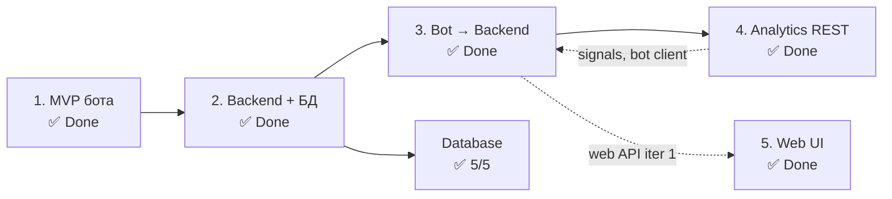

# Дорожная карта diaai

Опирается на [idea.md](idea.md) · [vision.md](vision.md) · [data-model.md](data-model.md) · [integrations.md](integrations.md)

---

## Организация работ

`plan.md` фиксирует **продуктовые этапы** верхнего уровня: что строим и в какой последовательности. Детализация — в tasklist'ах областей `docs/tasks/tasklist-<область>.md`.

| Область | Tasklist | Связь с этапами plan.md |
|---------|----------|-------------------------|
| bot | [tasklist-bot.md](tasks/tasklist-bot.md) | этапы 1, 3; voice — cross-cutting (frontend iter 8) |
| backend | [tasklist-backend.md](tasks/tasklist-backend.md) | этапы 2, 4 |
| database | [tasklist-database.md](tasks/tasklist-database.md) | параллельно этапу 2 ✅ (5/5) |
| frontend (web) | [tasklist-frontend.md](tasks/tasklist-frontend.md) | этап 5 ✅ (iter 0–9) |
| devops | [tasklist-devops.md](tasks/tasklist-devops.md) | **18/18 ✅** · VPS + CD · [summary](tasks/impl/devops/summary.md) |
| observability | [tasklist-observability.md](tasks/tasklist-observability.md) | ADR-005 · iter 1–3 ✅ |

Один продуктовый этап может затрагивать несколько областей; database и frontend ведут **свои** итерации внутри tasklist'ов.

---

## Ключевые принципы плана

**Поэтапность без переделки.** Каждый этап строится поверх предыдущего: MVP-бот не выбрасывается, а становится тонким клиентом; backend добавляется как новый слой, не заменяя существующее.

**Backend as core — раньше web.** Backend подключается до веб-интерфейса и становится единым слоем данных для всех клиентов. Веб и бот получают один источник истины.

**Ценность на каждом этапе.** Каждый этап поставляет работающий инкремент продукта или платформы — не промежуточный артефакт, а что-то, чем можно пользоваться.

---

## Легенда статусов

| Статус | Смысл |
|--------|-------|
| ✅ Done | завершён, критерии выполнены |
| 🚧 In Progress | в работе |
| 📋 Planned | запланирован, не начат |

---

## Обзор итераций

> **Параллельность:** web (этап 5) реализован **до** backend analytics REST (этап 4) — dashboard использует `/api/v1/web/*`, а не `/api/v1/analytics/*`. Этап 4 остаётся нужен для сигналов, рекомендаций и единого API для бота.

| Итерация | Название | Цель | Статус | Tasklist |
|----------|----------|------|--------|----------|
| 1 | MVP Telegram-бота | Запустить первый клиент с диалогом и анализом фото | ✅ Done | [tasklist-bot.md](tasks/tasklist-bot.md) |
| 2 | Backend-ядро и БД | Вынести данные и логику сопровождения в единый backend | ✅ Done | [tasklist-backend.md](tasks/tasklist-backend.md) · [tasklist-database.md](tasks/tasklist-database.md) |
| 3 | Миграция бота на backend | Сделать бота тонким клиентом без локального состояния | ✅ Done | [tasklist-bot.md](tasks/tasklist-bot.md) · [tasklist-backend.md](tasks/tasklist-backend.md) |
| 4 | Аналитика и динамика (backend REST) | `/api/v1/analytics/*`: снимки, сигналы, рекомендации | ✅ Done | [tasklist-backend.md](tasks/tasklist-backend.md) iter 4 |
| 5 | Веб-интерфейс | Dashboard, leaderboard, chat, voice, Text-to-SQL | ✅ Done | [tasklist-frontend.md](tasks/tasklist-frontend.md) |

**Не в таблице (закрыто в tasklist'ах):** database 5/5 ✅ · bot voice ✅ (frontend iter 8) · web analytics NL ✅ (frontend iter 9, `/api/v1/web/analytics/query`).

---

## Итерации

### Итерация 1 — MVP Telegram-бота `✅ Done`

**Ценность:** работающий бот: диалог с LLM, оценка ХЕ / БЖЕ / БЖУ, анализ фото (текст и изображение), история в RAM.

**Что сделано:**
- Telegram-бот на aiogram 3, long polling
- Прямой вызов OpenRouter (OpenAI-compatible)
- Обработчики текста и фото, `/start`
- SessionStore (история в RAM, без БД)
- Конфиг из env, логирование, `make install/run/lint/format`

**Критерии завершения:**
- бот стартует через `make run`
- отвечает на текст и фото
- ошибки LLM не роняют процесс

**Tasklist:** [docs/tasks/tasklist-bot.md](tasks/tasklist-bot.md)

---

### Итерация 2 — Backend-ядро и БД `✅ Done`

**Основание (backend итерация 1) ✅:** ADR-002, REST-контракты v1 — [summary](tasks/impl/backend/iteration-1-foundation/summary.md).

**Прогресс backend (задачи 01–08 ✅):** REST A/B, PostgreSQL, bot → API, quality gate — [iteration-2](tasks/impl/backend/iteration-2-core/summary.md) · [iteration-3](tasks/impl/backend/iteration-3-delivery/summary.md).

**Database (параллельно ✅):** 9 таблиц, ORM/repos, seed — [tasklist-database.md](tasks/tasklist-database.md).

**Ценность:** данные сохраняются между сессиями; появляется персистентный контекст пользователя.

**Что сделано:**
- REST API (FastAPI, [ADR-002](adr/adr-002-backend-stack.md)): auth, assistant, events
- PostgreSQL: схема, миграции Alembic, docker-compose (порт 5433)
- `make test` — **84** (67 backend + 17 bot); [backend/README.md](../backend/README.md)

**Критерии завершения:**
- backend принимает запросы и возвращает ответы ✅
- события питания и инсулина сохраняются в PostgreSQL ✅
- данные не теряются при перезапуске ✅

**Tasklist:** [docs/tasks/tasklist-backend.md](tasks/tasklist-backend.md) — [iteration-2 ✅](tasks/impl/backend/iteration-2-core/summary.md), [iteration-3 ✅](tasks/impl/backend/iteration-3-delivery/summary.md)

---

### Итерация 3 — Миграция бота на backend `✅ Done`

**Прогресс:** backend task-06–08 ✅ — bot → API, quality gate, история в PostgreSQL.

**Ценность:** бот становится тонким клиентом; единый контекст для всех будущих интерфейсов.

**Что сделано:**
- `src/diaai/backend_client.py` — httpx → backend API v1
- prod-путь без `LlmClient` / `SessionStore`
- env: `BACKEND_URL`, `BACKEND_SERVICE_TOKEN`
- structured logging, `/health` + version, quality docs (task-08)

**Критерии завершения:**
- бот не хранит состояние локально ✅
- история диалога персистентна между запусками бота ✅
- поведение для пользователя не изменилось ✅
- lint/test без утечки секретов в логах ✅

**Tasklist:** [tasklist-bot.md](tasks/tasklist-bot.md) · [tasklist-backend.md](tasks/tasklist-backend.md) · [iteration-3 summary](tasks/impl/backend/iteration-3-delivery/summary.md)

---

### Итерация 4 — Аналитика и динамика (backend REST) `✅ Done`

**Прогресс:** tasks 09–12 ✅ — [summary](tasks/impl/backend/iteration-4-analytics/summary.md)

**Ценность:** единый analytics API для бота и клиентов — тренды, сигналы, справочные рекомендации (без назначения доз).

**Частично закрыто (не заменяет этап 4):**
- Web dashboard KPI/activity/matrix — `/api/v1/web/patient|doctor/dashboard/*` ✅
- Таблицы `progress_snapshots`, `recommendations` в PG + seed ✅
- Text-to-SQL для доктора — `/api/v1/web/analytics/query` ✅ (frontend iter 9, отдельный контур)

**Что включает (backend iter 4, задачи 09–12):**
- Контракты `GET /api/v1/analytics/progress|signals|recommendations`
- Агрегация событий за day/week/month; эвристики сигналов
- Справочные recommendations; pytest + OpenAPI

**Критерии завершения:**
- backend отдаёт снимок прогресса за период по `telegram_id`
- сигналы и рекомендации доступны через `/api/v1/analytics/*`
- `make lint && make test` green; [summary](tasks/impl/backend/iteration-4-analytics/summary.md) ✅

**Tasklist:** [tasklist-backend.md](tasks/tasklist-backend.md) — [iteration-4 plan](tasks/impl/backend/iteration-4-analytics/plan.md)

---

### Итерация 5 — Веб-интерфейс `✅ Done`

**Ценность:** пациент — dashboard и чат; доктор — leaderboard и Text-to-SQL.

**Что сделано (frontend iter 0–9):** Next.js, `/dashboard`, `/leaderboard`, `/chat`, voice, analytics NL. Контракт: [frontend-contract.md](api/frontend-contract.md).

**Вне scope MVP (post-MVP):** запись на консультацию (D5), история консультаций (D6), карточка пациента доктора (Doc2–Doc4) — таблица `consultations` в PG есть, UI/API нет.

**Критерии завершения:** dashboard + chat + leaderboard ✅ · smoke: [smoke-test.md](smoke-test.md)

**Tasklist:** [tasklist-frontend.md](tasks/tasklist-frontend.md)

---

## Post-MVP (не в таблице этапов)

| Тема | Статус | Где детализировать |
|------|--------|-------------------|
| Backend analytics REST (этап 4) | 📋 Planned | [tasklist-backend.md](tasks/tasklist-backend.md) 09–12 |
| Консультации D5/D6, Doc2–Doc4 | 📋 Planned | [user-scenarios.md](spec/user-scenarios.md) |
| Production deploy (VPS + GHA CD) | ✅ iter 0–4 Done | [tasklist-devops.md](tasks/tasklist-devops.md) |
| Observability (GlitchTip, uptime, logs, metrics, alerting) | ✅ iter 1–3 Done | [tasklist-observability.md](tasks/tasklist-observability.md) · [ADR-005](adr/adr-005-observability.md) |
| Structured photo fields в assistant | 📋 Planned | backend README → iter 11 |

---

## Связанные документы

| Документ | Назначение |
|----------|------------|
| [idea.md](idea.md) | продуктовая модель и сценарии |
| [vision.md](vision.md) | границы системы и архитектура |
| [architecture.md](architecture.md) | компоненты, API, mermaid |
| [doc-audit.md](doc-audit.md) | аудит документации |
| [data-model.md](data-model.md) | доменные сущности |
| [integrations.md](integrations.md) | внешние сервисы и критичность |
| [adr/](adr/) | архитектурные решения |
| [templates/workflow.md](templates/workflow.md) | процесс работы и структура tasklist'ов |
| [prompts/generate-tasklist.md](prompts/generate-tasklist.md) | prompt и эталон декомпозиции tasklist'ов |
| [tasks/tasklist-backend.md](tasks/tasklist-backend.md) | детализация итераций 2 и 4 (backend) |
| [tasks/tasklist-bot.md](tasks/tasklist-bot.md) | MVP бота, миграция на backend, voice |
| [tasks/tasklist-frontend.md](tasks/tasklist-frontend.md) | web iter 0–9 ✅ |
| [tasks/tasklist-database.md](tasks/tasklist-database.md) | полноценный слой данных PostgreSQL ✅ |
| [tasks/tasklist-devops.md](tasks/tasklist-devops.md) | DevOps **18/18 ✅** · stack, GHCR, VPS, CD |
| [tasks/tasklist-observability.md](tasks/tasklist-observability.md) | Observability ADR-005 · iter 1–3 ✅ |
| [onboarding.md](onboarding.md) · [smoke-test.md](smoke-test.md) | вход разработчика · one-session проверка |
| [spec/](spec/) | продуктовые сценарии и требования к данным |
| [api/api-contract.md](api/api-contract.md) | REST API v1 — контракт, endpoint'ы, примеры |
| [api/conventions.md](api/conventions.md) | коды ошибок и соглашения REST API |
| [api/openapi.yaml](api/openapi.yaml) | OpenAPI 3.1 (machine-readable) |
