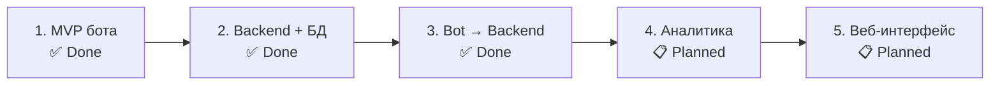

# Дорожная карта diaai

Опирается на [idea.md](idea.md) · [vision.md](vision.md) · [data-model.md](data-model.md) · [integrations.md](integrations.md)

---

## Организация работ

`plan.md` фиксирует этапы верхнего уровня: что строим и в какой последовательности. Детализация каждого этапа — в tasklist'е соответствующей области в `docs/tasks/tasklist-<область>.md`. Один этап соответствует одной области (bot, backend, web) и одному tasklist'у.

---

## Ключевые принципы плана

**Поэтапность без переделки.** Каждый этап строится поверх предыдущего: MVP-бот не выбрасывается, а становится тонким клиентом; backend добавляется как новый слой, не заменяя существующее.

**Backend as core — раньше web.** Backend подключается до веб-интерфейса и становится единым слоем данных для всех клиентов. Веб и бот получают один источник истины.

**Ценность на каждом этапе.** Каждый этап поставляет работающий инкремент продукта или платформы — не промежуточный артефакт, а что-то, чем можно пользоваться.

---

## Легенда статусов

| Статус | Смысл |
|--------|-------|
| ✅ Done | завершён, критерии выполнены |
| 🚧 In Progress | в работе |
| 📋 Planned | запланирован, не начат |

---

## Обзор итераций

| Итерация | Название | Цель | Статус | Tasklist |
|----------|----------|------|--------|----------|
| 1 | MVP Telegram-бота | Запустить первый клиент с диалогом и анализом фото | ✅ Done | [docs/tasks/tasklist-bot.md](tasks/tasklist-bot.md) |
| 2 | Backend-ядро и БД | Вынести данные и логику сопровождения в единый backend | ✅ Done | [docs/tasks/tasklist-backend.md](tasks/tasklist-backend.md) |
| 3 | Миграция бота на backend | Сделать бота тонким клиентом без локального состояния | ✅ Done | [docs/tasks/tasklist-bot.md](tasks/tasklist-bot.md) |
| 4 | Аналитика и динамика состояния | Добавить прогресс, тренды и сигналы изменений | 📋 Planned | [docs/tasks/tasklist-backend.md](tasks/tasklist-backend.md) |
| 5 | Веб-интерфейс (диабетик/доктор) | Дать единый web-доступ к данным и консультациям | 📋 Planned | [docs/tasks/tasklist-web.md](tasks/tasklist-web.md) |

---

## Итерации

### Итерация 1 — MVP Telegram-бота `✅ Done`

**Ценность:** работающий бот: диалог с LLM, оценка ХЕ / БЖЕ / БЖУ, анализ фото (текст и изображение), история в RAM.

**Что сделано:**
- Telegram-бот на aiogram 3, long polling
- Прямой вызов OpenRouter (OpenAI-compatible)
- Обработчики текста и фото, `/start`
- SessionStore (история в RAM, без БД)
- Конфиг из env, логирование, `make install/run/lint/format`

**Критерии завершения:**
- бот стартует через `make run`
- отвечает на текст и фото
- ошибки LLM не роняют процесс

**Tasklist:** [docs/tasks/tasklist-bot.md](tasks/tasklist-bot.md)

---

### Итерация 2 — Backend-ядро и БД `✅ Done`

**Основание (backend итерация 1) ✅:** ADR-002, REST-контракты v1 — [summary](tasks/impl/backend/iteration-1-foundation/summary.md).

**Прогресс backend (6/8 задач):** impl endpoint'ов A/B + PostgreSQL ✅ (task-05); документация backend ✅ (task-06).

**Ценность:** данные сохраняются между сессиями; появляется персистентный контекст пользователя.

**Что сделано:**
- REST API (FastAPI, [ADR-002](adr/adr-002-backend-stack.md)): auth, assistant, events
- PostgreSQL: схема, миграции Alembic, docker-compose (порт 5433)
- 21 тест; [backend/README.md](../backend/README.md) — онбординг

**Критерии завершения:**
- backend принимает запросы и возвращает ответы ✅
- события питания и инсулина сохраняются в PostgreSQL ✅
- данные не теряются при перезапуске ✅

**Tasklist:** [docs/tasks/tasklist-backend.md](tasks/tasklist-backend.md) — [iteration-2 ✅](tasks/impl/backend/iteration-2-core/summary.md), [iteration-3 ✅](tasks/impl/backend/iteration-3-delivery/summary.md)

---

### Итерация 3 — Миграция бота на backend `✅ Done`

**Прогресс:** backend task-06–08 ✅ — bot → API, quality gate, история в PostgreSQL.

**Ценность:** бот становится тонким клиентом; единый контекст для всех будущих интерфейсов.

**Что сделано:**
- `src/diaai/backend_client.py` — httpx → backend API v1
- prod-путь без `LlmClient` / `SessionStore`
- env: `BACKEND_URL`, `BACKEND_SERVICE_TOKEN`
- structured logging, `/health` + version, quality docs (task-08)

**Критерии завершения:**
- бот не хранит состояние локально ✅
- история диалога персистентна между запусками бота ✅
- поведение для пользователя не изменилось ✅
- lint/test без утечки секретов в логах ✅

**Tasklist:** [tasklist-bot.md](tasks/tasklist-bot.md) · [tasklist-backend.md](tasks/tasklist-backend.md) · [iteration-3 summary](tasks/impl/backend/iteration-3-delivery/summary.md)

---

### Итерация 4 — Аналитика и динамика состояния `📋 Planned`

**Ценность:** система показывает тренды и отклонения — пользователь видит динамику, а не только текущий момент.

**Что включает:**
- агрегация событий за период (день / неделя / месяц)
- Снимки прогресса: сумма ХЕ / БЖЕ / БЖУ / инсулина, тренд
- Сигналы изменений: заметные сдвиги в рационе и дозах
- Рекомендации на основе динамики (справочные, без назначения доз)
- Элементы прогнозирования при сохранении паттернов

**Критерии завершения:**
- backend формирует снимки прогресса за период
- система выдаёт рекомендации на основе истории питания и инсулина
- сигналы изменений доступны через API

**Tasklist:** [docs/tasks/tasklist-backend.md](tasks/tasklist-backend.md) — [итерация 4 в tasklist](tasks/tasklist-backend.md#итерация-4-аналитика-и-динамика-)

---

### Итерация 5 — Веб-интерфейс (диабетик/доктор) `📋 Planned`

**Ценность:** диабетик видит аналитику и динамику состояния в удобном веб-приложении; опционально — доктор и консультации.

**Что включает:**
- единый frontend-проект (роли: диабетик, доктор)
- интерфейс диабетика: история событий, снимки прогресса, тренды
- запись на онлайн / офлайн консультацию
- интерфейс доктора (опционально): обзор пациента, комментарии

**Критерии завершения:**
- диабетик видит динамику состояния за выбранный период
- работает с тем же backend что и бот
- запись к доктору функционирует (хотя бы базовый сценарий)

**Tasklist:** [docs/tasks/tasklist-web.md](tasks/tasklist-web.md)

---

## Связанные документы

| Документ | Назначение |
|----------|------------|
| [idea.md](idea.md) | продуктовая модель и сценарии |
| [vision.md](vision.md) | границы системы и архитектура |
| [data-model.md](data-model.md) | доменные сущности |
| [integrations.md](integrations.md) | внешние сервисы и критичность |
| [adr/](adr/) | архитектурные решения |
| [templates/workflow.md](templates/workflow.md) | процесс работы и структура tasklist'ов |
| [prompts/generate-tasklist.md](prompts/generate-tasklist.md) | prompt и эталон декомпозиции tasklist'ов |
| [tasks/tasklist-backend.md](tasks/tasklist-backend.md) | детализация итераций 2 и 4 (backend) |
| [api/conventions.md](api/conventions.md) | коды ошибок и соглашения REST API |
