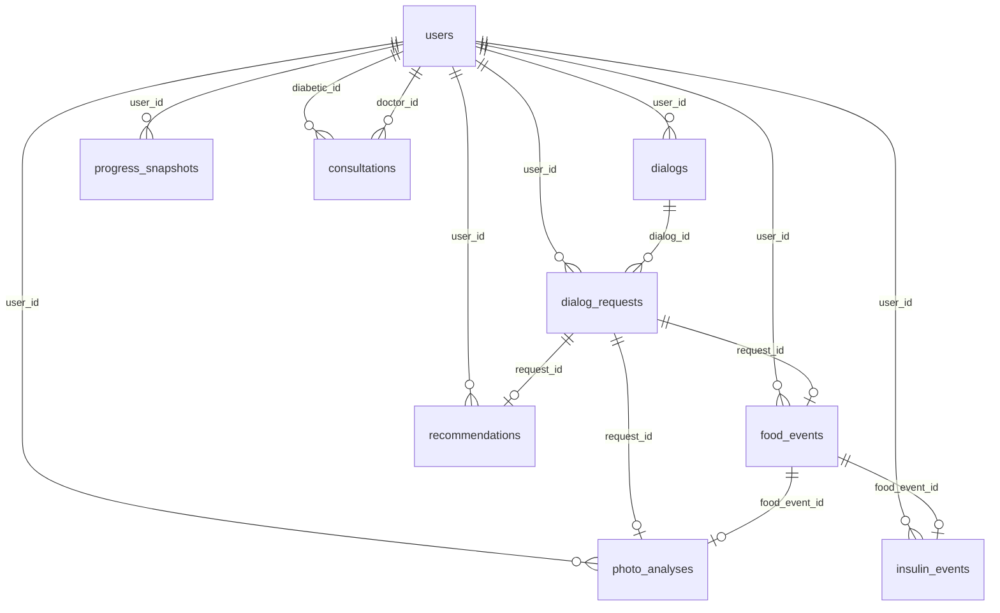

# ER и физическая схема PostgreSQL

Опирается на [user-scenarios.md](user-scenarios.md) · [data-requirements.md](data-requirements.md) · [data-model.md](../data-model.md)

Design review — [schema-review.md](schema-review.md). Миграция `002_*` — [`alembic/versions/002_full_data_layer.py`](../../alembic/versions/002_full_data_layer.py) (database iter 5 ✅).

---

## 1. Логическая модель

### Решения open questions (iter 1)

| Вопрос | Решение |
|--------|---------|
| PhotoAnalysis | Таблица `photo_analyses` + FK `request_id`, опц. FK `food_event_id` |
| ProgressSnapshot | Persist в `progress_snapshots` |
| Doctor User | `users.role` + `display_name`; `telegram_id` nullable для doctor |
| Patient–doctor | Только через `consultations` |

`dialog_requests.media` (JSONB) — raw metadata фото; структурированные оценки ХЕ/БЖУ — в `photo_analyses`.

### Cardinality и FK

| Связь | Cardinality | Nullable FK | ON DELETE |
|-------|-------------|-------------|-----------|
| User → Dialog, Request, events, snapshots, recommendations | 1:N | — | RESTRICT |
| User (doctor) → Consultation | 1:N | — | RESTRICT |
| Dialog → Request | 1:N | — | RESTRICT |
| Request → PhotoAnalysis | 1:0..1 | `request_id` NOT NULL в analysis | RESTRICT |
| PhotoAnalysis → FoodEvent | 0..1:0..1 | `food_event_id` nullable | SET NULL |
| Request → FoodEvent | 1:0..1 | `request_id` nullable | SET NULL |
| FoodEvent → InsulinEvent | 1:0..1 | `food_event_id` nullable | SET NULL |
| Request → Recommendation | 1:0..1 | `request_id` nullable | SET NULL |

### Сценарий → сущность → таблица

| ID | Read/Write | Таблицы |
|----|------------|---------|
| D1 | FoodEvent, InsulinEvent | `food_events`, `insulin_events` |
| D2, D7 | Dialog, Request, PhotoAnalysis | `dialogs`, `dialog_requests`, `photo_analyses` |
| D3 | ProgressSnapshot + агрегаты events | `progress_snapshots` |
| D4 | Recommendation | `recommendations` |
| D5–D6 | Consultation, User(doctor) | `consultations`, `users` |
| Doc1–Doc4 | User, Consultation, snapshots, events | `users`, `consultations`, `progress_snapshots`, `food_events`, `insulin_events` |

### Computed (не хранить)

| Поле | Сценарий | Реализация |
|------|----------|------------|
| `last_activity` | Doc1 | `GREATEST(MAX(food_events.recorded_at), MAX(insulin_events.injected_at))` по `user_id` |

---

## 2. ER-диаграмма (физическая)



---

## 3. Физическая модель

### 3.1 `users` (расширение MVP)

| Колонка | Тип | NOT NULL | Default | Примечание |
|---------|-----|----------|---------|------------|
| `id` | UUID | yes | — | PK |
| `telegram_id` | BIGINT | **no** | — | nullable для doctor; partial UNIQUE |
| `role` | TEXT | yes | — | CHECK `diabetic` / `doctor` |
| `display_name` | TEXT | no | — | **новая** |
| `email` | TEXT | no | — | **новая** |
| `is_active` | BOOLEAN | yes | true | as-is |
| `created_at` | TIMESTAMPTZ | yes | now() | as-is |

**Индексы:** `ix_users_telegram_id` (partial UNIQUE WHERE telegram_id IS NOT NULL), `ix_users_role`.

### 3.2 `dialogs` (as-is)

| Колонка | Тип | NOT NULL |
|---------|-----|----------|
| `id` | UUID | yes |
| `user_id` | UUID FK → users | yes |
| `channel` | TEXT | yes |
| `status` | TEXT | yes |
| `started_at` | TIMESTAMPTZ | yes |

**Индексы:** `ix_dialogs_user_id`.

### 3.3 `dialog_requests` (as-is)

| Колонка | Тип | NOT NULL |
|---------|-----|----------|
| `id` | UUID | yes |
| `dialog_id` | UUID FK → dialogs | yes |
| `user_id` | UUID FK → users | yes |
| `type` | TEXT | yes |
| `content` | TEXT | no |
| `reply` | TEXT | yes |
| `media` | JSON *(001)* / JSONB *(опц.)* | no |
| `created_at` | TIMESTAMPTZ | yes |

**Индексы:** `ix_dialog_requests_dialog_id`, `ix_dialog_requests_user_id`.

### 3.4 `food_events` (as-is + индексы)

| Колонка | Тип | NOT NULL |
|---------|-----|----------|
| `id` | UUID | yes |
| `user_id` | UUID FK → users | yes |
| `request_id` | UUID FK → dialog_requests | no |
| `description` | TEXT | yes |
| `xe`, `bje` | NUMERIC(10,2) | yes |
| `proteins`, `fats`, `carbs` | NUMERIC(10,2) | no |
| `source` | TEXT | yes |
| `comment` | TEXT | no |
| `recorded_at` | TIMESTAMPTZ | yes |

**Индексы:** `ix_food_events_user_id`, **`ix_food_events_user_recorded_at`** `(user_id, recorded_at DESC)`, **`ix_food_events_request_id`** (partial WHERE request_id IS NOT NULL).

### 3.5 `insulin_events` (as-is + индексы)

| Колонка | Тип | NOT NULL |
|---------|-----|----------|
| `id` | UUID | yes |
| `user_id` | UUID FK → users | yes |
| `food_event_id` | UUID FK → food_events | no |
| `dose` | NUMERIC(10,2) | yes |
| `injected_at` | TIMESTAMPTZ | yes |
| `comment` | TEXT | no |
| `recorded_at` | TIMESTAMPTZ | yes |

**Индексы:** `ix_insulin_events_user_id`, **`ix_insulin_events_user_injected_at`** `(user_id, injected_at DESC)`, **`ix_insulin_events_food_event_id`** (partial WHERE food_event_id IS NOT NULL).

### 3.6 `photo_analyses` (новая)

| Колонка | Тип | NOT NULL |
|---------|-----|----------|
| `id` | UUID | yes |
| `user_id` | UUID FK → users | yes |
| `request_id` | UUID FK → dialog_requests | yes |
| `food_event_id` | UUID FK → food_events | no |
| `object_type` | TEXT | yes | CHECK `dish` / `product` / `label` |
| `xe`, `bje` | NUMERIC(10,2) | no |
| `proteins`, `fats`, `carbs` | NUMERIC(10,2) | no |
| `confidence` | NUMERIC(3,2) | no | CHECK 0..1 |
| `comment` | TEXT | no |
| `created_at` | TIMESTAMPTZ | yes |

**Индексы:** `ix_photo_analyses_user_id`, `ix_photo_analyses_request_id`, `ix_photo_analyses_food_event_id` (partial).

### 3.7 `progress_snapshots` (новая)

| Колонка | Тип | NOT NULL |
|---------|-----|----------|
| `id` | UUID | yes |
| `user_id` | UUID FK → users | yes |
| `period` | TEXT | yes | CHECK `day` / `week` / `month` |
| `period_start`, `period_end` | DATE | yes |
| `sum_xe`, `sum_bje`, `sum_insulin` | NUMERIC(10,2) | yes |
| `sum_proteins`, `sum_fats`, `sum_carbs` | NUMERIC(10,2) | no |
| `trend` | TEXT | yes | CHECK `improving` / `stable` / `worsening` |
| `comment` | TEXT | no |
| `created_at` | TIMESTAMPTZ | yes |

**Индексы:** `ix_progress_snapshots_user_period` `(user_id, period, period_start DESC)`.

**Уникальность:** `UNIQUE (user_id, period, period_start)` — один снимок на период (PG15+).

**CHECK:** `period_start <= period_end`.

### 3.8 `recommendations` (новая)

| Колонка | Тип | NOT NULL |
|---------|-----|----------|
| `id` | UUID | yes |
| `user_id` | UUID FK → users | yes |
| `request_id` | UUID FK → dialog_requests | no |
| `text` | TEXT | yes |
| `type` | TEXT | yes | CHECK `nutrition` / `insulin` / `dynamics` / `forecast` |
| `created_at` | TIMESTAMPTZ | yes |

**Индексы:** `ix_recommendations_user_id`, `ix_recommendations_request_id` (partial).

### 3.9 `consultations` (новая)

| Колонка | Тип | NOT NULL |
|---------|-----|----------|
| `id` | UUID | yes |
| `diabetic_id` | UUID FK → users | yes |
| `doctor_id` | UUID FK → users | yes |
| `format` | TEXT | yes | CHECK `online` / `offline` |
| `scheduled_at` | TIMESTAMPTZ | yes |
| `status` | TEXT | yes | CHECK `scheduled` / `completed` / `cancelled` |
| `doctor_comment` | TEXT | no |
| `created_at` | TIMESTAMPTZ | yes |

**Индексы:** `ix_consultations_diabetic_id`, `ix_consultations_doctor_id`, `ix_consultations_doctor_scheduled` `(doctor_id, scheduled_at)`.

**CHECK:** `diabetic_id != doctor_id`.

---

## 3.10 Сводка: FK, ON DELETE и ограничения целостности

### Внешние ключи (все с индексом)

| Таблица | FK колонка | Ссылается на | NOT NULL | ON DELETE | Индекс |
|---------|------------|--------------|----------|-----------|--------|
| `dialogs` | `user_id` | `users.id` | yes | RESTRICT *(001: NO ACTION)* | `ix_dialogs_user_id` |
| `dialog_requests` | `dialog_id` | `dialogs.id` | yes | RESTRICT | `ix_dialog_requests_dialog_id` |
| `dialog_requests` | `user_id` | `users.id` | yes | RESTRICT | `ix_dialog_requests_user_id` |
| `food_events` | `user_id` | `users.id` | yes | RESTRICT | `ix_food_events_user_id` |
| `food_events` | `request_id` | `dialog_requests.id` | no | SET NULL *(целевое; 001: NO ACTION — alter в iter 5)* | `ix_food_events_request_id` |
| `insulin_events` | `user_id` | `users.id` | yes | RESTRICT | `ix_insulin_events_user_id` |
| `insulin_events` | `food_event_id` | `food_events.id` | no | SET NULL *(целевое; 001: NO ACTION)* | `ix_insulin_events_food_event_id` |
| `photo_analyses` | `user_id` | `users.id` | yes | RESTRICT | `ix_photo_analyses_user_id` |
| `photo_analyses` | `request_id` | `dialog_requests.id` | yes | RESTRICT | `ix_photo_analyses_request_id` |
| `photo_analyses` | `food_event_id` | `food_events.id` | no | SET NULL | `ix_photo_analyses_food_event_id` |
| `progress_snapshots` | `user_id` | `users.id` | yes | RESTRICT | `ix_progress_snapshots_user_period` |
| `recommendations` | `user_id` | `users.id` | yes | RESTRICT | `ix_recommendations_user_id` |
| `recommendations` | `request_id` | `dialog_requests.id` | no | SET NULL | `ix_recommendations_request_id` |
| `consultations` | `diabetic_id` | `users.id` | yes | RESTRICT | `ix_consultations_diabetic_id` |
| `consultations` | `doctor_id` | `users.id` | yes | RESTRICT | `ix_consultations_doctor_id` |

### CHECK и UNIQUE (новые в `002`)

| Таблица | Ограничение |
|---------|-------------|
| `users` | `role IN ('diabetic','doctor')`; partial UNIQUE `telegram_id` |
| `photo_analyses` | `object_type IN (...)`; `confidence` 0..1 |
| `progress_snapshots` | `period`, `trend` CHECK; `period_start <= period_end`; UNIQUE `(user_id, period, period_start)` |
| `recommendations` | `type IN (...)` |
| `consultations` | `format`, `status` CHECK; `diabetic_id != doctor_id` |

### Соглашения по типам PostgreSQL

| Категория | Тип | Таблицы / колонки |
|-----------|-----|-------------------|
| PK / FK | `UUID` | все `id`, все `*_id` |
| Telegram ID | `BIGINT` | `users.telegram_id` |
| Event time | `TIMESTAMPTZ` | `recorded_at`, `injected_at`, `scheduled_at`, `created_at`, `started_at` |
| Period bounds | `DATE` | `progress_snapshots.period_start/end` |
| ХЕ / БЖЕ / доза / суммы | `NUMERIC(10,2)` | `xe`, `bje`, `dose`, `sum_*` |
| Уверенность | `NUMERIC(3,2)` | `photo_analyses.confidence` |
| Строки / enum-like | `TEXT` + CHECK | `role`, `status`, `period`, `type`, … |
| Флаг | `BOOLEAN` | `users.is_active` |
| Semi-structured | `JSON` *(001)* / `JSONB` *(опц. в 002)* | `dialog_requests.media` |

---

## 4. Mapping: домен → таблица / колонка

| Домен (data-model) | Таблица | Колонки |
|--------------------|---------|---------|
| User | `users` | id, role, display_name, telegram_id, email, is_active, created_at |
| Dialog | `dialogs` | id, user_id, channel, status, started_at |
| Request (Запрос) | `dialog_requests` | id, dialog_id, user_id, type, content, reply, media, created_at |
| PhotoAnalysis | `photo_analyses` | id, user_id, request_id, food_event_id, object_type, xe, bje, proteins, fats, carbs, confidence, comment, created_at |
| FoodEvent | `food_events` | id, user_id, request_id, description, xe, bje, proteins, fats, carbs, source, comment, recorded_at |
| InsulinEvent | `insulin_events` | id, user_id, food_event_id, dose, injected_at, comment, recorded_at |
| ProgressSnapshot | `progress_snapshots` | id, user_id, period, period_start, period_end, sum_*, trend, comment, created_at |
| Recommendation | `recommendations` | id, user_id, request_id, text, type, created_at |
| Consultation | `consultations` | id, diabetic_id, doctor_id, format, scheduled_at, status, doctor_comment, created_at |

---

## 5. Diff MVP (`001`) → целевая схема

Источник MVP: [`001_initial_schema.py`](../../alembic/versions/001_initial_schema.py).

| Объект | Действие в `002` |
|--------|------------------|
| `users` | ADD `display_name`, `email`; ALTER `telegram_id` → nullable; ADD CHECK role; partial UNIQUE telegram_id |
| `dialogs` | без изменений колонок |
| `dialog_requests` | без изменений колонок |
| `food_events` | ADD индексы; ALTER FK `request_id` → ON DELETE SET NULL *(опц.)* |
| `insulin_events` | ADD индексы; ALTER FK `food_event_id` → ON DELETE SET NULL *(опц.)* |
| `photo_analyses` | CREATE |
| `progress_snapshots` | CREATE |
| `recommendations` | CREATE |
| `consultations` | CREATE |

**Не меняется в API v1:** поля `xe`, `bje`, `telegram_id`, `dose`, `recorded_at` — см. [api-contract.md](../api/api-contract.md).

---

## 6. Appendix: Draft migration 002

> Реализовано в [`alembic/versions/002_full_data_layer.py`](../../alembic/versions/002_full_data_layer.py) (database iter 5 ✅). Ниже — исходный черновик DDL.

```sql
-- === ALTER users ===
ALTER TABLE users ALTER COLUMN telegram_id DROP NOT NULL;
ALTER TABLE users ADD COLUMN display_name TEXT;
ALTER TABLE users ADD COLUMN email TEXT;
ALTER TABLE users DROP CONSTRAINT IF EXISTS users_telegram_id_key;
CREATE UNIQUE INDEX ix_users_telegram_id ON users (telegram_id) WHERE telegram_id IS NOT NULL;
ALTER TABLE users ADD CONSTRAINT ck_users_role CHECK (role IN ('diabetic', 'doctor'));
CREATE INDEX ix_users_role ON users (role);

-- === photo_analyses ===
CREATE TABLE photo_analyses (
    id UUID PRIMARY KEY,
    user_id UUID NOT NULL REFERENCES users (id) ON DELETE RESTRICT,
    request_id UUID NOT NULL REFERENCES dialog_requests (id) ON DELETE RESTRICT,
    food_event_id UUID REFERENCES food_events (id) ON DELETE SET NULL,
    object_type TEXT NOT NULL CHECK (object_type IN ('dish', 'product', 'label')),
    xe NUMERIC(10, 2),
    bje NUMERIC(10, 2),
    proteins NUMERIC(10, 2),
    fats NUMERIC(10, 2),
    carbs NUMERIC(10, 2),
    confidence NUMERIC(3, 2) CHECK (confidence >= 0 AND confidence <= 1),
    comment TEXT,
    created_at TIMESTAMPTZ NOT NULL DEFAULT now()
);
CREATE INDEX ix_photo_analyses_user_id ON photo_analyses (user_id);
CREATE INDEX ix_photo_analyses_request_id ON photo_analyses (request_id);
CREATE INDEX ix_photo_analyses_food_event_id ON photo_analyses (food_event_id)
    WHERE food_event_id IS NOT NULL;

-- === progress_snapshots ===
CREATE TABLE progress_snapshots (
    id UUID PRIMARY KEY,
    user_id UUID NOT NULL REFERENCES users (id) ON DELETE RESTRICT,
    period TEXT NOT NULL CHECK (period IN ('day', 'week', 'month')),
    period_start DATE NOT NULL,
    period_end DATE NOT NULL,
    sum_xe NUMERIC(10, 2) NOT NULL,
    sum_bje NUMERIC(10, 2) NOT NULL,
    sum_insulin NUMERIC(10, 2) NOT NULL,
    sum_proteins NUMERIC(10, 2),
    sum_fats NUMERIC(10, 2),
    sum_carbs NUMERIC(10, 2),
    trend TEXT NOT NULL CHECK (trend IN ('improving', 'stable', 'worsening')),
    comment TEXT,
    created_at TIMESTAMPTZ NOT NULL DEFAULT now(),
    CHECK (period_start <= period_end),
    UNIQUE (user_id, period, period_start)
);
CREATE INDEX ix_progress_snapshots_user_period ON progress_snapshots (user_id, period, period_start DESC);

-- === recommendations ===
CREATE TABLE recommendations (
    id UUID PRIMARY KEY,
    user_id UUID NOT NULL REFERENCES users (id) ON DELETE RESTRICT,
    request_id UUID REFERENCES dialog_requests (id) ON DELETE SET NULL,
    text TEXT NOT NULL,
    type TEXT NOT NULL CHECK (type IN ('nutrition', 'insulin', 'dynamics', 'forecast')),
    created_at TIMESTAMPTZ NOT NULL DEFAULT now()
);
CREATE INDEX ix_recommendations_user_id ON recommendations (user_id);
CREATE INDEX ix_recommendations_request_id ON recommendations (request_id)
    WHERE request_id IS NOT NULL;

-- === consultations ===
CREATE TABLE consultations (
    id UUID PRIMARY KEY,
    diabetic_id UUID NOT NULL REFERENCES users (id) ON DELETE RESTRICT,
    doctor_id UUID NOT NULL REFERENCES users (id) ON DELETE RESTRICT,
    format TEXT NOT NULL CHECK (format IN ('online', 'offline')),
    scheduled_at TIMESTAMPTZ NOT NULL,
    status TEXT NOT NULL CHECK (status IN ('scheduled', 'completed', 'cancelled')),
    doctor_comment TEXT,
    created_at TIMESTAMPTZ NOT NULL DEFAULT now(),
    CHECK (diabetic_id != doctor_id)
);
CREATE INDEX ix_consultations_diabetic_id ON consultations (diabetic_id);
CREATE INDEX ix_consultations_doctor_id ON consultations (doctor_id);
CREATE INDEX ix_consultations_doctor_scheduled ON consultations (doctor_id, scheduled_at);

-- === доп. индексы на 001-таблицах ===
CREATE INDEX ix_food_events_user_recorded_at ON food_events (user_id, recorded_at DESC);
CREATE INDEX ix_food_events_request_id ON food_events (request_id) WHERE request_id IS NOT NULL;
CREATE INDEX ix_insulin_events_user_injected_at ON insulin_events (user_id, injected_at DESC);
CREATE INDEX ix_insulin_events_food_event_id ON insulin_events (food_event_id)
    WHERE food_event_id IS NOT NULL;
```

---

## Связанные документы

- [schema-review.md](schema-review.md) — PostgreSQL design review
- [data-model.md](../data-model.md) — доменная модель
- [tasklist-database.md](../tasks/tasklist-database.md) — iter 2
