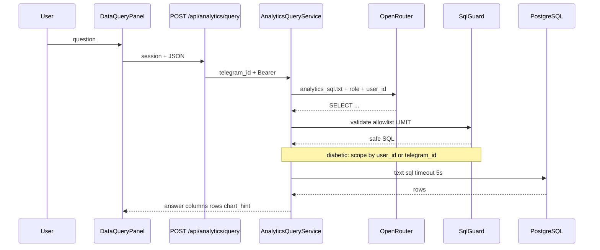
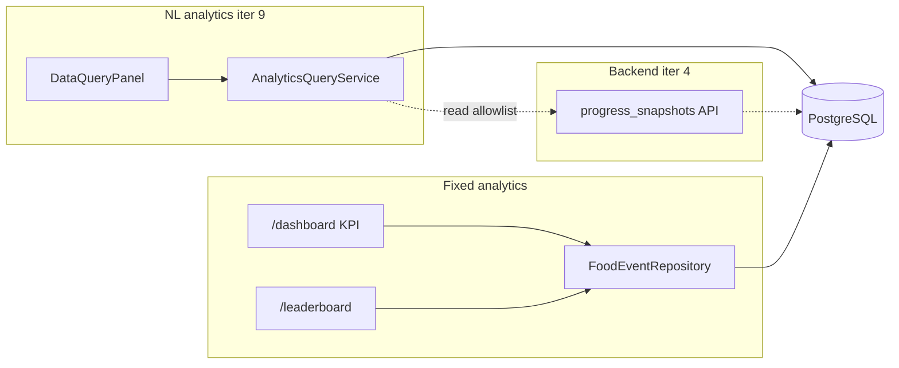
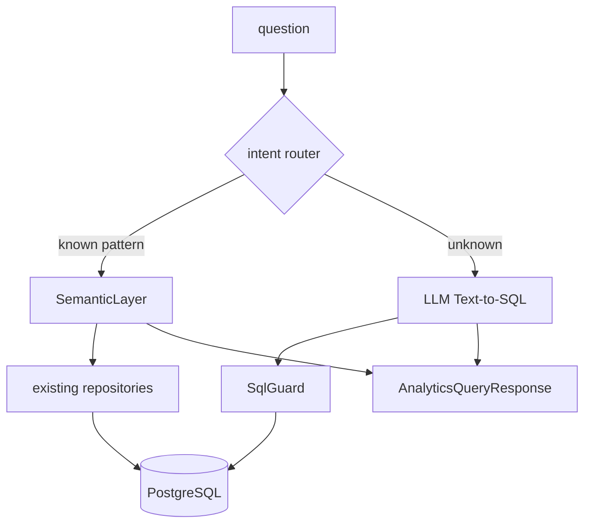

# Text-to-SQL — архитектура и roadmap

Опирается на [adr-004-text-to-sql.md](../adr/adr-004-text-to-sql.md) · [text-to-sql-scenarios.md](text-to-sql-scenarios.md) · [integrations.md](../integrations.md) · [frontend-contract.md](../api/frontend-contract.md) · [iteration-9 plan](../tasks/impl/frontend/iteration-9-text-to-sql/plan.md)

---

## 1. Спектр подходов

| Подход | Суть | Плюсы | Минусы | Статус в diaai |
|--------|------|-------|--------|----------------|
| **A. Fixed REST** | `GET /patient/dashboard/summary?period_days=7` | предсказуемо, быстро, без LLM | каждый новый вопрос = новый endpoint | ✅ dashboard iter 1–4 |
| **B. Semantic layer** | LLM выбирает `sum_xe(user, days)` из каталога функций | безопасно, стабильно | не ad-hoc Text-to-SQL | 📋 fallback / hybrid |
| **C. LLM → SQL + guard** | LLM пишет SELECT, backend валидирует и выполняет | гибкие ad-hoc вопросы | риск плохого SQL | ✅ **iter 9 (текущее)** |
| **D. Assistant tool** | tool `query_analytics` в чате D2 | единый UX с ассистентом | guardrails + UI таблицы в чате | ❌ out of scope iter 9 |
| **E. RAG по схеме** | retrieval релевантных колонок и few-shot Q→SQL | точнее на больших схемах | сложнее инфра | 📋 post-MVP |
| **F. Materialized views** | `progress_snapshots`, REST analytics | быстрые агрегаты | не отвечает на произвольный NL | ✅ backend iter 4 |

**Принято (ADR-004):** **C** — dedicated UI «Вопрос по данным», не tool в чате.

Dashboard (A) и Text-to-SQL (C) **дополняют** друг друга: KPI на экране vs произвольный вопрос.

---

## 2. Текущая реализация (iter 9)

### 2.1 Поток данных



### 2.2 Слои кода

| Слой | Путь | Ответственность |
|------|------|-----------------|
| UI | `web/components/analytics/data-query-panel.tsx` | ввод, таблица, bar chart |
| BFF | `web/app/api/analytics/query/route.ts` | session → backend |
| HTTP | `backend/api/v1/web/analytics_query.py` | auth, routing |
| Orchestration | `backend/services/analytics_query_service.py` | pipeline |
| Safety | `backend/services/sql_guard.py` | parse, allowlist, LIMIT |
| Prompt | `prompts/analytics_sql.txt` | DDL-контекст для LLM |
| Execute | SQLAlchemy `text(sql)` | read-only |

### 2.3 API-контракт (стабильная граница)

**Request:** `POST /api/v1/web/analytics/query`

```json
{ "question": "Сколько ХЕ я съел за последние 6 дней?" }
```

Query: `patient_telegram_id` (diabetic) или `doctor_telegram_id` (doctor).

**Response:**

```json
{
  "answer": "Результат: 42.5.",
  "columns": ["total_xe"],
  "rows": [[42.5]],
  "chart_hint": "scalar"
}
```

| `chart_hint` | UI |
|--------------|-----|
| `scalar` | текст ответа |
| `bar` | bar chart + таблица |
| `line` | line chart (зарезервировано) |
| `table` | только таблица |

SQL **не возвращается** клиенту — внутреннюю генерацию можно менять без смены web.

### 2.4 Guardrails

| Правило | Реализация |
|---------|------------|
| Только SELECT | `sqlglot` parse → `exp.Select` |
| Один statement | запрет `;` внутри |
| Allowlist таблиц | `users`, `food_events`, `insulin_events`, `progress_snapshots`, `dialog_requests`, `photo_analyses` |
| Keyword block | DDL/DML, `pg_catalog`, `information_schema` |
| Row limit | `LIMIT ≤ 100` (принудительно) |
| Query timeout | `ANALYTICS_QUERY_TIMEOUT_SECONDS` (default 5 s) |
| LLM timeout | `ANALYTICS_QUERY_LLM_TIMEOUT_SECONDS` (default 30 s) |
| Diabetic scope | в SQL должен быть `user_id` или `telegram_id` текущего пациента |
| Doctor | доступ к когорте без авто-filter |

Env: `ANALYTICS_QUERY_MODEL`, `OPENROUTER_API_KEY` — см. [integrations.md](../integrations.md).

### 2.5 Известные ограничения MVP

| Ограничение | Следствие |
|-------------|-----------|
| Качество SQL на LLM | возможен `0.0` или пустой результат при верных данных в PG |
| Scope diabetic — substring check | не AST-анализ `WHERE`; достаточно для MVP |
| `_format_answer` — шаблон | без второго LLM-вызова для summarize |
| Нет retry | одна попытка генерации SQL |
| Нет кэша | каждый вопрос = LLM + PG |

---

## 3. Связь с другими областями



| Область | Роль | Конфликт с iter 9 |
|---------|------|-------------------|
| Frontend dashboard | fixed KPI | нет |
| Backend iter 4 REST | snapshots, signals | параллельно; Text-to-SQL может читать `progress_snapshots` |
| Assistant D2 | plain chat | отдельный канал; tool — будущее |
| Bot | text/voice → assistant | data questions out of scope |

---

## 4. Roadmap доработок

### Уровень 1 — быстрые улучшения (тот же ADR-004)

| # | Улучшение | Точка в коде | Контракт API |
|---|-----------|--------------|--------------|
| 1.1 | Retry 1× при ошибке PG с feedback в prompt | `AnalyticsQueryService._generate_sql` | без изменений |
| 1.2 | Few-shot Q→SQL в `analytics_sql.txt` | prompt | без изменений |
| 1.3 | Явное сообщение при 0 rows + подсказка имён seed | `_format_answer` | без изменений |
| 1.4 | Debug metrics (hash question, tables, row_count) | `query()` logging | без изменений |

### Уровень 2 — Hybrid semantic layer (рекомендуется)



Паттерны для router (первые кандидаты):

- «ХЕ за N дней» → `FoodEventRepository.sum_xe_in_window`
- «топ-N пациентов по ХЕ» → leaderboard-like aggregation
- «сколько вопросов» → `DialogRequest` count

Новый модуль: `backend/services/analytics_semantic_layer.py` (или methods в `AnalyticsQueryService`).

### Уровень 3 — Shared QueryEngine + assistant

| Компонент | Назначение |
|-----------|------------|
| `QueryEngine` protocol | `query(viewer, question) → AnalyticsQueryResponse` |
| Consumers | DataQueryPanel (сейчас), assistant tool (будущее), bot (опционально) |

Один `SqlGuard`, один контракт ответа.

### Уровень 4 — Hardening

| Мера | Зачем |
|------|-------|
| Read-only PG role `analytics_reader` | defense in depth |
| `statement_timeout` на session | PG-level kill |
| Audit log (question hash + SQL hash) | compliance, debug |
| Column allowlist в `SqlGuard` | не только таблицы |
| RAG по `schema-er.md` | большая схема |

---

## 5. Карта расширения

```
AnalyticsQueryService.query()     ← router / hybrid
  ├── _generate_sql()             ← few-shot, retry
  ├── SqlGuard                    ← AST scope, columns
  ├── _execute()                  ← bind params, ro role
  ├── _format_answer()            ← optional LLM summarize
  └── _infer_chart_hint()         ← line, multi-series

prompts/analytics_sql.txt         ← schema + examples
docs/spec/text-to-sql-scenarios.md ← golden = regression
backend/tests/test_analytics_query.py
```

**Правило изменения схемы:** ADR amendment → `ALLOWED_TABLES` → строка в prompt → golden scenario → тест.

---

## 6. Чеклист добавления новой таблицы

1. Обоснование в ADR-004 (amendment или новый ADR)
2. `SqlGuard.ALLOWED_TABLES`
3. DDL-строка в `prompts/analytics_sql.txt`
4. Golden question в [text-to-sql-scenarios.md](text-to-sql-scenarios.md)
5. Тест в `test_analytics_query.py`
6. Scope rules для diabetic (если таблица с `user_id`)

---

## Связанные документы

| Документ | Назначение |
|----------|------------|
| [adr-004-text-to-sql.md](../adr/adr-004-text-to-sql.md) | принятое решение |
| [text-to-sql-scenarios.md](text-to-sql-scenarios.md) | golden / negative tests |
| [frontend-contract.md](../api/frontend-contract.md) | BFF + backend contract |
| [schema-er.md](schema-er.md) | физическая схема PG |
