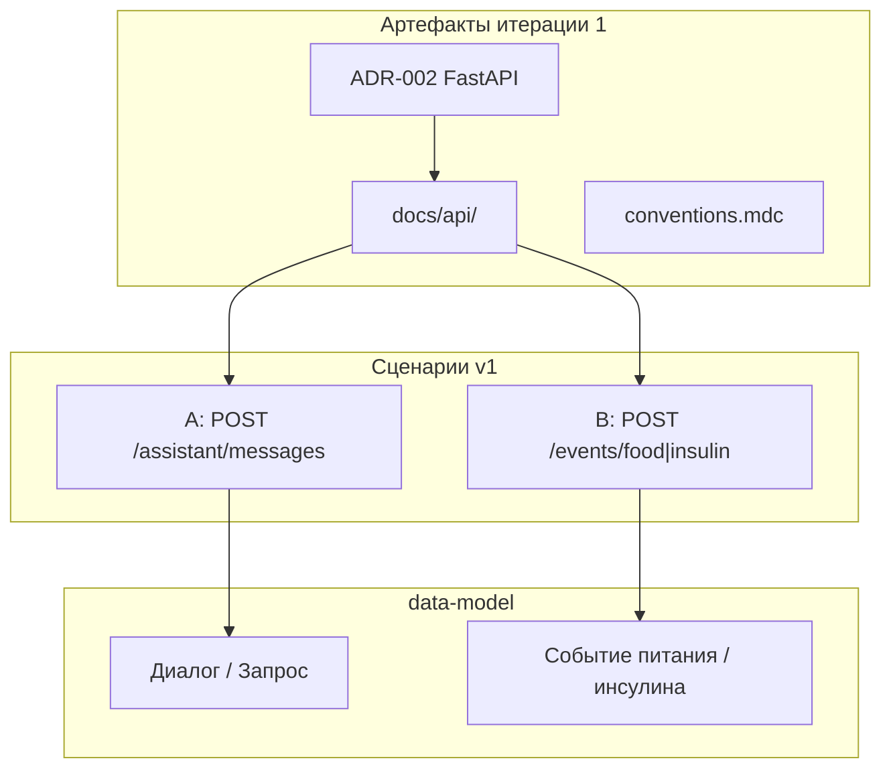

# Итерация backend 1: Основание

Опирается на [plan.md](../../../../../plan.md#итерация-2--backend-ядро-и-бд) · [tasklist-backend.md](../../../tasklist-backend.md) · [vision.md](../../../../../vision.md) · [data-model.md](../../../../../data-model.md) · [integrations.md](../../../../../integrations.md)

## Цель

Зафиксировать стек backend и REST-контракты двух MVP-сценариев до написания кода — contract-first основа для итерации 2 (сборка и поставка).

## Ценность

- Единые решения: ADR-002, conventions, API v1 — без переделки при реализации
- Контракты покрывают текущий бот ([handlers.py](../../../../../src/diaai/handlers.py)) и домен ([data-model.md](../../../../../data-model.md))
- Следующие задачи (03–08) опираются на документы, а не на устные договорённости

## Связь с plan.md

| plan.md | Backend tasklist |
|---------|------------------|
| [Итерация 2 — Backend-ядро и БД](../../../../../plan.md#итерация-2--backend-ядро-и-бд) | Итерации backend **1** (основание) + **2** (03–05) + **3** (06–08) |

Итерация backend 1 — **фаза проектирования** внутри plan.md итерации 2.

## Архитектура (решения итерации)

### Стек (ADR-002)

FastAPI, Uvicorn, PostgreSQL, SQLAlchemy 2, Alembic, pydantic-settings, OpenRouter через backend — см. [adr-002-backend-stack.md](../../../../../adr/adr-002-backend-stack.md).

### API v1

| Сценарий | Endpoint | Сущности | Документ |
|----------|----------|----------|----------|
| A — вопрос ассистенту | `POST /api/v1/assistant/messages` | Диалог, Запрос | [assistant-question.md](../../../../../api/scenarios/assistant-question.md) |
| B — фиксация события | `POST /api/v1/events/food`, `/insulin` | Событие питания, инсулина | [event-record.md](../../../../../api/scenarios/event-record.md) |

Соглашения: [conventions.md](../../../../../api/conventions.md), [openapi.yaml](../../../../../api/openapi.yaml).

### Интеграции (обновлено в итерации 1)

- **Backend REST API** — bot → `/api/v1` ([integrations.md](../../../../../integrations.md))
- **OpenRouter** — целевой вызов из backend (сценарий A)
- **PostgreSQL** — MVP backend для сценария B ([ADR-001](../../../../../adr/adr-001-database.md))

## Задачи итерации

| Задача | Описание | Статус | Документы |
|--------|----------|--------|-----------|
| 01 | Стек, ADR, conventions | ✅ Done | [plan](tasks/task-01-stack-adr/plan.md) · [summary](tasks/task-01-stack-adr/summary.md) |
| 02 | API-контракты (2 сценария) | ✅ Done | [plan](tasks/task-02-api-contracts/plan.md) · [summary](tasks/task-02-api-contracts/summary.md) |

## Критерии завершения итерации

- [x] ADR-002 принят; [vision.md](../../../../../vision.md) и [conventions.mdc](../../../../../.cursor/rules/conventions.mdc) согласованы
- [x] Контракты A/B в `docs/api/`; OpenAPI; коды ошибок в conventions
- [x] [data-model.md](../../../../../data-model.md) — API-поля v1; [integrations.md](../../../../../integrations.md) — backend API

## Definition of Done

**Агент:** ADR + API docs + domain/integrations sync; task-01/02 summary закрыты.

**Пользователь:** ADR-002 и `docs/api/scenarios/` — понятно, как backend заменит прямые вызовы бота.

## Затронутые файлы (итерация)

| Файл | Изменение |
|------|-----------|
| `docs/adr/adr-002-backend-stack.md` | создан |
| `.cursor/rules/conventions.mdc` | backend-стек |
| `docs/vision.md` | ADR-002, технологии backend |
| `docs/api/**` | conventions, scenarios, openapi |
| `docs/data-model.md` | API-поля, маппинг сценариев |
| `docs/integrations.md` | Backend REST, PostgreSQL MVP backend |

## Следующая итерация

[iteration-2-core](../iteration-2-core/plan.md) — задачи 03–05: каркас, тесты, impl. [iteration-3-delivery](../iteration-3-delivery/plan.md) — задачи 06–08: docs, bot, quality.

## Документы

- 📝 [Summary](summary.md) — по завершении итерации
