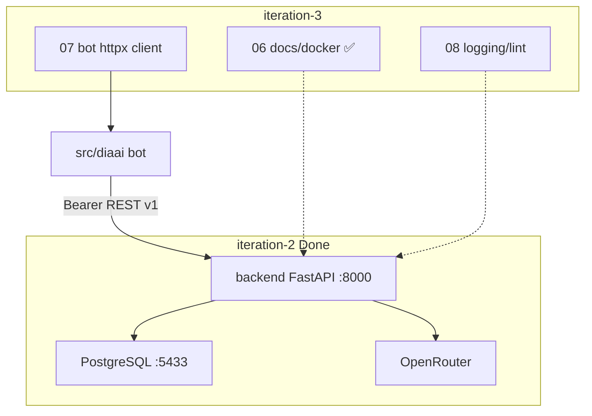

# Итерация backend 3: Поставка

Опирается на [tasklist-backend.md](../../../tasklist-backend.md) · [iteration-2-core](../iteration-2-core/plan.md) · [plan.md](../../../../../plan.md#итерация-3--миграция-бота-на-backend) · [ADR-002](../../../../../adr/adr-002-backend-stack.md)

Skills: [fastapi-templates](.agents/skills/fastapi-templates/SKILL.md) — docker, OpenAPI, httpx AsyncClient, logging

## Цель

Доставить backend в эксплуатацию: документация и docker, миграция бота на API, инженерный стандарт.

## Статус

🚧 In Progress — task-06 ✅; **task-07** next.

## Ценность

- Новый разработчик поднимает stack по [backend/README.md](../../../../../backend/README.md) и `.env.example`
- Бот — тонкий клиент без RAM и прямого OpenRouter
- Логи и lint без утечки секретов и промптов

## Предусловия

- ✅ [Итерация backend 1](../iteration-1-foundation/summary.md) — ADR-002, `docs/api/`
- ✅ [Итерация backend 2](../iteration-2-core/summary.md) — endpoint'ы A/B, PostgreSQL, 21 тест, live API

## Связь с plan.md (продукт)

| plan.md | Backend tasklist |
|---------|------------------|
| [Итерация 2 — Backend-ядро и БД](../../../../../plan.md#итерация-2--backend-ядро-и-бд) | iteration-1–2 ✅, task-06 docs ✅ |
| [Итерация 3 — Миграция бота](../../../../../plan.md#итерация-3--миграция-бота-на-backend) | task-07 + [tasklist-bot.md](../../../tasklist-bot.md) |
| [Итерация 4 — Аналитика](../../../../../plan.md#итерация-4--аналитика-и-динамика-состояния) | после закрытия 01–08 |

## Архитектура



**Dev-стек (task-06):** PostgreSQL в Docker; backend локально `make backend-run` (hot reload). Backend **не** в compose — KISS.

**Целевой поток (task-07):** Telegram → bot → `POST /api/v1/assistant/messages` → PG + OpenRouter → ответ пользователю.

## Задачи итерации

| # | Задача | Статус | Документы |
|---|--------|--------|-----------|
| 06 | Документирование backend | ✅ Done | [plan](tasks/task-06-backend-docs/plan.md) · [summary](tasks/task-06-backend-docs/summary.md) |
| 07 | Рефакторинг бота → API | 🚧 Next | [plan](tasks/task-07-bot-refactor/plan.md) · [summary](tasks/task-07-bot-refactor/summary.md) |
| 08 | Качество и инженерные практики | 📋 Planned | [plan](tasks/task-08-quality/plan.md) · [summary](tasks/task-08-quality/summary.md) |

### Task-06 (кратко) ✅

| Артефакт | Содержание |
|----------|------------|
| [`backend/README.md`](../../../../../backend/README.md) | quick start, env, curl, troubleshooting |
| `docker-compose.yml` | healthcheck PG, порт 5433 |
| `.env.example`, `Makefile` | комментарии, `backend-openapi-export` |
| `docs/plan.md`, корневой README | статус итераций |

### Task-07 (кратко)

| Слой | Артефакты |
|------|-----------|
| Client | `src/diaai/backend_client.py` — httpx, Bearer, `X-Request-Id` |
| Handlers | `handlers.py` → POST assistant; без `LlmClient`/`SessionStore` в prod |
| Config | `BACKEND_URL`, `BACKEND_SERVICE_TOKEN` в `.env.example` |
| Docs | `vision.md`, `integrations.md`, tasklist-bot |

Сценарий B (events) из бота — вне scope task-07.

### Task-08 (кратко)

| Тема | Артефакты |
|------|-----------|
| Logging | middleware: request_id, method, path, status; без секретов/body |
| Lint | ruff backend + bot scope |
| Health | optional version в `/health` |
| Контракты | conventions, финальная синхронизация vision/plan |

## Критерии завершения итерации

- [x] README + docker-compose: backend + PostgreSQL с нуля ([backend/README.md](../../../../../backend/README.md))
- [ ] `make run` — бот через backend; история после перезапуска (task-07)
- [ ] `make backend-lint && make backend-test`; логи без токенов (task-08)
- [x] OpenAPI совпадает с реализацией

## Dev quick start

Полная инструкция — [backend/README.md](../../../../../backend/README.md):

```bash
cp .env.example .env
make backend-install
docker compose up -d
make backend-migrate
make backend-run   # http://127.0.0.1:8000/docs
make backend-test  # 21 passed
```

## Definition of Done

**Агент:** task-06/07/08 summary закрыты; полный прогон lint/test/run.

**Пользователь:** сценарии A и B в Telegram (A — task-07); README актуален.

## Следующий этап

После закрытия итерации — [Итерация 4 — Аналитика](../../../../../plan.md#итерация-4--аналитика-и-динамика-состояния).

## Документы

- 📋 [План области](../plan.md)
- 📝 [Summary](summary.md) — 🚧 in progress (task-06 ✅)
