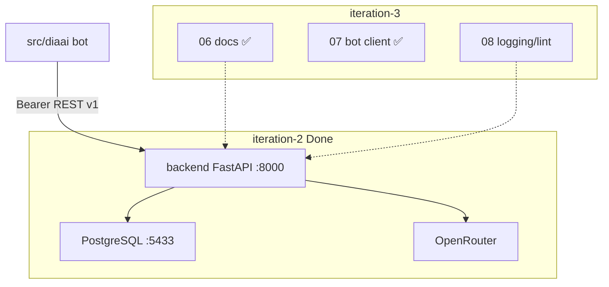

# Итерация backend 3: Поставка

Опирается на [tasklist-backend.md](../../../tasklist-backend.md) · [iteration-2-core](../iteration-2-core/plan.md) · [plan.md](../../../../../plan.md#итерация-3--миграция-бота-на-backend) · [ADR-002](../../../../../adr/adr-002-backend-stack.md)

Skills: [fastapi-templates](.agents/skills/fastapi-templates/SKILL.md) · [python-testing-patterns](.agents/skills/python-testing-patterns/SKILL.md)

## Цель

Доставить backend в эксплуатацию: документация и docker, миграция бота на API, инженерный стандарт.

## Статус

✅ Done — задачи 06–08 (2026-06-07).

## Ценность

- Новый разработчик поднимает stack по [backend/README.md](../../../../../backend/README.md) и `.env.example`
- Бот — тонкий клиент без RAM и прямого OpenRouter; история в PostgreSQL
- Логи и lint без утечки секретов и промптов (task-08)

## Предусловия

- ✅ [Итерация backend 1](../iteration-1-foundation/summary.md) — ADR-002, `docs/api/`
- ✅ [Итерация backend 2](../iteration-2-core/summary.md) — endpoint'ы A/B, PostgreSQL, 21 тест, live API

## Связь с plan.md (продукт)

| plan.md | Backend tasklist |
|---------|------------------|
| [Итерация 2 — Backend-ядро и БД](../../../../../plan.md#итерация-2--backend-ядро-и-бд) | iteration-1–2 ✅, task-06 docs ✅ |
| [Итерация 3 — Миграция бота](../../../../../plan.md#итерация-3--миграция-бота-на-backend) | task-07 ✅ + [tasklist-bot.md](../../../tasklist-bot.md) |
| [Итерация 4 — Аналитика](../../../../../plan.md#итерация-4--аналитика-и-динамика-состояния) | после закрытия 01–08 |

## Архитектура



**Dev-стек:** PostgreSQL в Docker (`:5433`); backend `make backend-run`; бот `make run` — оба процесса.

**Поток (task-07):** Telegram → `backend_client.py` → `POST /api/v1/assistant/messages` → PG + OpenRouter → ответ.

## Задачи итерации

| # | Задача | Статус | Документы |
|---|--------|--------|-----------|
| 06 | Документирование backend | ✅ Done | [plan](tasks/task-06-backend-docs/plan.md) · [summary](tasks/task-06-backend-docs/summary.md) |
| 07 | Рефакторинг бота → API | ✅ Done | [plan](tasks/task-07-bot-refactor/plan.md) · [summary](tasks/task-07-bot-refactor/summary.md) |
| 08 | Качество и инженерные практики | ✅ Done | [plan](tasks/task-08-quality/plan.md) · [summary](tasks/task-08-quality/summary.md) |

### Task-06 ✅

| Артефакт | Содержание |
|----------|------------|
| [`backend/README.md`](../../../../../backend/README.md) | quick start, env, curl, troubleshooting |
| `docker-compose.yml` | healthcheck PG, порт 5433 |
| `.env.example`, `Makefile` | `backend-openapi-export` |

### Task-07 ✅

| Слой | Артефакты |
|------|-----------|
| Client | `src/diaai/backend_client.py` — httpx, Bearer, `X-Request-Id` |
| Handlers | `handlers.py`, `main.py`, `bot.py`, `config.py` — без `LlmClient`/`SessionStore` в prod |
| Tests | `tests/test_backend_client.py`, `tests/test_config.py`; `make test` (36) |
| Docs | `vision.md`, `integrations.md`, `tasklist-bot.md`, `.env.example` |

Сценарий B из бота и `DELETE` диалога для `/start` — вне scope.

### Task-08 (кратко)

| Тема | Артефакты |
|------|-----------|
| Logging | middleware без секретов/body |
| Lint | ruff, `make lint` / `make test` |
| Health | optional version в `/health` |
| Docs | финальная синхронизация vision/plan |

## Критерии завершения итерации

- [x] README + docker-compose: backend + PG с нуля
- [x] OpenAPI совпадает с реализацией
- [x] бот через backend; история в PG (task-07)
- [x] unit-тесты bot client (`tests/`, 15 тестов)
- [x] structured logging без токенов/промптов (task-08)
- [x] закрыть iteration-3 summary ✅

## Dev quick start

```bash
cp .env.example .env
make backend-install
docker compose up -d && make backend-migrate

# терминал 1
make backend-run

# терминал 2
make run

make test   # 45 passed (30 backend + 15 bot)
```

## Definition of Done

**Агент:** task-08 summary; `make lint && make test && make backend-run` + `make run`.

**Пользователь:** сценарий A в Telegram; README актуален; лог запроса без секретов.

## Следующий этап

[task-08](tasks/task-08-quality/plan.md) ✅ → [Итерация 4 — Аналитика](../iteration-4-analytics/plan.md).

## Документы

- 📋 [План области](../plan.md)
- 📝 [Summary](summary.md) — ✅ Done (06–08)
