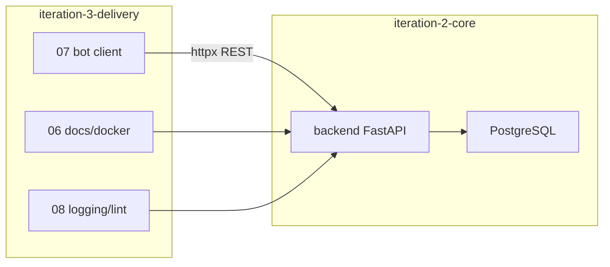

# Итерация backend 3: Поставка

Опирается на [plan.md](../../../../../plan.md#итерация-3--миграция-бота-на-backend) · [tasklist-backend.md](../../../tasklist-backend.md) · [iteration-2-core](../iteration-2-core/plan.md)

## Цель

Доставить backend в эксплуатацию: документация и docker, миграция бота на API, инженерный стандарт.

## Ценность

- Новый разработчик поднимает stack по README и `.env.example`
- Бот — тонкий клиент без RAM и прямого OpenRouter
- Логи и lint без утечки секретов и промптов

## Предусловия

- ✅ [Итерация backend 1](../iteration-1-foundation/summary.md) — ADR-002, `docs/api/`
- [ ] [Итерация backend 2](../iteration-2-core/plan.md) — task-05: рабочие endpoint'ы A/B, PostgreSQL, `make backend-test` зелёный

## Связь с plan.md

| plan.md | Backend tasklist |
|---------|------------------|
| [Итерация 2 — Backend-ядро и БД](../../../../../plan.md#итерация-2--backend-ядро-и-бд) | iteration-2 (03–05) + task-06 (docs) |
| [Итерация 3 — Миграция бота](../../../../../plan.md#итерация-3--миграция-бота-на-backend) | task-07 + [tasklist-bot.md](../../../tasklist-bot.md) |

## Архитектура

Skill: [fastapi-templates](.agents/skills/fastapi-templates/SKILL.md) — docker, OpenAPI, AsyncClient, logging middleware.

## Задачи итерации

| # | Задача | Статус | Документы |
|---|--------|--------|-----------|
| 06 | Документирование backend | 📋 Planned | [plan](tasks/task-06-backend-docs/plan.md) · [summary](tasks/task-06-backend-docs/summary.md) |
| 07 | Рефакторинг бота → API | 📋 Planned | [plan](tasks/task-07-bot-refactor/plan.md) · [summary](tasks/task-07-bot-refactor/summary.md) |
| 08 | Качество и инженерные практики | 📋 Planned | [plan](tasks/task-08-quality/plan.md) · [summary](tasks/task-08-quality/summary.md) |

## Критерии завершения итерации

- [ ] README + docker-compose: backend + PostgreSQL поднимаются с нуля
- [ ] `make run` — бот отвечает через backend; история сохраняется после перезапуска
- [ ] `make backend-lint && make backend-test`; логи без токенов и промптов
- [ ] OpenAPI (`/docs` или [openapi.yaml](../../../../../api/openapi.yaml)) совпадает с реализацией

## Definition of Done

**Агент:** task-06/07/08 summary закрыты; полный прогон lint/test/run.

**Пользователь:** сценарии A и B в Telegram; README актуален; лог одного запроса без секретов.

## Следующий этап

[Итерация 4 — Аналитика](../../../../../plan.md#итерация-4--аналитика-и-динамика-состояния) · [tasklist-backend.md](../../../tasklist-backend.md#итерация-4-аналитика-следующий-этап)

## Документы

- 📝 [Summary](summary.md) — по завершении итерации
