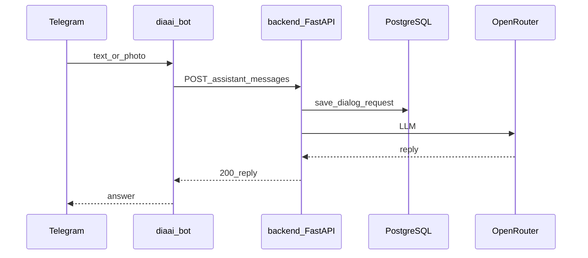

# Task 07: Рефакторинг бота → API

Опирается на [iteration-3-delivery/plan.md](../../plan.md) · [assistant-question.md](../../../../../../api/scenarios/assistant-question.md)

Skills: [fastapi-templates](.agents/skills/fastapi-templates/SKILL.md) — httpx AsyncClient pattern (как в tests/conftest)

## Цель

Бот вызывает backend REST вместо прямого `LlmClient` + `SessionStore` в [handlers.py](../../../../../../src/diaai/handlers.py).

## Архитектура

## Состав работ

### 1. `src/diaai/backend_client.py` (новый файл)

- `httpx.AsyncClient` с `base_url` из env `BACKEND_URL`
- заголовки: `Authorization: Bearer`, `X-Request-Id` (uuid4)
- метод: `send_assistant_message(telegram_id, text, image_base64=..., image_media_type=...)`
- маппинг ошибок 401/502/503 → сообщения пользователю

### 2. `handlers.py`

- inject `BackendClient` вместо `LlmClient` + `SessionStore`
- `text_handler` / `photo_handler` → POST `/api/v1/assistant/messages`
- photo: base64 как сейчас; поля по [assistant-question.md](../../../../../../api/scenarios/assistant-question.md)
- `/start` — UX без изменений; сброс диалога — defer (endpoint DELETE — post-MVP)

### 3. Wiring (`main.py`, config)

- prod-путь не использует `llm_client` для диалога
- env: `BACKEND_URL`, `BACKEND_SERVICE_TOKEN` в `.env.example`

### 4. Документы

- [vision.md](../../../../../../vision.md), [integrations.md](../../../../../../integrations.md)
- [tasklist-bot.md](../../../../../tasklist-bot.md) — согласование с plan.md итерация 3

## Затронутые файлы

- `src/diaai/backend_client.py` (новый)
- `src/diaai/handlers.py`, `src/diaai/main.py`, `src/diaai/config.py`
- `.env.example`, `docs/vision.md`, `docs/integrations.md`

## DoD

| Кто | Критерий |
|-----|----------|
| Агент | handlers не импортирует `llm_client` для prod; `make run` + backend up |
| Пользователь | текст/фото в Telegram; перезапуск бота — история в PG |

## Вне scope

- Сценарий B (POST events) из бота — [tasklist-bot.md](../../../../../tasklist-bot.md)
- Web client

## Следующий шаг

Task-08 — structured logging, lint, правила контрактов.
