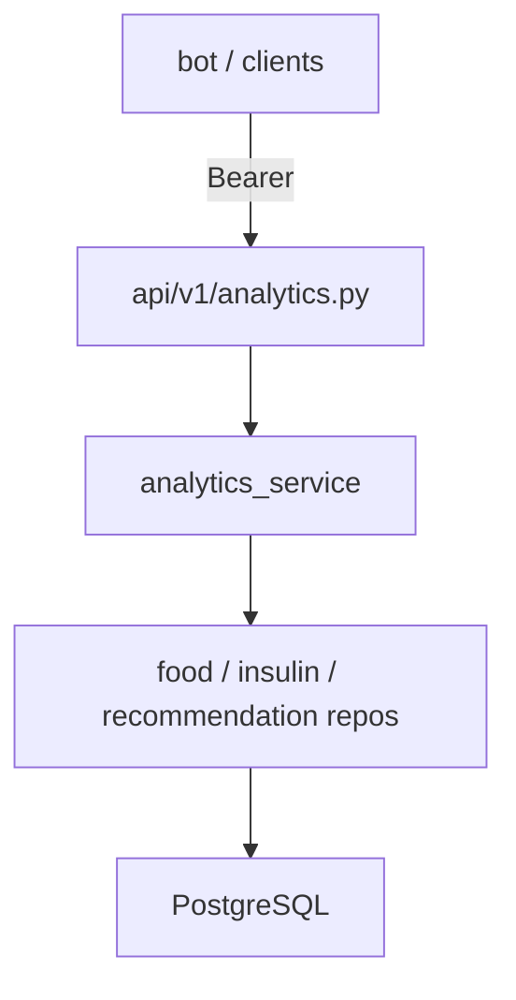

# Итерация backend 4: Аналитика и динамика состояния

Опирается на [tasklist-backend.md](../../../tasklist-backend.md) · [iteration-3-delivery](../iteration-3-delivery/plan.md) · [plan.md](../../../../plan.md#итерация-4--аналитика-и-динамика-backend-rest) · [data-model.md](../../../../data-model.md)

Skills: [api-design-principles](.agents/skills/api-design-principles/SKILL.md) · [python-testing-patterns](.agents/skills/python-testing-patterns/SKILL.md)

## Цель

REST API `/api/v1/analytics/*`: снимки прогресса, сигналы, справочные рекомендации — для бота и клиентов вне web-dashboard.

## Статус

🚧 **In Progress** — task 09 ✅ · tasks 10–12 📋

## Ценность

- Бот и клиенты получают **единый** analytics API (D3, D4)
- Не дублирует web dashboard (`/api/v1/web/*` уже ✅)
- Rule-based v1; LLM для рекомендаций — post-MVP

## Предусловия

- ✅ Backend delivery 01–08, database 5/5 (9 таблиц, `progress_snapshots`, `recommendations`)
- ✅ Web dashboard + Text-to-SQL — frontend iter 0–9 (не блокирует iter 4)
- ✅ Task 09 — контракты OpenAPI + scenarios

## Связь с plan.md

| plan.md | Backend |
|---------|---------|
| [Итерация 4 — analytics REST](../../../../plan.md#итерация-4--аналитика-и-динамика-backend-rest) | tasks 09–12 |
| [Итерация 5 — web ✅](../../../../plan.md#итерация-5--веб-интерфейс) | потребляет `/web/*`, не `/analytics/*` |

## Scope / out of scope

| В scope | Вне scope |
|---------|-----------|
| `GET /api/v1/analytics/progress\|signals\|recommendations` | Web UI |
| On-the-fly агрегация + read `recommendations` | ML-прогнозы глюкозы |
| Rule-based signals/recs, guard без доз | CRUD consultations |
| pytest + OpenAPI | Новые Alembic migrations *(002 уже есть)* |

## Архитектура



**Переиспользование:** `web_utils.period_window_days`, `FoodEventRepository`, `InsulinEventRepository` (как `WebPatientService`).

## Задачи

| # | Задача | Статус | Документы |
|---|--------|--------|-----------|
| 09 | Контракты analytics | ✅ Done | [plan](tasks/task-09-analytics-contracts/plan.md) · [summary](tasks/task-09-analytics-contracts/summary.md) |
| 10 | Impl progress | 📋 Next | [plan](tasks/task-10-progress-snapshots/plan.md) |
| 11 | Signals + recommendations | 📋 Planned | [plan](tasks/task-11-recommendations-signals/plan.md) |
| 12 | Docs + quality gate | 📋 Planned | [plan](tasks/task-12-docs-and-quality/plan.md) |

## Критерии завершения итерации

- [x] OpenAPI + scenarios analytics (task 09)
- [ ] `GET /analytics/progress` — impl + tests
- [ ] `GET /analytics/signals`, `/analytics/recommendations` — impl + tests
- [ ] Guard: рекомендации без назначения доз
- [ ] `make lint && make test` green; [summary.md](summary.md) ✅

## Dev quick start (после task 10)

```bash
make db-reset && make backend-run
curl -s -H "Authorization: Bearer $BACKEND_SERVICE_TOKEN" \
  "http://127.0.0.1:8000/api/v1/analytics/progress?telegram_id=900000001&period=week"
```

## Следующий этап

Task 10 → [task-10-progress-snapshots/plan.md](tasks/task-10-progress-snapshots/plan.md)
