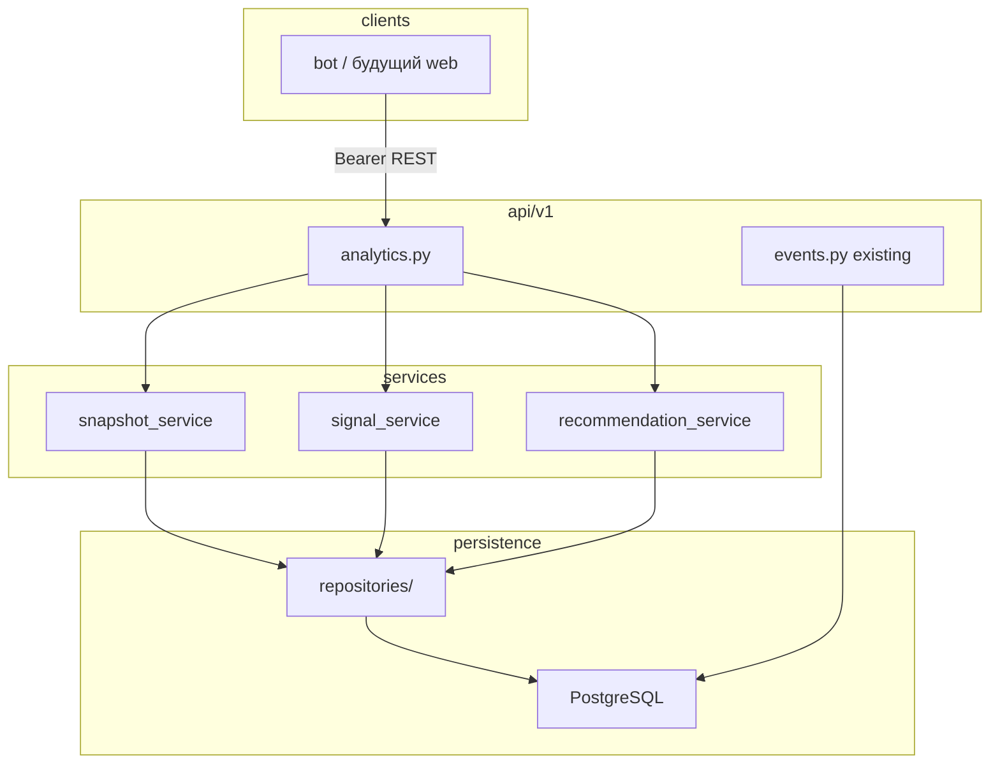

# Итерация backend 4: Аналитика и динамика состояния

Опирается на [tasklist-backend.md](../../../tasklist-backend.md) · [iteration-3-delivery](../iteration-3-delivery/plan.md) · [plan.md](../../../../plan.md#итерация-4--аналитика-и-динамика-состояния) · [data-model.md](../../../../data-model.md) · [vision.md](../../../../vision.md)

Skills: [api-design-principles](.agents/skills/api-design-principles/SKILL.md) · [python-testing-patterns](.agents/skills/python-testing-patterns/SKILL.md)

## Цель

Добавить в backend аналитику по истории питания и инсулина: снимки прогресса за период, сигналы изменений и справочные рекомендации — без назначения доз.

## Статус

📋 Planned — задачи 09–12 (после закрытия delivery 01–08 ✅).

## Ценность

- Пользователь видит **динамику**, а не только текущий момент (день / неделя / месяц)
- Единый API для будущего web и расширений бота
- Основа для итерации 5 (веб-дашборд)

## Предусловия

- ✅ [Итерация backend 3](../iteration-3-delivery/summary.md) — bot → API, PostgreSQL, quality gate (task-08)
- ✅ События `food_events` / `insulin_events` и assistant v1 в production-ready состоянии
- 📋 Сущности `ProgressSnapshot`, `Recommendation` — описаны в [data-model.md](../../../../data-model.md), таблиц ещё нет

## Связь с plan.md (продукт)

| plan.md | Backend tasklist |
|---------|------------------|
| [Итерация 4 — Аналитика](../../../../plan.md#итерация-4--аналитика-и-динамика-состояния) | iteration-4, задачи 09–12 |
| [Итерация 5 — Веб](../../../../plan.md#итерация-5--веб-интерфейс-диабетикдоктор) | потребитель API аналитики |

## Scope / out of scope

| В scope | Вне scope (post-MVP) |
|---------|----------------------|
| Агрегация ХЕ / БЖЕ / БЖУ / инсулина за период | ML-прогнозы глюкозы |
| REST API снимков и сигналов | Web UI |
| Справочные реcommendations (без доз) | Роль доктора, консультации |
| Contract-first: OpenAPI + pytest | Read-replica / TimescaleDB |
| Миграция Alembic для новых таблиц | PhotoAnalysis как отдельная сущность |

## Архитектура



**Поток:** `telegram_id` + период (`day` / `week` / `month`) → агрегация `food_events` / `insulin_events` → `ProgressSnapshot` (расчёт или материализация) → JSON-ответ; опционально — список сигналов и рекомендаций за тот же период.

**Принципы:** KISS — SQL-агрегации в repository; без отдельного analytics-сервиса; LLM для рекомендаций только если rule-based недостаточно (решение в task-03).

## Задачи итерации

| # | Задача | Статус | Документы |
|---|--------|--------|-----------|
| 09 | Контракты аналитики (OpenAPI, scenarios) | 📋 Planned | [plan](tasks/task-09-analytics-contracts/plan.md) |
| 10 | Снимки прогресса (ORM, migration, GET) | 📋 Planned | [plan](tasks/task-10-progress-snapshots/plan.md) |
| 11 | Сигналы и рекомендации | 📋 Planned | [plan](tasks/task-11-recommendations-signals/plan.md) |
| 12 | Тесты, документация, закрытие итерации | 📋 Planned | [plan](tasks/task-12-docs-and-quality/plan.md) |

### Task-09 — контракты (кратко)

| Артефакт | Содержание |
|----------|------------|
| `docs/api/api-contract.md` | новые endpoint'ы analytics v1 |
| `docs/api/scenarios/` | сценарий progress / signals |
| `docs/api/openapi.yaml` | `GET /api/v1/analytics/progress`, signals, recommendations |
| `docs/data-model.md` | поля `ProgressSnapshot`, `Recommendation` |
| `docs/tech/api-contracts.md` | tech debt / scope v2 |

### Task-10 — снимки (кратко)

| Слой | Артефакты |
|------|-----------|
| DB | Alembic `002_*`, модели `ProgressSnapshot` (или view-only MVP без persist — решение в task plan) |
| Repo | агрегация по `user_id`, период, timezone UTC |
| API | `GET ...?telegram_id=&period=day\|week\|month` |
| Tests | contract + impl, 403 по ownership |

### Task-11 — сигналы и рекомендации (кратко)

| Тема | Содержание |
|------|------------|
| Signals | эвристики: рост/падение средних ХЕ, частота инсулина, отклонение от baseline периода |
| Recommendations | справочный текст; **не** дозы инсулина; опционально LLM с system prompt |
| API | `GET /api/v1/analytics/signals`, `GET /api/v1/analytics/recommendations` |

### Task-12 — закрытие (кратко)

| Тема | Содержание |
|------|------------|
| Tests | расширить `make test`; coverage ключевых сценариев |
| Docs | `backend/README.md`, `tasklist-backend.md`, iteration-4 `summary.md` |
| Quality | `make lint`; логи без PII (как task-08) |

## Критерии завершения итерации

- [ ] OpenAPI и scenarios для analytics согласованы с [conventions.md](../../../../api/conventions.md)
- [ ] Backend отдаёт снимок прогресса за day/week/month по `telegram_id`
- [ ] Сигналы изменений доступны через API
- [ ] Рекомendations справочные, без назначения доз (guard в prompt / коде)
- [ ] Alembic migration применяется на dev PG (`make backend-migrate`)
- [ ] `make lint && make test` — green; счёт тестов зафиксирован в README
- [ ] [summary.md](summary.md) итерации 4 ✅

## Dev quick start (после task-10+)

```bash
docker compose up -d
make backend-migrate
make backend-run

# пример (контракт TBD в task-09)
curl -s -H "Authorization: Bearer $BACKEND_SERVICE_TOKEN" \
  "http://127.0.0.1:8000/api/v1/analytics/progress?telegram_id=404674868&period=week"
```

## Definition of Done

**Агент:** задачи 09–12 с `plan.md` / `summary.md`; итерация закрыта в tasklist.

**Пользователь:** по Swagger понятно, как получить прогресс и сигналы; ответы не содержат назначений доз.

## Следующий этап

[Итерация 5 — Веб](../../../../plan.md#итерация-5--веб-интерфейс-диабетикдоктор) · [tasklist-web.md](../../../tasklist-web.md).

## Документы

- 📋 [План области](../plan.md)
- 📝 [Summary](summary.md) — 📋 Planned
