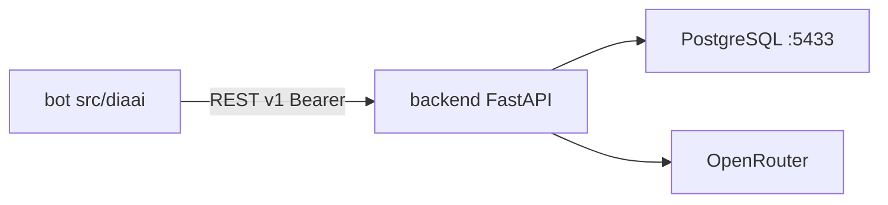

# Backend: план реализации

Опирается на [tasklist-backend.md](../../tasklist-backend.md) · [plan.md](../../../plan.md) · [vision.md](../../../vision.md) · [ADR-002](../../../adr/adr-002-backend-stack.md)

## Цель области

Вынести логику MVP-бота в FastAPI backend с PostgreSQL: два сценария (вопрос ассистенту, фиксация события), затем тонкий Telegram-клиент.

## Ценность

- Персистентные данные и единый контекст пользователя
- Contract-first API (`docs/api/`)
- Бот и будущий web — клиенты одного backend

## Итерации backend

| # | Название | Задачи | Статус | План |
|---|----------|--------|--------|------|
| 1 | Основание | 01–02 | ✅ Done | [iteration-1-foundation/plan.md](iteration-1-foundation/plan.md) · [summary](iteration-1-foundation/summary.md) |
| 2 | Сборка ядра | 03–05 | ✅ Done | [iteration-2-core/plan.md](iteration-2-core/plan.md) · [summary](iteration-2-core/summary.md) |
| 3 | Поставка | 06–08 | ✅ Done | [iteration-3-delivery/plan.md](iteration-3-delivery/plan.md) · [summary](iteration-3-delivery/summary.md) |
| 4 | Аналитика | 09–12 | 🚧 In Progress (09 ✅) | [iteration-4-analytics/plan.md](iteration-4-analytics/plan.md) · [summary](iteration-4-analytics/summary.md) |

**Прогресс:** 9 / 12 задач (01–09 ✅) · **следующий:** task 10 · **тесты:** `make test` — **84** (67 backend + 17 bot)

## Связь с plan.md (продукт)

| plan.md | Backend |
|---------|---------|
| [Итерация 2 — Backend-ядро и БД](../../../plan.md#итерация-2--backend-ядро-и-бд) | итерации 1–2 ✅, task-06 ✅ |
| [Итерация 3 — Миграция бота](../../../plan.md#итерация-3--миграция-бота-на-backend) | task-06–08 ✅ |
| [Итерация 4 — Аналитика](../../../plan.md#итерация-4--аналитика-и-динамика-backend-rest) | iteration-4 🚧 (09 ✅, 10–12 📋) |

## Архитектура (текущая)



Структура: [backend-structure.md](../../../tech/backend-structure.md) · контракт: [api-contract.md](../../../api/api-contract.md) · сводка: [api-contracts.md](../../../tech/api-contracts.md) · онбординг: [backend/README.md](../../../backend/README.md).

## Прогресс задач

| Задача | Описание | Статус |
|--------|----------|--------|
| 01 | Стек, ADR | ✅ |
| 02 | API-контракты | ✅ |
| 03 | Каркас backend | ✅ |
| 04 | API-тесты | ✅ |
| 05 | Endpoint'ы + БД | ✅ |
| 06 | Документирование | ✅ |
| 07 | Рефакторинг бота | ✅ |
| 08 | Качество | ✅ |
| 09 | Контракты аналитики | 📋 |
| 10 | Снимки прогресса | 📋 |
| 11 | Сигналы и рекомендации | 📋 |
| 12 | Тесты и документация | 📋 |

## Критерии завершения области (01–08)

- [x] ADR-002, REST-контракты v1
- [x] FastAPI-каркас, auth, `/health`, `/docs`
- [x] Contract + impl tests (backend **21**)
- [x] Impl A/B в PostgreSQL + OpenRouter
- [x] README, docker-compose docs *(task-06)*
- [x] Bot → API, история в PG, unit-тесты bot *(task-07, `tests/` 15)*
- [x] lint/test/run, логи без секретов *(task-08)*

## Иерархия планов

```
docs/tasks/impl/backend/
├── plan.md                         ← этот документ
├── summary.md
├── iteration-1-foundation/plan.md
├── iteration-2-core/plan.md        ← task-03–05 ✅
├── iteration-3-delivery/plan.md    ← task-06–08 ✅
├── iteration-4-analytics/plan.md   ← task-09–12 📋
└── iteration-*/tasks/task-NN-*/plan.md
```

## Команды

| Команда | Назначение |
|---------|------------|
| `make backend-run` | FastAPI :8000 |
| `make run` | Telegram-бот (требует backend) |
| `make test` | pytest: backend + bot (**84**) |
| `make lint` | ruff: src, backend, tests |

## Документы

- 📝 [Summary области](summary.md)
- 📋 [Итерация 3 — план](iteration-3-delivery/plan.md)
- 📋 [Итерация 4 — план](iteration-4-analytics/plan.md)
