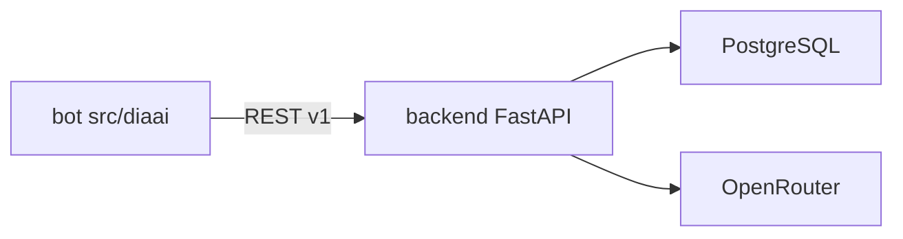

# Backend: план реализации

Опирается на [tasklist-backend.md](../../tasklist-backend.md) · [plan.md](../../../plan.md#итерация-2--backend-ядро-и-бд) · [vision.md](../../../vision.md) · [ADR-002](../../../adr/adr-002-backend-stack.md)

## Цель области

Вынести логику MVP-бота в FastAPI backend с PostgreSQL: два сценария (вопрос ассистенту, фиксация события), затем тонкий Telegram-клиент.

## Ценность

- Персистентные данные и единый контекст пользователя
- Contract-first API (`docs/api/`)
- Бот и будущий web — клиенты одного backend

## Итерации backend

| # | Название | Задачи | Статус | План |
|---|----------|--------|--------|------|
| 1 | Основание | 01–02 | ✅ Done | [iteration-1-foundation/plan.md](iteration-1-foundation/plan.md) |
| 2 | Сборка ядра | 03–05 | 🚧 In Progress | [iteration-2-core/plan.md](iteration-2-core/plan.md) · [summary](iteration-2-core/summary.md) |
| 3 | Поставка | 06–08 | 📋 Planned | [iteration-3-delivery/plan.md](iteration-3-delivery/plan.md) |

**Текущий фокус:** iteration-2, task-05 (endpoint impl).

## Связь с plan.md (продукт)

| plan.md | Backend |
|---------|---------|
| [Итерация 2 — Backend-ядро и БД](../../../plan.md#итерация-2--backend-ядро-и-бд) | итерации 1–2 (+ task-06 docs) |
| [Итерация 3 — Миграция бота](../../../plan.md#итерация-3--миграция-бота-на-backend) | task-07 |
| [Итерация 4 — Аналитика](../../../plan.md#итерация-4--аналитика-и-динамика-состояния) | после 01–08 |

## Архитектура (целевая)

Структура кода: [backend-structure.md](../../../tech/backend-structure.md) · контракты: [api-contracts.md](../../../tech/api-contracts.md).

## Прогресс задач

| Задача | Описание | Статус |
|--------|----------|--------|
| 01 | Стек, ADR | ✅ |
| 02 | API-контракты | ✅ |
| 03 | Каркас backend | ✅ |
| 04 | API-тесты | ✅ |
| 05 | Endpoint'ы + БД | 🚧 Next |
| 06 | Документирование | 📋 |
| 07 | Рефакторинг бота | 📋 |
| 08 | Качество | 📋 |

## Критерии завершения области (задачи 01–08)

- [x] ADR-002, REST-контракты v1
- [x] FastAPI-каркас, `/health`, stub v1, auth
- [x] Contract tests (17) — auth/422/400/501
- [ ] Impl A/B в PostgreSQL
- [ ] README, docker-compose, bot → API
- [ ] lint/test/run, логи без секретов

## Документы

- 📝 [Summary](summary.md) — прогресс области (4/8 задач)
