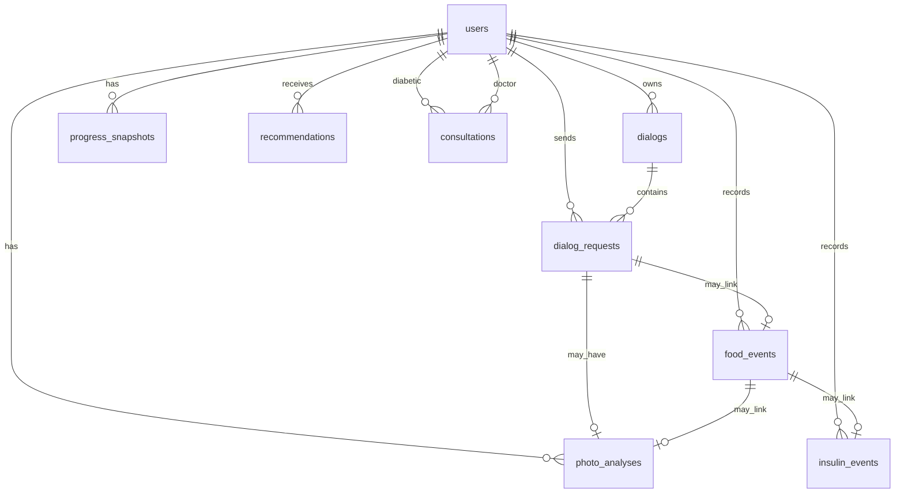

# Итерация database 2: Проектирование схемы данных

Опирается на [tasklist-database.md](../../../tasklist-database.md) · [impl/database/plan.md](../plan.md) · [iteration-1 summary](../iteration-1-user-scenarios/summary.md)

Skills: [postgresql-table-design](../../../../../.agents/skills/postgresql-table-design/SKILL.md)

## Цель

Актуализировать логическую и физическую модель PostgreSQL, ER-диаграмму и design review — вход для миграции `002_*` (итерация 5) и analytics API (backend iter 4).

## Ценность

- Единая целевая схема вместо gap-list из iter 1
- Решения по open questions зафиксированы до кода
- Review по PostgreSQL best practices до DDL в репозитории

## Зависимости

| Вход | Документ |
|------|----------|
| Сценарии D1–D7, Doc1–Doc4 | [user-scenarios.md](../../../../spec/user-scenarios.md) |
| Read/write, MVP scope | [data-requirements.md](../../../../spec/data-requirements.md) |
| MVP schema | [001_initial_schema.py](../../../../../alembic/versions/001_initial_schema.py) |
| Домен | [data-model.md](../../../../data-model.md) |
| СУБД | [ADR-001](../../../../adr/adr-001-database.md) |

## Задачи

| # | Задача | Статус | Документы |
|---|--------|--------|-----------|
| 02 | Проектирование схемы (логика + физика + ER) | 📋 Planned | [plan](tasks/task-02-schema-design/plan.md) · [summary](tasks/task-02-schema-design/summary.md) |

## Решения для проектирования (из open questions iter 1)

| Вопрос | Решение iter 2 | Обоснование |
|--------|----------------|-------------|
| PhotoAnalysis | **Таблица `photo_analyses`** + FK `request_id`, опц. FK `food_event_id` | Web D7, связь с FoodEvent; `dialog_requests.media` остаётся для raw metadata |
| ProgressSnapshot | **Таблица `progress_snapshots`** (persist) | Backend iter 4, D3/Doc2; on-the-fly — только для dev fallback |
| Doctor User | **`users.role`** enum `diabetic` / `doctor`; doctor без `telegram_id` nullable | Doc1, Consultation FK |
| Patient–doctor link | **Через `consultations`** (+ опц. `doctor_id` на snapshot read) | KISS; M2M — backlog |

## Целевые таблицы (002)

**Расширение MVP:**

| Таблица | Действие |
|---------|----------|
| `users` | + `display_name`, `email` nullable, `telegram_id` nullable для doctor |
| `photo_analyses` | новая |
| `progress_snapshots` | новая |
| `recommendations` | новая |
| `consultations` | новая |

## Артефакты

| Файл | Назначение |
|------|------------|
| `docs/spec/schema-er.md` | ER Mermaid + mapping логика → колонка |
| `docs/spec/schema-review.md` | postgresql-table-design pass/warn/fix |
| `docs/data-model.md` | целевая SQL-схема, diff с 001 |
| `docs/spec/README.md` | ссылки на schema-* |
| Черновик DDL | в task-02 plan / schema-er appendix *(impl — iter 5)* |

## Definition of Done

**Self-check:** ER покрывает iter 1; FK indexed; `TIMESTAMPTZ`; review в schema-review.md; diff с 001 явный; ADR-001 согласован.

**User-check:** `schema-er.md` + `data-model.md` — одни сущности; нет незакрытых Fix в review.

## Вне scope

- Alembic migration в репо — iter 5
- ORM/models — iter 5
- Makefile `db-*` — iter 4
- Новые REST endpoint'ы — backend iter 4

## Make-команды

Не требуются. Self-check: diff с `alembic/versions/001_initial_schema.py`.
