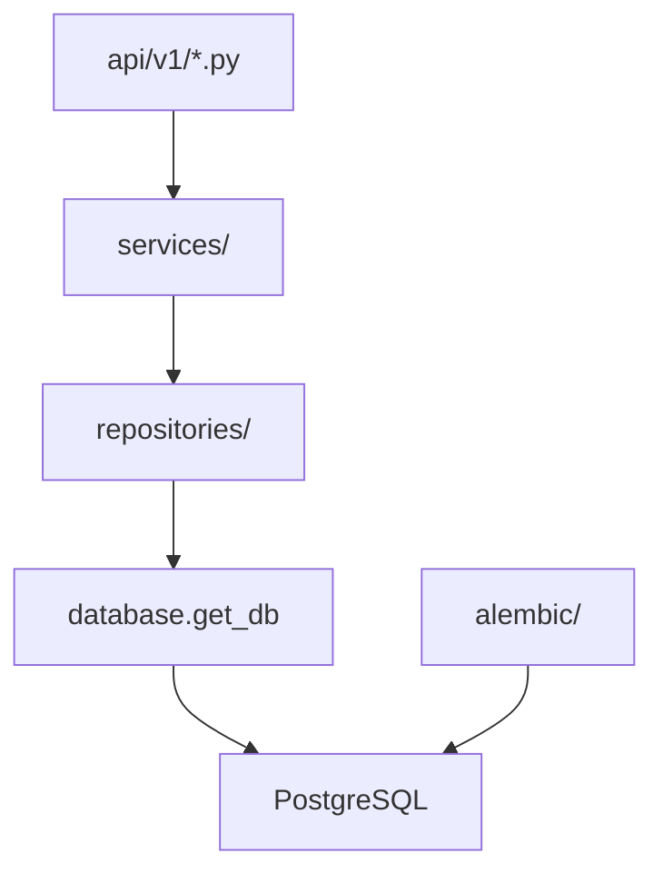

# Итерация database 3: ADR и практика доступа к БД

Опирается на [tasklist-database.md](../../../tasklist-database.md) · [impl/database/plan.md](../plan.md) · [iteration-2 summary](../iteration-2-schema-design/summary.md)

**Статус итерации:** ✅ Done · [summary](summary.md)

## Контекст

- **Tasklist:** итерация 3, задача 03
- **Зависимости (✅):** iter 1–2 ([schema-er.md](../../../../spec/schema-er.md)); backend MVP ([iteration-2-core summary](../../backend/iteration-2-core/summary.md))
- **Уже в коде:** async SQLAlchemy 2, Alembic `001`, паттерн handlers → services → repositories → `get_db`



**ADR-002** выбрал FastAPI + SQLAlchemy + Alembic, но не описал практику сессий, миграций и соглашений. **ADR-003** закрывает этот пробел без дублирования ADR-001 (СУБД) и ADR-002 (HTTP-стек).

## Цель

Единый источник для разработчиков: **почему** выбран текущий стек доступа к данным и **как** добавить таблицу / миграцию / repository за 5 шагов.

## Ценность

- Единый ответ «почему SQLAlchemy async + Alembic»
- Onboarding: добавить таблицу за 5 шагов без чтения всего backend
- Связь ADR-001 (PG) + ADR-002 (FastAPI) + практика repos

## Задачи

| # | Задача | Статус | Документы |
|---|--------|--------|-----------|
| 03 | ADR и практика доступа к БД | ✅ Done | [plan](tasks/task-03-data-access-adr/plan.md) · [summary](tasks/task-03-data-access-adr/summary.md) |

## Шаг 1: Сравнение альтернатив (ADR-003)

| Вариант | Вердикт | Обоснование |
|---------|---------|-------------|
| **SQLAlchemy 2 async + Alembic** | ✅ выбрано | Уже в backend; asyncpg; metadata → миграции; repos KISS |
| Raw SQL (asyncpg напрямую) | отклонено | Дублирование схемы, нет единого metadata для Alembic |
| SQLAlchemy sync | отклонено | FastAPI async — лишний thread pool |
| Django ORM | отклонено | ADR-002 — FastAPI |
| Tortoise / SQLModel | отклонено | второй ORM-стек |
| BaseRepository / generic CRUD | отклонено на MVP | тонкие repos — [backend-structure.md](../../../../tech/backend-structure.md) |

**Решение:**

| Аспект | Выбор |
|--------|--------|
| ORM | SQLAlchemy 2.x, `DeclarativeBase`, `Mapped[]` |
| Driver | `asyncpg` (`postgresql+asyncpg://`) |
| Session | `async_sessionmaker`, `expire_on_commit=False` |
| DI | FastAPI `Depends(get_db)` — commit/rollback на границе запроса |
| Миграции | Alembic async; revisions в `alembic/versions/` |
| Слои | handler → service → repository; без SQL в handlers |
| Модели | один файл на таблицу в `backend/models/` |
| Именование | snake_case = [schema-er.md](../../../../spec/schema-er.md) |
| Тесты | sqlite in-memory + `dependency_overrides[get_db]` |

## Шаг 2: ADR-003

Создан [adr-003-data-access-layer.md](../../../../adr/adr-003-data-access-layer.md):

1. Контекст — multi-service PG; 9 таблиц; `002` — iter 5
2. Альтернативы — таблица выше
3. Решение — стек + соглашения (service vs repo, Alembic, rollback)
4. Последствия
5. Вне scope — `db-*`, `002_*`, RLS
6. Связанные документы

Обновлён [adr/README.md](../../../../adr/README.md).

## Шаг 3: Guide `database-access.md`

Создан [database-access.md](../../../../tech/database-access.md):

- карта файлов (`database.py`, `alembic/`, models, repos, services)
- workflow «новая таблица» — 5 шагов
- make-команды
- тестирование (sqlite vs PG)
- troubleshooting

## Шаг 4: Смежные документы

| Файл | Статус |
|------|--------|
| `docs/tech/backend-structure.md` | секция «Слой данных» ✅ |
| `backend/README.md` | «Миграции и БД» ✅ |
| `docs/adr/adr-002-backend-stack.md` | ссылка ADR-003 ✅ |

## Артефакты

| Файл | Назначение |
|------|------------|
| [adr-003-data-access-layer.md](../../../../adr/adr-003-data-access-layer.md) | ADR |
| [database-access.md](../../../../tech/database-access.md) | практический guide |

## Definition of Done

**Self-check:** ADR принят; guide с 5 шагами; `make backend-migrate && make backend-test` green (30 passed).

**User-check:** по ADR понятно «почему»; по guide — «как»; backend README → guide.

## Вне scope

- `make db-*` — iter 4
- миграция `002_*`, новые models — iter 5
- изменения кода backend (кроме README)

## Make-команды

```bash
docker compose up -d
make backend-migrate
make backend-test
```

## Следующий шаг

[Итерация 4 — инфраструктура, seed, команды](../iteration-4-db-infra-seed/plan.md)
