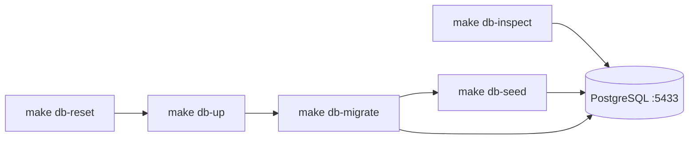

# Итерация database 4: Инфраструктура, seed, команды

Опирается на [tasklist-database.md](../../../tasklist-database.md) · [impl/database/plan.md](../plan.md) · [iteration-3 summary](../iteration-3-data-access-adr/summary.md)

**Статус итерации:** ✅ Done · [summary](summary.md)

## Контекст

- **Tasklist:** итерация 4, задача 04
- **Зависимости (✅):** ADR-003, [database-access.md](../../../../tech/database-access.md), схема `001_initial_schema` ([Backend MVP](../../backend/iteration-2-core/summary.md))
- **Вне scope:** миграция `002_*`, seed таблиц iter 5 (`progress_snapshots` — пустой массив в JSON v1)



Bootstrap (compose, Alembic, `001_*`, `DATABASE_URL`) создан в Backend iter 2; iter 4 добавляет **операции** (`make db-*`), **seed** и **inspect**.

## Цель

Повторяемое локальное окружение PostgreSQL: one-command поднятие/сброс, seed из анонимизированного прогресса, скрипты просмотра данных.

## Ценность

- `make db-reset` — чистая seeded БД за одну команду
- Idempotent seed для CI и onboarding
- `make db-inspect` — быстрая проверка без ПДн

## Задачи

| # | Задача | Статус | Документы |
|---|--------|--------|-----------|
| 04 | Инфраструктура БД, seed, команды | ✅ Done | [plan](tasks/task-04-db-infra-seed/plan.md) · [summary](tasks/task-04-db-infra-seed/summary.md) |

## Шаг 1: Формат seed `data/progress-import.v1.json`

```json
{
  "schema_version": 1,
  "users": [...],
  "food_events": [...],
  "insulin_events": [...],
  "progress_snapshots": []
}
```

- Фиксированные UUID — идемпотентность
- Анонимизация: `telegram_id` из `900000xxx`, синтетические описания
- Объём: 2 users, 10 food_events, 5 insulin_events (7–10 дней)
- `progress_snapshots: []` — заполнение в iter 5

См. [data/README.md](../../../../data/README.md).

## Шаг 2: `scripts/db/seed_from_progress.py`

- `asyncio.run`, `create_async_engine`, `get_settings().database_url`
- Pydantic-валидация JSON; проверка FK до insert
- Порядок: `users` → `food_events` → `insulin_events`
- **Идемпотентность:** `INSERT ... ON CONFLICT (id) DO NOTHING`
- Не логировать описания и `telegram_id`

## Шаг 3: `scripts/db/db_inspect.py`

> Имя `db_inspect.py` (не `inspect.py`) — конфликт со stdlib при запуске из `scripts/db/`.

- Counts: `users`, `food_events`, `insulin_events`, `dialogs`, `dialog_requests`
- Sample без ПДн; `--verbose` — telegram_id, усечённые description/comment

## Шаг 4: Makefile — цели `db-*`

| Цель | Действие |
|------|----------|
| `make db-up` | `docker compose up -d` + loop `pg_isready` |
| `make db-down` | `docker compose down` |
| `make db-reset` | `down -v` → `db-up` → `db-migrate` → `db-seed` |
| `make db-migrate` | alias `make backend-migrate` |
| `make db-seed` | `uv run python scripts/db/seed_from_progress.py` |
| `make db-shell` | `docker compose exec postgres psql -U diaai -d diaai` |
| `make db-inspect` | `uv run python scripts/db/db_inspect.py` |

## Шаг 5: Документация

| Файл | Изменение |
|------|-----------|
| [database-access.md](../../../../tech/database-access.md) | § «Локальное окружение и seed», таблица `db-*` |
| [README.md](../../../../README.md) | quick start: `make db-reset` |
| [backend/README.md](../../../../backend/README.md) | таблица `db-*`, quick start |
| [.env.example](../../../../.env.example) | комментарий к `DATABASE_URL` |
| [tasklist-database.md](../../../tasklist-database.md) | § «Базовая инфраструктура (зависимость)» |

`docker-compose.yml` — без изменений (healthcheck достаточен; wait в Makefile).

## Артефакты

| Файл | Назначение |
|------|------------|
| [data/progress-import.v1.json](../../../../data/progress-import.v1.json) | эталонная выгрузка |
| [scripts/db/seed_from_progress.py](../../../../scripts/db/seed_from_progress.py) | idempotent load |
| [scripts/db/db_inspect.py](../../../../scripts/db/db_inspect.py) | counts + sample |
| [Makefile](../../../../Makefile) | цели `db-*` |

## Definition of Done

**Self-check (агент):**

```bash
make db-reset && make db-inspect    # users:2, food:10, insulin:5
make db-seed && make db-inspect     # counts unchanged
make backend-test                   # 30 passed
make lint
```

**User-check (пользователь):**

```bash
make db-up / make db-down
make db-migrate
make db-reset && make db-inspect
make db-shell   # SELECT count(*) FROM food_events;
```

## Отклонения от первоначального плана

| План | Факт | Причина |
|------|------|---------|
| `inspect.py` | `db_inspect.py` | Shadowing stdlib `inspect` |
| `docker compose wait` | loop `pg_isready` | wait зависал |
| JSON Schema | pydantic в seed | без новой зависимости |
| `docker-compose.yml` | без diff | healthcheck уже был |

## Make-команды (справка)

```bash
make db-reset && make db-inspect
make db-seed   # idempotent
make backend-test
```

## Следующий шаг

[Итерация 5 — ORM, репозитории, backend](../iteration-5-orm-repos/plan.md)
