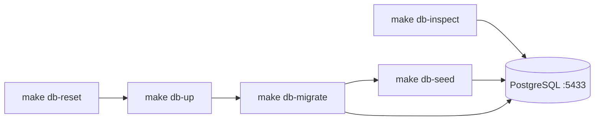

# Итерация database 4: Инфраструктура, seed, команды

Опирается на [tasklist-database.md](../../../tasklist-database.md) · [impl/database/plan.md](../plan.md) · [iteration-3 summary](../iteration-3-data-access-adr/summary.md)

**Статус итерации:** ✅ Done · [summary](summary.md)

## Контекст

- **Tasklist:** итерация 4, задача 04
- **Зависимости (✅):** ADR-003, [database-access.md](../../../../tech/database-access.md), схема `001_initial_schema`
- **Вне scope:** миграция `002_*`, seed таблиц iter 5 (`progress_snapshots` — пустой массив в JSON v1)



## Цель

Повторяемое локальное окружение PostgreSQL: one-command поднятие/сброс, seed из анонимизированного прогресса, скрипты просмотра данных.

## Ценность

- `make db-reset` — чистая seeded БД за одну команду
- Idempotent seed для CI и onboarding
- `make db-inspect` — быстрая проверка без ПДн

## Задачи

| # | Задача | Статус | Документы |
|---|--------|--------|-----------|
| 04 | Инфраструктура БД, seed, команды | ✅ Done | [plan](tasks/task-04-db-infra-seed/plan.md) · [summary](tasks/task-04-db-infra-seed/summary.md) |

## Артефакты

| Файл | Назначение |
|------|------------|
| `data/progress-import.v1.json` | эталонная анонимизированная выгрузка |
| `scripts/db/seed_from_progress.py` | idempotent load |
| `scripts/db/inspect.py` | counts + sample rows |
| `Makefile` | цели `db-*` |

## Definition of Done

**Self-check:** `make db-reset && make db-inspect` green; повторный `make db-seed` — без дублей; `make backend-test` green.

**User-check:** `make db-reset`; `data/progress-import.v1.json` читаем; `make db-shell` — ручной SELECT; README описывает все `db-*`.

## Make-команды

```bash
make db-reset && make db-inspect
make db-seed   # idempotent
make backend-test
```

## Следующий шаг

[Итерация 5 — ORM, репозитории, backend](../iteration-5-orm-repos/plan.md)
