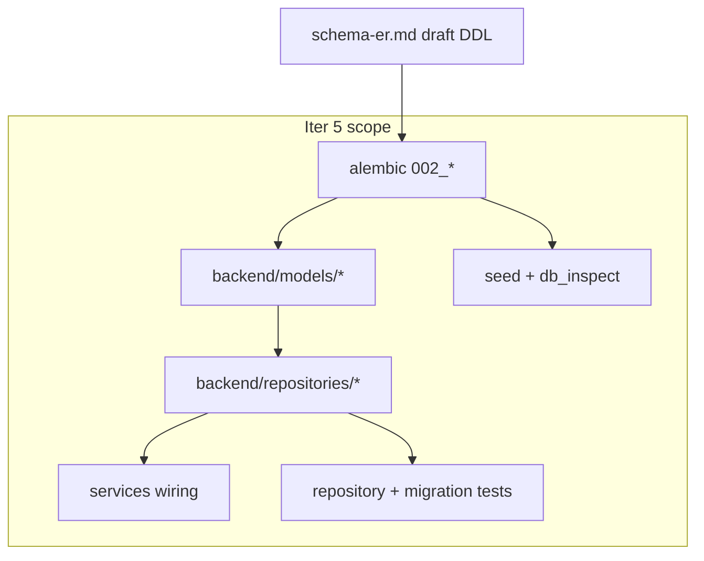

# Итерация database 5: ORM, репозитории, backend

Опирается на [tasklist-database.md](../../../tasklist-database.md) · [impl/database/plan.md](../plan.md) · [iteration-4 summary](../iteration-4-db-infra-seed/summary.md)

**Статус итерации:** ✅ Done · [summary](summary.md)

## Контекст

- **Tasklist:** итерация 5, задача 05
- **Зависимости (✅):** iter 1–4; [schema-er.md](../../../../spec/schema-er.md) §5–6 (draft DDL); [ADR-003](../../../../adr/adr-003-data-access-layer.md); `make db-*` + seed
- **Разблокирует:** [tasklist-backend.md](../../../tasklist-backend.md) задачи 09–12 (analytics API на готовых таблицах)

**Состояние до iter 5:** 5 таблиц (`001`), 6 models, 6 repos; `assistant_service` / `events_service` пишут в PG; bot prod без `SessionStore`. Не было: `photo_analyses`, `progress_snapshots`, `recommendations`, `consultations`; `User` без `display_name`/`email`, `telegram_id` NOT NULL.



## Цель

Реализовать целевую схему (9 таблиц) в коде: миграция `002_*`, ORM-модели, репозитории, минимальная интеграция в services — полный data layer в PostgreSQL перед backend analytics.

## Ценность

- Backend analytics (09–12) работает на готовых таблицах
- Photo-запросы persist в `photo_analyses`
- Seed и inspect покрывают все 9 таблиц
- Доменные данные backend — только PostgreSQL (без RAM persistence)

## Задачи

| # | Задача | Статус | Документы |
|---|--------|--------|-----------|
| 05 | ORM, репозитории, backend | ✅ Done | [plan](tasks/task-05-orm-repos/plan.md) · [summary](tasks/task-05-orm-repos/summary.md) |

---

## Шаг 1: Миграция `002_full_data_layer.py`

**Создать:** [`alembic/versions/002_full_data_layer.py`](../../../../alembic/versions/002_full_data_layer.py) (`revision="002"`, `down_revision="001"`).

**Источник DDL:** [schema-er.md §6](../../../../spec/schema-er.md#6-appendix-draft-migration-002) — без отклонений без ADR.

| Блок | Действие |
|------|----------|
| `users` | ADD `display_name`, `email`; `telegram_id` → nullable; DROP unique constraint; partial UNIQUE index; CHECK role; index `ix_users_role` |
| `food_events` / `insulin_events` | ADD composite/partial indexes (§3.4–3.5) |
| `photo_analyses` | CREATE |
| `progress_snapshots` | CREATE |
| `recommendations` | CREATE |
| `consultations` | CREATE |

**`downgrade()`:** обратный порядок (drop new tables → revert users).

**Проверка:** `make db-reset` (migrate 001→002 + seed); `uv run alembic downgrade -1` / `upgrade head` на чистой БД.

---

## Шаг 2: SQLAlchemy models (один файл — одна таблица)

**Новые файлы** в [`backend/models/`](../../../../backend/models/):

| Файл | Таблица |
|------|---------|
| `photo_analysis.py` | `photo_analyses` |
| `progress_snapshot.py` | `progress_snapshots` |
| `recommendation.py` | `recommendations` |
| `consultation.py` | `consultations` |

**Обновить:** [`backend/models/user.py`](../../../../backend/models/user.py) — `display_name`, `email`; `telegram_id: Mapped[int | None]`; убрать `unique=True` на колонке (partial index — только в миграции).

**Register:** [`backend/models/__init__.py`](../../../../backend/models/__init__.py), [`alembic/env.py`](../../../../alembic/env.py) — обязательно.

Образец стиля: [`backend/models/food_event.py`](../../../../backend/models/food_event.py).

---

## Шаг 3: Repositories

**Новые файлы** в [`backend/repositories/`](../../../../backend/repositories/):

| Repository | Методы (MVP) |
|------------|--------------|
| `photo_analysis.py` | `create(...)`, `get_by_request_id`, `list_by_user_id` |
| `progress_snapshot.py` | `create`, `get_by_user_period`, `list_by_user` |
| `recommendation.py` | `create`, `list_by_user` |
| `consultation.py` | `create`, `get_by_id`, `list_by_diabetic`, `list_by_doctor` |

**Обновить:** [`backend/repositories/user.py`](../../../../backend/repositories/user.py) — `get_or_create(telegram_id)` без изменения контракта API v1; `create_doctor(display_name, email)` для seed/web.

Паттерн: thin repo, без `AppError`, `flush()` при необходимости PK — [ADR-003](../../../../adr/adr-003-data-access-layer.md).

---

## Шаг 4: Services — wiring (без новых REST endpoint'ов)

### `assistant_service` — photo_analysis persist

После `RequestRepository.create` для `request_type in ("photo", "mixed")`:

- создать `PhotoAnalysis` через repo: `user_id`, `request_id`, `object_type="dish"`, `comment=reply`
- structured поля (`xe`, `bje`, …) — **null на MVP**; парсинг LLM → backend iter 11

Файл: [`backend/services/assistant_service.py`](../../../../backend/services/assistant_service.py)

### Заготовки services (repos only, без routers)

| Файл | Назначение |
|------|------------|
| `backend/services/progress_service.py` | обёртка над `ProgressSnapshotRepository` — create/list |
| `backend/services/consultation_service.py` | обёртка над `ConsultationRepository` — create/list |

Используются в тестах repos и как точка входа для backend iter 4 (09–12). **Новые endpoint'ы — вне scope.**

### `events_service`

Без изменений контракта API; link `food_event.request_id` — уже есть.

### RAM persistence

Backend на PG; bot prod без `SessionStore`. **Не трогать** legacy `src/diaai/session_store.py` (bot tests). Критерий: доменные данные backend — только PostgreSQL.

---

## Шаг 5: Seed и inspect (расширение iter 4)

| Файл | Изменение |
|------|-----------|
| [`data/progress-import.v1.json`](../../../../data/progress-import.v1.json) | `schema_version: 2`; doctor: `display_name`; 1–2 `progress_snapshots`; 1 `consultation` |
| [`scripts/db/seed_from_progress.py`](../../../../scripts/db/seed_from_progress.py) | load новых секций; idempotent по `id` |
| [`scripts/db/db_inspect.py`](../../../../scripts/db/db_inspect.py) | counts для 4 новых таблиц |
| [`data/README.md`](../../../../data/README.md) | описание v2 / новых секций |

---

## Шаг 6: Тесты

| Файл | Содержание |
|------|------------|
| `backend/tests/test_migrations.py` | metadata: 9 таблиц |
| `backend/tests/test_repositories_extended.py` | CRUD/list для новых repos через sqlite `:memory:` |
| `backend/tests/test_assistant.py` | photo request → row в `photo_analyses`; text → без row |
| [`backend/tests/conftest.py`](../../../../backend/tests/conftest.py) | импорт всех models для `create_all`; markers `integration`/`unit` |

**Стратегия:** unit/contract — sqlite + mock LLM; migration smoke — `make db-reset` на PG.

**Skills review:** [fastapi-templates](../../../../../.agents/skills/fastapi-templates/SKILL.md), [python-testing-patterns](../../../../../.agents/skills/python-testing-patterns/SKILL.md).

---

## Шаг 7: Документация

| Файл | Изменение |
|------|-----------|
| [`docs/data-model.md`](../../../../data-model.md) | фактическая SQL после `002_*` |
| [`backend/README.md`](../../../../backend/README.md) | миграция `002`, новые таблицы |
| [`docs/tech/database-access.md`](../../../../tech/database-access.md) | ссылка на 9 таблиц |
| [`docs/tasks/tasklist-backend.md`](../../../tasklist-backend.md) | dependency iter 5 ✅ для 09–12 |
| [`docs/tasks/impl/database/summary.md`](../summary.md) | область 5/5 |

**Не менять** [`docs/api/api-contract.md`](../../../../api/api-contract.md) v1 — persisted fields API без изменений (schema-er §5).

---

## Артефакты

| Путь | Назначение |
|------|------------|
| `alembic/versions/002_full_data_layer.py` | DDL iter 5 |
| `backend/models/*` (4 новых + User) | ORM |
| `backend/repositories/*` (4 новых) | data access |
| `backend/services/progress_service.py`, `consultation_service.py` | stubs |
| `backend/tests/test_migrations.py`, `test_repositories_extended.py` | tests |
| `data/progress-import.v1.json` v2 | seed |

---

## Definition of Done

**Self-check (агент):**

```bash
make db-reset                    # 001 + 002 + seed
make db-inspect                  # 9 tables, snapshots > 0
make backend-test                # repo/migration tests
make test                        # backend + bot
make lint
uv run alembic downgrade -1      # dev: откат 002
uv run alembic upgrade head
```

**User-check (пользователь):**

- `make db-reset` → `make backend-run` → curl assistant (photo) + events → `make db-inspect` — `photo_analyses`, events в PG
- restart backend — данные на месте

---

## Вне scope

- REST endpoint'ы analytics (backend 09–12)
- Парсинг ХЕ/БЖУ из LLM reply в structured `photo_analyses` fields
- Web UI, bot changes
- JSON Schema для seed v2 (pydantic достаточно)
- RLS, generic BaseRepository
- Синхронизация ORM `__table_args__` с partial indexes для «чистого» autogenerate (drift ожидаем — ADR-003)

---

## Риски

| Риск | Решение |
|------|---------|
| sqlite ≠ PG (partial index, CHECK) | migration smoke на docker PG via `make db-reset`; unit tests — упрощённые cases |
| `telegram_id` nullable ломает seed doctor | seed doctor может оставить `telegram_id`; nullable для web-only doctors |
| Breaking User ORM | миграция ALTER + обновить model + repo tests |
| Alembic autogenerate drift | partial indexes/constraints только в миграции; autogenerate опционален |

---

## Порядок реализации

1. Записать `plan.md` (iteration + task-05)
2. `002_full_data_layer.py` + verify migrate
3. Models + `__init__` + `env.py`
4. Repositories
5. `assistant_service` photo persist + stub progress/consultation services
6. Seed + inspect update
7. Tests
8. Docs + self-check + summary + tasklist **5/5**

---

## Следующий шаг

Backend iter 4 analytics (tasks 09–12) на готовом data layer — [tasklist-backend.md](../../../tasklist-backend.md).
