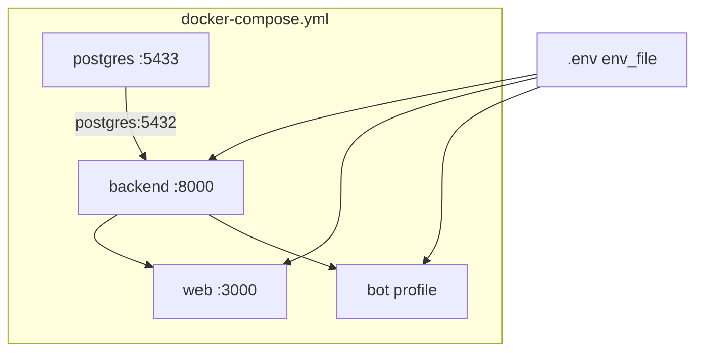

# Итерация 0 — локальный полный стек

Опирается на [tasklist-devops.md](../../../tasklist-devops.md) · [impl/devops/plan.md](../plan.md) · [plan.md](../../../../plan.md)

## Цель

`make stack-up` поднимает **postgres + backend + web** (+ bot optional) из одного корневого [`docker-compose.yml`](../../../../docker-compose.yml).

## Ценность

- Onboarding, smoke и demo **одной командой** — без 3–4 терминалов
- Host dev сохранён: `make db-*`, `backend-run`, `web-dev`, `make test` (84)

## Архитектура stack



## Ключевые решения

| Решение | Выбор |
|---------|-------|
| Orchestration | **Только** корневой `docker-compose.yml` |
| Dockerfile layout | `devops/docker/{backend,bot,web}/` |
| Python build context | repo root (`.`) — `alembic/`, `prompts/`, `uv.lock` |
| Web build context | `web/` + `dockerfile: ../devops/docker/web/Dockerfile` |
| `DATABASE_URL` в stack | `@postgres:5432` (compose override) |
| Host `db-*` | `@localhost:5433` |
| Migrate | backend entrypoint: `.venv/bin/alembic upgrade head` |
| Seed | `make db-reset` / `make stack-init` — не в entrypoint |
| Bot | profile `bot`; `make stack-up-bot` |
| Web runtime | Node 24, `next build` + `node …/next start` |
| uv in images | pin `ghcr.io/astral-sh/uv:0.11` |

## Задачи

| # | Задача | Статус | Документы |
|---|--------|--------|-----------|
| 01 | Структура `devops/` | ✅ Done | [plan](tasks/task-01-devops-layout/plan.md) · [summary](tasks/task-01-devops-layout/summary.md) |
| 02 | Dockerfile + .dockerignore | ✅ Done | [plan](tasks/task-02-dockerfiles/plan.md) · [summary](tasks/task-02-dockerfiles/summary.md) |
| 03 | Корневой compose | ✅ Done | [plan](tasks/task-03-compose-full-stack/plan.md) · [summary](tasks/task-03-compose-full-stack/summary.md) |
| 04 | Makefile stack-* | ✅ Done | [plan](tasks/task-04-makefile-stack/plan.md) · [summary](tasks/task-04-makefile-stack/summary.md) |
| 05 | Ревью docker-expert | ✅ Done | [plan](tasks/task-05-docker-review/plan.md) · [summary](tasks/task-05-docker-review/summary.md) |
| 06 | Docs + закрытие | ✅ Done | [plan](tasks/task-06-docs-compose/plan.md) · [summary](tasks/task-06-docs-compose/summary.md) |

## Make-команды (итог)

| Команда | Действие |
|---------|----------|
| `make stack-up` | полный stack (build + up) |
| `make stack-up-bot` | stack + profile bot |
| `make stack-down` / `stack-ps` | stop / status |
| `make stack-logs` | follow all или `SVC=` |
| `make stack-logs-tail` | последние 100 строк (без follow) |
| `make stack-health` | pg + `/health` + web :3000 |
| `make stack-init` | `db-reset` + `stack-up` |
| `make db-up` | **только** postgres |

## Критерии завершения

- [x] `make stack-up && make stack-health`
- [x] smoke login `@ivan_p`, dashboard 200
- [x] `make stack-up-bot` → polling без rebuild пакета
- [x] `make db-reset` / `make db-up` без full stack
- [x] [docs/devops/docker-compose-local.md](../../../devops/docker-compose-local.md)
- [x] docker-expert review (2 раунда) — [task-05 summary](tasks/task-05-docker-review/summary.md)
- [x] [summary iter 0](summary.md) ✅

## Verify (2026-06-23)

```bash
make stack-down && make stack-up && make stack-health
make stack-up-bot                    # bot polling OK
curl -X POST localhost:3000/api/auth/login -d '{"username":"ivan_p"}'
make db-up && docker compose ps      # только postgres
make test                            # 84 passed
```

## Следующий шаг

[Итерация 1](../iteration-1-registry-ci/plan.md) — GHCR + GHA (tasks 07–09).
