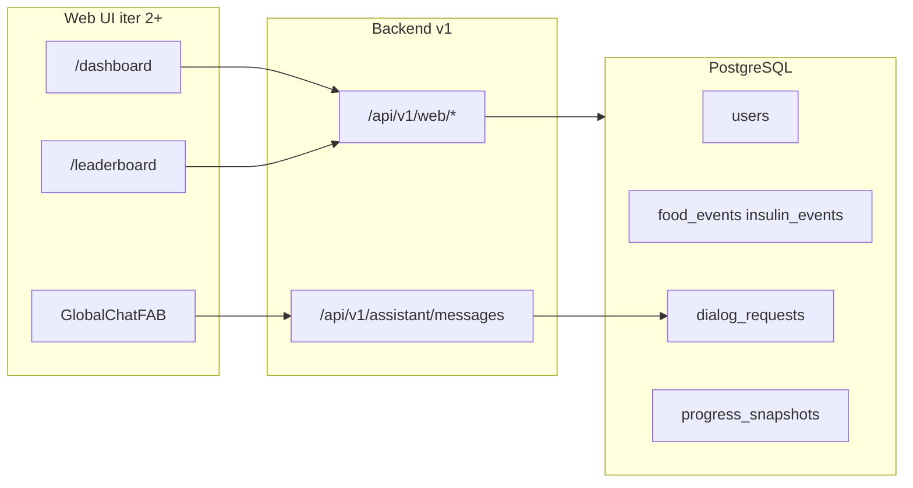

# Итерация frontend 0: UI-требования и API-контракты

Опирается на [tasklist-frontend.md](../../../tasklist-frontend.md) · [impl/frontend/plan.md](../plan.md) · [vision.md](../../../../vision.md)

Skills: [api-design-principles](../../../../.agents/skills/api-design-principles/SKILL.md)

**Статус:** ✅ Done · [summary](summary.md)

---

## Цель

Зафиксировать функциональные требования к четырём зонам UI, стиль (tbench dark), MVP-вход по Telegram username и REST-контракты для всех экранов — **без кода** в `web/` и backend.

## Ценность

- Единый контракт для iter 1 (backend API + seed) и iter 2–6 (экраны Next.js)
- Явный маппинг «панель преподавателя / tbench» → домен diaai (доктор, пациенты, метрики)
- Снятие неоднозначности auth и web-specific endpoint'ов

## Зависимости

| Область | Статус | Нужно iter 0 |
|---------|--------|--------------|
| Backend MVP (assistant, events) | ✅ | базовый чат, события |
| Database iter 5 (9 таблиц) | ✅ | analytics, consultations |
| Bot API v1 | ✅ | reuse `POST /assistant/messages` |

## Маппинг UI → домен

| # | Зона UI (ТЗ) | Маршрут / UI | Сценарии | API |
|---|--------------|--------------|----------|-----|
| 1 | Панель пациента с диабетом | `/dashboard` | D1, D3 | patient dashboard API *(iter 3)* |
| 2 | Лидерboard | `/leaderboard` | D3 | `GET /api/v1/web/leaderboard` |
| 3 | Глобальный чат (FAB) | overlay | D2 | `GET …/assistant/history`, `POST /api/v1/assistant/messages` |
| 4 | Матрица прогресса | блок на `/dashboard` | Doc2, D3 | `GET …/progress-matrix` |
| — | Вход | `/login` | — | `POST /api/v1/web/auth/resolve` |

## Задачи

| # | Задача | Статус | Документы |
|---|--------|--------|-----------|
| 00 | UI-требования и API-контракты | ✅ Done | [plan](tasks/task-00-ui-contracts/plan.md) · [summary](tasks/task-00-ui-contracts/summary.md) |

## Состав работ (task 00)

- [x] **Зона 1 — dashboard:** 4 KPI + delta; chart 14d; questions; submissions; matrix (ссылка на зону 4)
- [x] **Зона 2 — leaderboard:** table / scatter toggle; продукты + ХЕ; медали топ-5 БЖЕ на продукты
- [x] **Зона 3 — FAB chat:** overlay, history + send
- [x] **Зона 4 — matrix:** пациенты × периоды/метрики, tooltip
- [x] **Стиль:** tbench dark, design tokens S1–S13
- [x] **Auth:** username → `telegram_id` / role; demo doctor `@doctor_ivanov`
- [x] **API:** 8 web endpoint'ов + reuse assistant; openapi tag `web`
- [x] **Сверка:** user-scenarios, data-requirements, api v1
- [x] **Review:** api-design-principles → [api-contract-review.md](../../../../api/api-contract-review.md)

## Артефакты

| Файл | Действие | Статус |
|------|----------|--------|
| [docs/spec/frontend-requirements.md](../../../../spec/frontend-requirements.md) | создать | ✅ |
| [docs/spec/frontend-design-system.md](../../../../spec/frontend-design-system.md) | создать | ✅ |
| [docs/api/frontend-contract.md](../../../../api/frontend-contract.md) | создать | ✅ |
| [docs/api/openapi.yaml](../../../../api/openapi.yaml) | tag `web` | ✅ |
| [docs/api/api-contract.md](../../../../api/api-contract.md) | web-секция + cross-link | ✅ |
| [docs/api/api-contract-review.md](../../../../api/api-contract-review.md) | design review | ✅ |
| [docs/spec/README.md](../../../../spec/README.md) | индекс frontend spec | ✅ |
| [docs/integrations.md](../../../../integrations.md) | web client | ✅ |
| [docs/tasks/tasklist-frontend.md](../../../tasklist-frontend.md) | статус iter 0 | ✅ |
| [impl/frontend/plan.md](../plan.md) | прогресс 1/10 | ✅ |

## API (контракт v1, префикс `/api/v1/web/`)

| Method | Path | Зона |
|--------|------|------|
| POST | `/web/auth/resolve` | auth |
| GET | `/web/doctor/dashboard/summary` | 1 |
| GET | `/web/doctor/dashboard/activity` | 1 |
| GET | `/web/doctor/dashboard/questions` | 1 |
| GET | `/web/doctor/dashboard/submissions` | 1 |
| GET | `/web/doctor/dashboard/progress-matrix` | 4 |
| GET | `/web/leaderboard` | 2 |
| GET | `/web/assistant/history` | 3 |

Детали: [frontend-contract.md](../../../../api/frontend-contract.md).

## Open questions → iter 1

| Вопрос | Рекомендация |
|--------|--------------|
| Нет `telegram_username` в `users` | seed-map / `display_name` / миграция `003` |
| Patient → doctor cohort | все diabetics в seed на MVP |

## Definition of Done

**Self-check:** ✅ 4 зоны в spec; design tokens; endpoint'ы с JSON; openapi tag `web`; согласовано с api v1 и data-model; api-design-principles review.

**User-check:**

- [ ] `frontend-requirements.md` — понятны 4 зоны и вход через username
- [ ] `frontend-contract.md` — понятны endpoint'ы и JSON

## Вне scope

Код `web/`, backend routers, миграции, seed — **iter 1**. Next.js scaffold — **iter 2**.

## Следующая итерация

[iteration-1-frontend-api](../iteration-1-frontend-api/plan.md) — реализация `/api/v1/web/*`, seed `@doctor_ivanov`, demo data.
