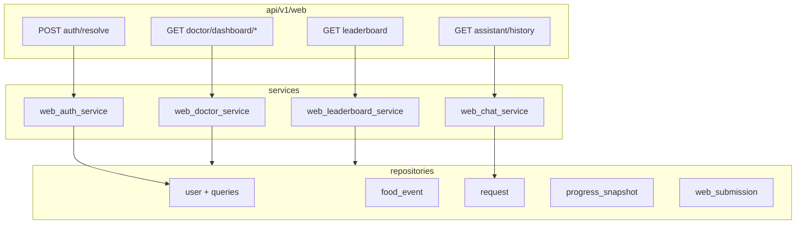

# Итерация frontend 1: API для frontend

Опирается на [tasklist-frontend.md](../../../tasklist-frontend.md) · [impl/frontend/plan.md](../plan.md) · [frontend-contract.md](../../../../api/frontend-contract.md)

Skills: [api-design-principles](../../../../.agents/skills/api-design-principles/SKILL.md) · [fastapi-templates](../../../../.agents/skills/fastapi-templates/SKILL.md) · [modern-python](../../../../.agents/skills/modern-python/SKILL.md)

**Статус:** ✅ Done · [summary](summary.md)

---

## Цель

Backend отдаёт все DTO для dashboard, leaderboard, chat history и login resolve; после `make db-reset` UI iter 3+ может работать на live API без mock.

## Ценность

- Контракты iter 0 становятся runnable API
- Demo doctor `@doctor_ivanov` и когорта пациентов в seed
- Contract tests фиксируют схему для Next.js iter 2+

## Зависимости

| Область | Статус | Нужно iter 1 |
|---------|--------|--------------|
| Frontend iter 0 (контракты) | ✅ | [frontend-contract.md](../../../../api/frontend-contract.md) |
| Backend MVP (assistant, events) | ✅ | reuse `POST /assistant/messages` |
| Database iter 5 (9 таблиц) | ✅ | food, dialogs, snapshots |
| `web/` Next.js | 📋 iter 2 | потребитель API |

**Зона работ:** backend + database/seed. **Не** `web/` Next.js.

## Gap analysis (контракт → PG → действие)

| Endpoint / блок | Источник PG | Gap (до iter 1) | Действие |
|-----------------|-------------|-----------------|----------|
| `POST /web/auth/resolve` | `users` | нет `telegram_username` | миграция `003` + seed doctor |
| Dashboard KPI / activity | `food_events`, `dialog_requests` | 1 diabetic; нет requests в seed | seed v3 |
| Questions feed | `dialog_requests` + `users` | seed не грузил dialogs | seed + repo queries |
| Submissions | `food_events`, `photo_analyses` | photo не в seed | seed + `WebSubmissionRepository` |
| Progress matrix | `progress_snapshots` | 1 patient, 2 snapshots | seed × patients × weeks |
| Leaderboard | snapshots + events | мало patients | seed + `WebLeaderboardService` |
| Assistant history | `dialog_requests` | нет list-by-user | repo + `WebChatService` |
| Doctor cohort | `users.role=diabetic` | нет doctor→patient filter | **MVP:** все diabetics |

## Архитектура



Паттерн: **handler → service → repo → `get_db`**, Bearer через [backend/api/deps.py](../../../../../backend/api/deps.py), DI через [service_deps.py](../../../../../backend/api/v1/web/service_deps.py).

## Задачи

| # | Задача | Статус | Документы |
|---|--------|--------|-----------|
| 01 | Frontend API + seed v3 | ✅ Done | [plan](tasks/task-01-frontend-api/plan.md) · [summary](tasks/task-01-frontend-api/summary.md) |

## Состав работ (task 01)

- [x] Gap analysis → зафиксировать в task plan
- [x] Миграция `003_telegram_username` + `User.telegram_username`
- [x] `backend/schemas/web.py` — DTO по frontend-contract
- [x] Repos: cohort aggregations, `web_submission` (UNION pagination)
- [x] Services: `web_auth`, `web_doctor`, `web_leaderboard`, `web_chat`
- [x] Routers `backend/api/v1/web/*` + register in v1 router
- [x] Seed v3: `@doctor_ivanov`, 6 diabetics, dialogs, photo_analyses, snapshots
- [x] `backend/tests/test_web_api.py` (8 cases)
- [x] Docs: README, api-contracts, frontend-contract impl ✅
- [x] Skills review: fastapi-templates, modern-python, postgresql-table-design, sharp-edges

## Реализованные файлы

| Путь | Назначение |
|------|------------|
| [alembic/versions/003_telegram_username.py](../../../../../alembic/versions/003_telegram_username.py) | `users.telegram_username` + partial UNIQUE |
| [backend/schemas/web.py](../../../../../backend/schemas/web.py) | Pydantic DTO |
| [backend/services/web_*.py](../../../../../backend/services/) | auth, doctor, leaderboard, chat, utils |
| [backend/repositories/web_submission.py](../../../../../backend/repositories/web_submission.py) | SQL UNION submissions |
| [backend/api/v1/web/](../../../../../backend/api/v1/web/) | auth, dashboard, leaderboard, history |
| [backend/api/v1/web/service_deps.py](../../../../../backend/api/v1/web/service_deps.py) | DI factories |
| [backend/tests/test_web_api.py](../../../../../backend/tests/test_web_api.py) | contract tests |
| [data/progress-import.v1.json](../../../../../data/progress-import.v1.json) | schema v3 |
| [scripts/db/seed_from_progress.py](../../../../../scripts/db/seed_from_progress.py) | dialogs, requests, photos |

## API (реализовано, префикс `/api/v1/web/`)

| Method | Path | Auth | Описание |
|--------|------|------|----------|
| POST | `/web/auth/resolve` | Bearer | username → user |
| GET | `/web/doctor/dashboard/summary` | Bearer + doctor | 4 KPI |
| GET | `/web/doctor/dashboard/activity` | Bearer + doctor | series 14d |
| GET | `/web/doctor/dashboard/questions` | Bearer + doctor | лента вопросов |
| GET | `/web/doctor/dashboard/submissions` | Bearer + doctor | food + photo |
| GET | `/web/doctor/dashboard/progress-matrix` | Bearer + doctor | матрица |
| GET | `/web/leaderboard` | Bearer + doctor | table + scatter |
| GET | `/web/assistant/history` | Bearer | history FAB |

Детали: [frontend-contract.md](../../../../api/frontend-contract.md).

## Seed v3

| Сущность | Count (demo) |
|----------|--------------|
| users | 7 (1 doctor + 6 diabetics) |
| food_events | 167 |
| dialog_requests | 24 |
| photo_analyses | 4 |
| progress_snapshots | 18 |

Demo doctor: `@doctor_ivanov`, `telegram_id: 162684825`, `display_name: Doctor Ivanov`.

## Решения

| Решение | Обоснование |
|---------|-------------|
| Миграция `003` | lookup по `telegram_username` для auth resolve |
| Cohort MVP | все `role=diabetic`, без consultations filter |
| `columns=metric` в progress-matrix | query принят; MVP — period-колонки |
| Submissions pagination | SQL `UNION ALL` в `WebSubmissionRepository` |
| Service DI | `get_web_*_service` вместо inline `Service(db)` |

## Skills (review)

| Skill | Фокус | Verdict |
|-------|-------|---------|
| api-design-principles | impl ↔ iter 0 contract | ✅ |
| fastapi-templates | layers, DI, async | ✅ |
| modern-python | ruff, typing, structure | ✅ |
| postgresql-table-design | `003` partial UNIQUE | ✅ |
| sharp-edges | Bearer, ORM, no raw SQL injection | ✅ |

## Definition of Done

**Self-check (агент):** ✅

- [x] Миграция `003` applies
- [x] Seed idempotent (+0 на повтор)
- [x] 8 web endpoints 200 + schema
- [x] Doctor `doctor_ivanov` в PG
- [x] `make test` — 60 passed
- [x] `make lint` green

**User-check:**

```bash
make db-reset && make db-inspect
make backend-run
export TOKEN="$BACKEND_SERVICE_TOKEN"
export BASE="http://127.0.0.1:8000"
export DOC=162684825

curl -s -X POST "$BASE/api/v1/web/auth/resolve" \
  -H "Authorization: Bearer $TOKEN" -H "Content-Type: application/json" \
  -d '{"username":"doctor_ivanov"}'

curl -s "$BASE/api/v1/web/doctor/dashboard/summary?doctor_telegram_id=$DOC" \
  -H "Authorization: Bearer $TOKEN"

curl -s "$BASE/api/v1/web/leaderboard?doctor_telegram_id=$DOC" \
  -H "Authorization: Bearer $TOKEN"
```

## Вне scope

- Next.js (`web/`) — iter 2
- Backend analytics `/api/v1/analytics/*` — backend iter 4
- JWT / web sessions на backend
- Doctor→patient cohort через consultations

## Следующая итерация

[iteration-2-scaffold](../iteration-2-scaffold/plan.md) — каркас Next.js, layout, auth BFF.
