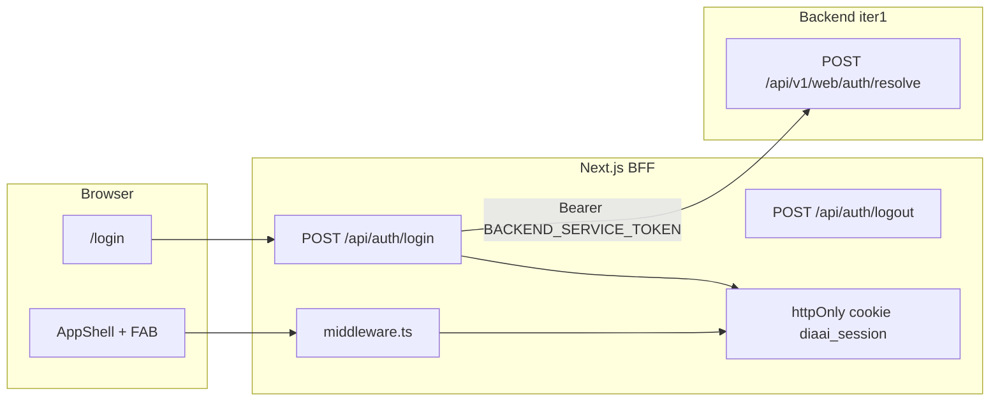

# Итерация frontend 2: Каркас frontend

Опирается на [tasklist-frontend.md](../../../tasklist-frontend.md) · [impl/frontend/plan.md](../plan.md) · [frontend-requirements.md](../../../../spec/frontend-requirements.md)

Skills: [shadcn](../../../../.agents/skills/shadcn/SKILL.md) · [vercel-react-best-practices](../../../../.agents/skills/vercel-react-best-practices/SKILL.md) · [nextjs-app-router-patterns](../../../../.agents/skills/nextjs-app-router-patterns/SKILL.md)

**Статус:** 🚧 In Progress

---

## Цель

Инициализировать Next.js App Router + shadcn/ui + Tailwind в `web/`; тёмная тема tbench, layout, вход по Telegram username (BFF), make-команды.

## Ценность

- Runnable web-клиент на :3000 для iter 3–6
- Auth через backend iter 1 (`POST /api/v1/web/auth/resolve`)
- App shell с навигацией и FAB-заглушкой без dashboard data

## Зависимости

| Область | Статус | Нужно iter 2 |
|---------|--------|--------------|
| Frontend iter 0 (spec, design system) | ✅ | tokens, routes, auth flow |
| Frontend iter 1 (web API) | ✅ | auth/resolve, demo `akozhin` |
| `web/` toolchain | ✅ | `.nvmrc`, `package.json` engines |

**Зона работ:** `web/` Next.js + Makefile + docs. **Не** dashboard/leaderboard API fetch.

## Архитектура



**Решения:**

1. BFF-only auth — `BACKEND_SERVICE_TOKEN` только server env
2. Сессия — httpOnly cookie `diaai_session`
3. Route groups: `(auth)/login`, `(app)/*`
4. Role-based: doctor → Dashboard/Leaderboard/Chat; diabetic → Chat only
5. Placeholder pages без fetch API
6. FAB — Sheet-заглушка «iter 5»

## Задачи

| # | Задача | Статус | Документы |
|---|--------|--------|-----------|
| 02 | Каркас Next.js + layout + auth | 🚧 In Progress | [plan](tasks/task-02-scaffold/plan.md) · [summary](tasks/task-02-scaffold/summary.md) |

## Состав работ (task 02)

- [ ] `pnpm create next-app` в `web/`
- [ ] shadcn/ui init + базовые компоненты + design tokens
- [ ] BFF login/logout + session cookie + middleware
- [ ] Login page, AppShell (sidebar/header), placeholder routes, ChatFab
- [ ] Makefile: `web-install`, `web-dev`, `web-build`, `web-lint`
- [ ] `web/README.md`, root README, integrations, `.env.example`
- [ ] Skills review + summary

## Definition of Done

**Self-check:**

```bash
make db-reset && make backend-run   # :8000
make web-install && make web-dev    # :3000
make web-lint && make web-build
```

- Login `akozhin` → `/dashboard`
- Nav + FAB + logout
- Dark theme, lint/build green

**User-check:** localhost:3000, login, навигация, FAB, logout.

## Out of scope

- Dashboard/leaderboard/history fetch (iter 3–5)
- JWT/OAuth, E2E Playwright (iter 7)
