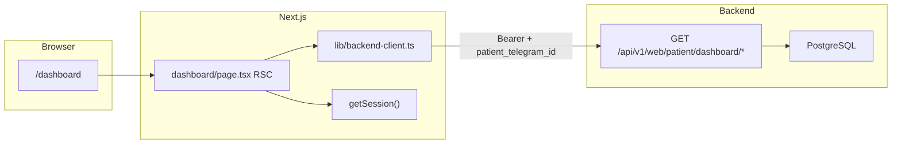

# Итерация frontend 3: Панель пациента с диабетом

Опирается на [tasklist-frontend.md](../../../tasklist-frontend.md) · [impl/frontend/plan.md](../plan.md) · [frontend-requirements.md](../../../../spec/frontend-requirements.md) · [frontend-design-system.md](../../../../spec/frontend-design-system.md) · [frontend-contract.md](../../../../api/frontend-contract.md)

Skills: [shadcn](../../../../.agents/skills/shadcn/SKILL.md) · [vercel-react-best-practices](../../../../.agents/skills/vercel-react-best-practices/SKILL.md) · [nextjs-app-router-patterns](../../../../.agents/skills/nextjs-app-router-patterns/SKILL.md)

**Статус:** ✅ Done · [summary](summary.md)

---

## Цель

Страница `/dashboard` для роли `diabetic`: личные KPI с дельтой, график активности 14 дней, таблица вопросов ассистенту, лента фиксаций, матрица прогресса — на live API без mock (D1, D3).

## Ценность

- Первый data-driven экран web-клиента для пациента с диабетом
- Закрывает gap iter 1: `/doctor/dashboard/*` → patient-scoped API
- Переиспользует shell iter 2 (sidebar, header, FAB) без переделки каркаса

## Зависимости

| Область | Статус | Нужно iter 3 |
|---------|--------|--------------|
| Frontend iter 0 (spec, design system) | ✅ | wireframes экрана 1, зона 4 |
| Frontend iter 1 (web API, seed v3) | ✅ | PG-данные для demo-пациентов |
| Frontend iter 2 (scaffold, auth BFF) | ✅ | `/dashboard` placeholder, session |
| Backend running + seed | ✅ | `make db-reset`, `make backend-run` |

**Зона работ:** `web/` + **backend patient API** + docs. **Не** leaderboard, **не** полный чат.

## Gap analysis (iter 2 → iter 3)

| Блок | Сейчас | Целевое iter 3 | Действие |
|------|--------|----------------|----------|
| `/dashboard` page | Card-placeholder «iter 3» | 5 блоков UI с данными | replace placeholder |
| Backend API | `/doctor/dashboard/*` (когорта) | `/patient/dashboard/*` (single user) | backend iter 3 scope |
| `backend-client.ts` | только `resolveUsername` | fetch patient dashboard DTO | extend `lib/` |
| KPI ids | `active_patients`, cohort metrics | личные: xe, questions, food, insulin | новые `KpiId` или patient schema |
| Questions/submissions | включают `patient` в items | только данные текущего user | filter + упрощённый DTO |
| Progress matrix | rows = patients | 1 row / metric rows для user | patient-scoped matrix |
| Loading/error/empty | нет | skeleton + retry | UI states |
| Contract docs | doctor-only в frontend-contract | patient section | update `frontend-contract.md` |

## Архитектура



### Ключевые решения

| # | Решение | Обоснование |
|---|---------|-------------|
| 1 | Отдельный prefix `/patient/dashboard/*` | не ломать doctor API; явный scope |
| 2 | Auth: `patient_telegram_id` query + `require_diabetic` | симметрия с `require_doctor` |
| 3 | BFF server-only fetch | `BACKEND_SERVICE_TOKEN` не в browser |
| 4 | RSC для dashboard page | один round-trip; client только chart interactivity |
| 5 | Переиспользовать DTO где возможно | `ActivityDayPoint`, matrix cells — общие типы |
| 6 | Patient KPI set | 4 личных метрики из [frontend-requirements § KPI](../../../../spec/frontend-requirements.md) |
| 7 | Без hardcoded mock | данные только из API + seed |

## Целевые endpoint'ы (backend, iter 3)

| # | Method | Path | Query | Response |
|---|--------|------|-------|----------|
| 1 | GET | `/api/v1/web/patient/dashboard/summary` | `patient_telegram_id`, `period_days?` | KPI + delta |
| 2 | GET | `/api/v1/web/patient/dashboard/activity` | `patient_telegram_id`, `days?` | `series[]` 14d |
| 3 | GET | `/api/v1/web/patient/dashboard/questions` | `patient_telegram_id`, `limit?`, `offset?` | paginated Q&A |
| 4 | GET | `/api/v1/web/patient/dashboard/submissions` | `patient_telegram_id`, `limit?`, `offset?` | food + photo |
| 5 | GET | `/api/v1/web/patient/dashboard/progress-matrix` | `patient_telegram_id`, `period?` | matrix для user |

*Детали JSON — дополнить [frontend-contract.md](../../../../api/frontend-contract.md) в task 03.*

## Целевая структура `web/`

```
web/
├── app/(app)/dashboard/
│   ├── page.tsx                    # RSC: parallel fetch blocks
│   ├── loading.tsx                 # skeleton
│   └── error.tsx                   # retry
├── components/dashboard/
│   ├── kpi-grid.tsx
│   ├── activity-chart.tsx          # client (recharts)
│   ├── questions-table.tsx
│   ├── submissions-list.tsx
│   └── progress-matrix.tsx
├── lib/
│   ├── backend-client.ts           # + patient fetch helpers
│   └── types/patient-dashboard.ts  # DTO types
```

## Backend (координация в task 03)

```
backend/
├── api/v1/web/patient_dashboard.py
├── services/web_patient_service.py   # filter by user_id
├── api/v1/web/deps.py                # require_diabetic
└── tests/test_web_patient_api.py
```

Паттерн: переиспользовать repos из `WebDoctorService`, но scope = `[patient.id]`.

## Задачи

| # | Задача | Статус | Документы |
|---|--------|--------|-----------|
| 03 | Панель пациента с диабетом | 📋 Planned | [plan](tasks/task-03-patient-dashboard/plan.md) · [summary](tasks/task-03-patient-dashboard/summary.md) |

## Фазы реализации (task 03)

| Фаза | Содержание | Зона |
|------|------------|------|
| 0 | Plan task 03 + gap backend | docs |
| 1 | Patient API + tests + contract | backend |
| 2 | Types + backend-client helpers | web/lib |
| 3 | KPI grid + activity chart | web/components |
| 4 | Questions table + submissions list | web/components |
| 5 | Progress matrix block | web/components |
| 6 | Dashboard page assembly + states | web/app |
| 7 | lint/build + smoke + summary | verify |

## Env

Без новых переменных — `web/.env.local`: `BACKEND_URL`, `BACKEND_SERVICE_TOKEN` (iter 2).

## Make-команды

```bash
make db-reset && make backend-run    # :8000
make web-dev                           # :3000
make backend-test                      # patient API tests
make web-lint && make web-build
```

## Definition of Done

**Self-check (агент):**

- Patient API: 5 endpoint'ов, contract tests green
- `/dashboard` рендерит данные залогиненного пациента (`ivan_p` из seed)
- Нет hardcoded mock; TypeScript strict; `make web-build` green
- Loading skeleton, empty и error states

**User-check:**

- Login пациента из seed → `/dashboard` заполнен
- KPI и график отражают его активность
- Doctor (`doctor_ivanov`) по-прежнему редиректится на `/leaderboard`

## Out of scope

- Leaderboard (iter 4)
- FAB / полный чат (iter 5–6)
- Детальные страницы submission по клику (stub link OK)
- Patient API для doctor cohort view (post-MVP Doc1)

## Риски

| Риск | Mitigation |
|------|------------|
| KPI doctor vs patient — разные id | отдельный `PatientKpiId` enum в schemas |
| Insulin агрегат отсутствует в doctor service | добавить repo method `sum_insulin_in_window` |
| Chart hydration mismatch | `"use client"` только для recharts wrapper |
| Мало seed-данных у patient | проверить seed v3 для `ivan_p`, `maria_s` |

## Skills (при реализации)

| Skill | Фокус |
|-------|-------|
| shadcn | Card KPI, Table, Chart tokens |
| vercel-react-best-practices | RSC fetch, Suspense boundaries |
| nextjs-app-router-patterns | loading.tsx, error.tsx, parallel routes optional |

## Demo credentials

| username | role | экран |
|----------|------|-------|
| `ivan_p` | diabetic | `/dashboard` |
| `maria_s` | diabetic | `/dashboard` |
| `doctor_ivanov` | doctor | redirect → `/leaderboard` |
