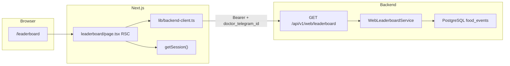

# Итерация frontend 4: Лидерборд

Опирается на [tasklist-frontend.md](../../../tasklist-frontend.md) · [impl/frontend/plan.md](../plan.md) · [frontend-requirements.md](../../../../spec/frontend-requirements.md) · [frontend-design-system.md](../../../../spec/frontend-design-system.md) · [frontend-contract.md](../../../../api/frontend-contract.md)

Skills: [shadcn](../../../../.agents/skills/shadcn/SKILL.md) · [vercel-react-best-practices](../../../../.agents/skills/vercel-react-best-practices/SKILL.md) · [nextjs-app-router-patterns](../../../../.agents/skills/nextjs-app-router-patterns/SKILL.md)

**Статус:** 📋 Next · [summary](summary.md)

---

## Цель

Страница `/leaderboard` для роли `doctor`: переключатель таблица / scatter plot; таблица рейтинга пациентов с иконками продуктов, количеством ХЕ и медалями топ-5 по БЖЕ на продукты (D3).

## Ценность

- Первый data-driven экран web-клиента для доктора
- Закрывает gap iter 1: legacy leaderboard DTO → продуктовый контракт + UI
- Scatter plot для сравнения метрик когорты

## Зависимости

| Область | Статус | Нужно iter 4 |
|---------|--------|--------------|
| Frontend iter 0 (spec, design system) | ✅ | зона 2 — продукты + топ-5 БЖЕ |
| Frontend iter 1 (web API, seed v3) | ✅ | `GET /leaderboard` (legacy → extend) |
| Frontend iter 2 (scaffold, auth BFF) | ✅ | `/leaderboard` placeholder, session |
| Frontend iter 3 (patient dashboard) | ✅ | паттерн RSC + components |
| Backend running + seed | ✅ | `food_events.description` в seed |

**Зона работ:** `web/` + **backend leaderboard DTO** + docs. **Не** FAB-чат, **не** doctor cohort dashboard (Doc1).

## Gap analysis (iter 1 → iter 4)

| Блок | Сейчас | Целевое iter 4 | Действие |
|------|--------|----------------|----------|
| `/leaderboard` page | Card-placeholder «iter 4» | table + scatter | replace placeholder |
| `table[].metrics` + `table[].medal` | топ-3 за место, badges ХЕ/БЖЕ/insulin | удалить | backend + contract |
| `table[].products` | нет | `name`, `xe`, `bje`, `bje_medal?` | `WebLeaderboardService` + repo |
| `bje_medal` | нет | топ-5 продуктов когорты по БЖЕ | aggregate `food_events` |
| `backend-client.ts` | нет fetch leaderboard | `fetchLeaderboard()` | extend `lib/` |
| UI components | нет | table, product chips, scatter | `components/leaderboard/*` |
| Loading/error/empty | нет | skeleton + retry | UI states |
| Contract docs | legacy `metrics`/`medal` | `products` + `bje_medal` | уже в spec; sync impl |

## Архитектура



### Ключевые решения

| # | Решение | Обоснование |
|---|---------|-------------|
| 1 | Продукт = `food_events.description` (normalized) | нет отдельной таблицы продуктов на MVP |
| 2 | Медали только на продукты (топ-5 БЖЕ когорты) | не на rank пациента; см. [frontend-requirements § Экран 2](../../../../spec/frontend-requirements.md) |
| 3 | Scatter без изменений | оси `metric_x` / `metric_y` из API |
| 4 | Tabs Table/Scatter — client component | переключение без full reload |
| 5 | Иконки продуктов — slug/heuristic по `name` | без CDN assets на MVP |
| 6 | BFF server-only fetch | `BACKEND_SERVICE_TOKEN` не в browser |
| 7 | Удалить legacy `metrics`/`medal` из response | breaking внутри web API; UI iter 4 ещё не в prod |

## Целевой endpoint (backend, iter 4)

| Method | Path | Query | Response |
|--------|------|-------|----------|
| GET | `/api/v1/web/leaderboard` | `doctor_telegram_id`, `period?`, `metric?`, `metric_x?`, `metric_y?` | `period`, `metric`, `table[]`, `scatter[]` |

**Table row (iter 4):** `rank`, `patient`, `progress_pct`, `products[]` (`name`, `xe`, `bje`, `bje_medal?`).

*Детали JSON — [frontend-contract.md § Leaderboard](../../../../api/frontend-contract.md).*

## Целевая структура `web/`

```
web/
├── app/(app)/leaderboard/
│   ├── page.tsx                    # RSC: fetch + layout
│   ├── loading.tsx                 # skeleton
│   └── error.tsx                   # retry
├── components/leaderboard/
│   ├── leaderboard-tabs.tsx        # Table / Scatter (client)
│   ├── leaderboard-table.tsx
│   ├── product-chip.tsx            # icon + xe + bje medal overlay
│   └── leaderboard-scatter.tsx     # client (recharts)
├── lib/
│   ├── backend-client.ts           # + fetchLeaderboard()
│   └── types/leaderboard.ts        # DTO types
```

## Backend (iter 4 scope)

```
backend/
├── schemas/web.py                    # LeaderboardProduct, BjeMedal
├── repositories/food_event.py        # products_by_user()
├── services/web_leaderboard_service.py
├── services/web_utils.py             # bje_medal_for_rank(1..5)
└── tests/test_web_api.py
```

Паттерн: расширить `WebLeaderboardService`; cohort top-5 BJE считается один раз по всем `food_events` diabetics за период.

## Задачи

| # | Задача | Статус | Документы |
|---|--------|--------|-----------|
| 04 | Лидерборд UI + backend DTO | 📋 Next | [plan](tasks/task-04-leaderboard/plan.md) · [summary](tasks/task-04-leaderboard/summary.md) |

## Фазы реализации (task 04)

| Фаза | Содержание | Зона |
|------|------------|------|
| 0 | Plan task 04 + gap backend | docs |
| 1 | Leaderboard DTO + repo + service + tests | backend |
| 2 | Types + `fetchLeaderboard()` | web/lib |
| 3 | Product chips + leaderboard table | web/components |
| 4 | Scatter chart + tabs toggle | web/components |
| 5 | Leaderboard page + loading/error | web/app |
| 6 | lint/build + smoke + summary | verify |

## Env

Без новых переменных — `web/.env.local`: `BACKEND_URL`, `BACKEND_SERVICE_TOKEN` (iter 2).

## Make-команды

```bash
make db-reset && make backend-run    # :8000
make web-dev                           # :3000
make backend-test                      # test_web_api leaderboard
make web-lint && make web-build
```

## Definition of Done

**Self-check (агент):**

- API возвращает `products[]` с `bje_medal` для топ-5 БЖЕ когорты; legacy `metrics`/`medal` удалены
- `/leaderboard` рендерит table и scatter на live API
- TypeScript strict; `make web-build` green; loading/empty/error states
- Переключение Table/Scatter без remount bugs

**User-check (пользователь):**

- Login `doctor_ivanov` → `/leaderboard` заполнен
- Иконки продуктов и ХЕ видны в таблице
- Топ-5 по БЖЕ отмечены медалями на продуктах
- Scatter с hover/tooltip по осям метрик
- `ivan_p` на `/leaderboard` → redirect `/dashboard`

## Out of scope

- Фильтр по отдельному продукту
- Экспорт CSV / print
- Doctor cohort dashboard (Doc1) — post-MVP
- FAB / полный чат (iter 5–6)

## Риски

| Риск | Mitigation |
|------|------------|
| `description` не нормализован в seed | trim + lowercase при group by |
| Много уникальных продуктов в строке | limit top-N по xe на пациента (MVP: все, если < 20) |
| Scatter hydration mismatch | `"use client"` только для recharts wrapper |
| Breaking change legacy DTO | iter 4 UI + backend в одном PR; контракт уже обновлён |

## Skills (при реализации)

| Skill | Фокус |
|-------|-------|
| shadcn | Tabs, Table, Badge, Progress |
| vercel-react-best-practices | chart performance, RSC fetch |
| nextjs-app-router-patterns | loading.tsx, error.tsx |

## Demo credentials

| username | role | экран |
|----------|------|-------|
| `doctor_ivanov` | doctor | `/leaderboard` |
| `ivan_p` | diabetic | redirect → `/dashboard` |
