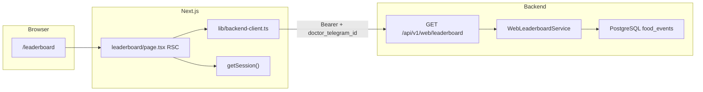

# Итерация frontend 4: Лидерборд

Опирается на [tasklist-frontend.md](../../../tasklist-frontend.md) · [impl/frontend/plan.md](../plan.md) · [frontend-requirements.md](../../../../spec/frontend-requirements.md) · [frontend-design-system.md](../../../../spec/frontend-design-system.md) · [frontend-contract.md](../../../../api/frontend-contract.md)

Skills: [shadcn](../../../../.agents/skills/shadcn/SKILL.md) · [vercel-react-best-practices](../../../../.agents/skills/vercel-react-best-practices/SKILL.md) · [nextjs-app-router-patterns](../../../../.agents/skills/nextjs-app-router-patterns/SKILL.md)

**Статус:** 📋 Next

---

## Цель

Страница `/leaderboard` для роли `doctor`: переключатель таблица / scatter plot; таблица рейтинга пациентов с иконками продуктов, количеством ХЕ и медалями топ-5 по БЖЕ на продукты.

## Ценность

- Первый data-driven экран для доктора (D3)
- Закрывает gap iter 1: leaderboard API → UI с новым продуктовым DTO
- Scatter plot для сравнения метрик когорты

## Зависимости

| Область | Статус | Нужно iter 4 |
|---------|--------|--------------|
| Frontend iter 0 (spec) | ✅ | зона 2 — продукты + топ-5 БЖЕ |
| Frontend iter 1 (web API) | ✅ | `GET /leaderboard` (legacy → extend) |
| Frontend iter 2 (scaffold) | ✅ | `/leaderboard` placeholder, session |
| Frontend iter 3 (patient dashboard) | ✅ | паттерн RSC + components |
| Backend running + seed | ✅ | `food_events` с `description` |

**Зона работ:** `web/` + **backend leaderboard DTO** + docs.

## Gap analysis (iter 1 → iter 4)

| Блок | Сейчас (iter 1) | Целевое iter 4 | Действие |
|------|-----------------|----------------|----------|
| `/leaderboard` page | Card-placeholder | table + scatter | replace placeholder |
| `table[].metrics` + `table[].medal` | топ-3 за место, badges ХЕ/БЖЕ/insulin | удалить | backend + contract |
| `table[].products` | нет | name, xe, bje, bje_medal | `WebLeaderboardService` + repo |
| `bje_medal` | нет | топ-5 продуктов когорты по БЖЕ | aggregate `food_events` |
| Frontend types | нет | `LeaderboardResponse` в `lib/types/` | extend `backend-client.ts` |
| UI components | нет | ProductChips, LeaderboardTable, ScatterChart | `components/leaderboard/*` |

## Архитектура

### Ключевые решения

| # | Решение | Обоснование |
|---|---------|-------------|
| 1 | Продукт = `food_events.description` (normalized) | нет отдельной таблицы продуктов на MVP |
| 2 | Медали только на продукты (топ-5 БЖЕ когорты) | не на rank пациента |
| 3 | Scatter без изменений | оси `metric_x` / `metric_y` из API |
| 4 | Tabs Table/Scatter — client component | переключение без full reload |
| 5 | Иконки продуктов — slug/heuristic по name | без CDN assets на MVP |

## Backend (iter 4 scope)

| Файл | Изменение |
|------|-----------|
| `backend/schemas/web.py` | `LeaderboardProduct`, `BjeMedal`; `products` в `LeaderboardTableRow` |
| `backend/repositories/food_event.py` | `products_by_user()` — group by description |
| `backend/services/web_leaderboard_service.py` | cohort top-5 BJE, убрать `medal_for_rank` |
| `backend/services/web_utils.py` | `bje_medal_for_rank(1..5)` |
| `backend/tests/test_web_api.py` | products + bje_medal вместо patient medals |

## Frontend (iter 4 scope)

| Файл | Изменение |
|------|-----------|
| `web/lib/types/leaderboard.ts` | DTO types |
| `web/lib/backend-client.ts` | `fetchLeaderboard()` |
| `web/components/leaderboard/*` | table, product chips, scatter chart |
| `web/app/(app)/leaderboard/page.tsx` | RSC + loading/error |

## Definition of Done

**Self-check:** оба режима на live API; backend tests green; `make web-build` green.

**User-check:** login `doctor_ivanov` → `/leaderboard`; иконки продуктов и ХЕ; топ-5 БЖЕ с медалями; scatter с hover/tooltip.

## Demo credentials

| username | role | экран |
|----------|------|-------|
| `doctor_ivanov` | doctor | `/leaderboard` |
| `ivan_p` | diabetic | redirect → `/dashboard` |

## Out of scope

- Фильтр по отдельному продукту
- Экспорт CSV
- Doctor cohort dashboard (Doc1) — post-MVP

## Задачи

| # | Задача | Документ |
|---|--------|----------|
| 04 | Лидерборд UI + backend DTO | [plan](tasks/task-04-leaderboard/plan.md) |
