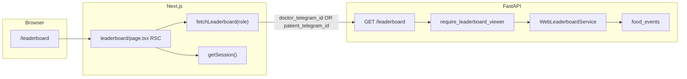

# Итерация frontend 4: Лидерборд

Опирается на [tasklist-frontend.md](../../../tasklist-frontend.md) · [impl/frontend/plan.md](../plan.md) · [frontend-requirements.md](../../../../spec/frontend-requirements.md) · [frontend-design-system.md](../../../../spec/frontend-design-system.md) · [frontend-contract.md](../../../../api/frontend-contract.md)

Skills: [shadcn](../../../../.agents/skills/shadcn/SKILL.md) · [vercel-react-best-practices](../../../../.agents/skills/vercel-react-best-practices/SKILL.md) · [nextjs-app-router-patterns](../../../../.agents/skills/nextjs-app-router-patterns/SKILL.md)

**Статус:** ✅ Done · [summary](summary.md)

---

## Цель

Страница `/leaderboard` для ролей **doctor** и **diabetic**: переключатель таблица / scatter plot; таблица рейтинга когорты с продуктами, ХЕ и медалями топ-5 по БЖЕ; у пациента — подсветка своей строки и место в рейтинге (D3).

## Ценность

- Data-driven экран рейтинга когорты для доктора и пациента
- Закрыт gap iter 1: legacy leaderboard DTO → продуктовый контракт + UI
- Явный блок «Топ-5 по БЖЕ» и эмодзи-медали на чипах продуктов
- Scatter plot для сравнения метрик когорты

## Зависимости

| Область | Статус | Нужно iter 4 |
|---------|--------|--------------|
| Frontend iter 0 (spec, design system) | ✅ | зона 2 — продукты + топ-5 БЖЕ |
| Frontend iter 1 (web API, seed v3) | ✅ | `GET /leaderboard` |
| Frontend iter 2 (scaffold, auth BFF) | ✅ | `/leaderboard` placeholder, session |
| Frontend iter 3 (patient dashboard) | ✅ | паттерн RSC + `patientFetch` |
| Backend running + seed | ✅ | `food_events.description` |

**Зона работ:** `web/` + **backend leaderboard DTO** + docs. **Не** FAB-чат, **не** doctor cohort dashboard (Doc1).

## Gap analysis (iter 1 → iter 4)

| Блок | Было | Стало | Статус |
|------|------|-------|--------|
| `/leaderboard` page | placeholder | table + scatter + top-5 legend | ✅ |
| `table[].metrics` + `table[].medal` | топ-3 за rank | удалено | ✅ |
| `table[].products` | нет | `name`, `xe`, `bje`, `bje_medal?` | ✅ |
| Auth API | только `doctor_telegram_id` | + `patient_telegram_id` | ✅ |
| Доступ diabetic | redirect → `/dashboard` | `/leaderboard` в nav + API | ✅ |
| Медали в UI | badge «БЖЕ» | 🥇–5️⃣ + блок топ-5 | ✅ |
| Подсветка пациента | нет | строка + «ваше место: #N» | ✅ |

## Архитектура



### Ключевые решения

| # | Решение | Обоснование |
|---|---------|-------------|
| 1 | Продукт = `food_events.description` (trim + group) | нет таблицы продуктов на MVP |
| 2 | Медали на продукты (топ-5 БЖЕ когорты), не на rank | spec зона 2 |
| 3 | Один endpoint, два query-параметра auth | KISS; тот же DTO когорты |
| 4 | `BjeTop5Legend` — агрегат на клиенте из `table[]` | без отдельного API |
| 5 | Эмодзи 🥇🥈🥉4️⃣5️⃣ на `ProductChip` | заметнее, чем текст «БЖЕ» |
| 6 | Пациент: highlight строки `currentUserId` | ориентация в рейтинге |
| 7 | Tabs/scatter — client components | без hydration issues |

## Целевой endpoint

| Method | Path | Query (auth) | Response |
|--------|------|--------------|----------|
| GET | `/api/v1/web/leaderboard` | `doctor_telegram_id` **или** `patient_telegram_id` + `period?`, `metric?`, `metric_x?`, `metric_y?` | `period`, `metric`, `table[]`, `scatter[]` |

**Table row:** `rank`, `patient`, `progress_pct`, `products[]` (`name`, `xe`, `bje`, `bje_medal?`).

*Детали — [frontend-contract.md § Leaderboard](../../../../api/frontend-contract.md).*

## Структура `web/` (факт)

```
web/
├── app/(app)/leaderboard/
│   ├── page.tsx
│   ├── loading.tsx
│   └── error.tsx
├── components/leaderboard/
│   ├── bje-top5-legend.tsx       # блок топ-5 БЖЕ когорты
│   ├── leaderboard-tabs.tsx
│   ├── leaderboard-table.tsx     # highlight currentUserId
│   ├── product-chip.tsx          # emoji + 🥇–5️⃣
│   └── leaderboard-scatter.tsx
├── lib/
│   ├── leaderboard-utils.ts      # aggregateTop5Bje, MEDAL_EMOJI
│   ├── types/leaderboard.ts
│   └── backend-client.ts         # fetchLeaderboard(id, role)
├── components/ui/
│   ├── tabs.tsx, progress.tsx, badge.tsx, tooltip.tsx
├── middleware.ts                 # diabetic НЕ редиректится с /leaderboard
└── components/app-sidebar.tsx    # Leaderboard для doctor + diabetic
```

## Backend (факт)

```
backend/
├── api/v1/web/deps.py              # require_leaderboard_viewer
├── api/v1/web/leaderboard.py
├── schemas/web.py                    # LeaderboardProduct, BjeMedal
├── repositories/food_event.py        # products_by_user()
├── services/web_leaderboard_service.py
├── services/web_utils.py             # bje_medal_for_rank(1..5)
└── tests/test_web_api.py             # test_leaderboard_products, test_leaderboard_patient_access
```

## Задачи

| # | Задача | Статус | Документы |
|---|--------|--------|-----------|
| 04 | Лидерборд UI + backend DTO | ✅ Done | [plan](tasks/task-04-leaderboard/plan.md) · [summary](tasks/task-04-leaderboard/summary.md) |

## Фазы реализации (task 04)

| Фаза | Содержание | Статус |
|------|------------|--------|
| 1 | Backend DTO + repo + service + tests | ✅ |
| 2 | Types + `fetchLeaderboard(id, role)` | ✅ |
| 3 | UI: table, chips, scatter, tabs | ✅ |
| 4 | Top-5 legend + emoji medals | ✅ |
| 5 | Patient access (API, middleware, nav, highlight) | ✅ |
| 6 | lint/build + docs + summary | ✅ |

## Definition of Done

**Self-check:**

- [x] API: `products[]` + `bje_medal`; legacy `metrics`/`medal` удалены
- [x] `patient_telegram_id` и `doctor_telegram_id` → 200
- [x] `/leaderboard` table + scatter + top-5 legend
- [x] `make backend-test` (53 tests) + `make web-build` green

**User-check:**

- [x] `doctor_ivanov` → `/leaderboard`: таблица, медали, scatter
- [x] `ivan_p` → `/leaderboard`: тот же рейтинг, подсветка строки, «ваше место: #N»

## Make-команды

```bash
make db-reset && make backend-run
make web-dev
make backend-test
make web-lint && make web-build
```

## Demo credentials

| username | role | экран |
|----------|------|-------|
| `doctor_ivanov` | doctor | `/leaderboard` (default после login) |
| `ivan_p` | diabetic | `/dashboard` (default) · `/leaderboard` в nav |

## Out of scope

- Period/metric URL sync, фильтр по продукту, CSV export
- Doctor cohort dashboard (Doc1)
- FAB / полный чат (iter 5–6)

## Отклонения от исходного плана

| Отклонение | Причина |
|------------|---------|
| Лидерборд для `diabetic` | запрос пользователя; тот же DTO когорты |
| `BjeTop5Legend` + emoji medals | UX: медали не были заметны |
| Period/metric selectors | MVP: фиксированные 30d / xe |
