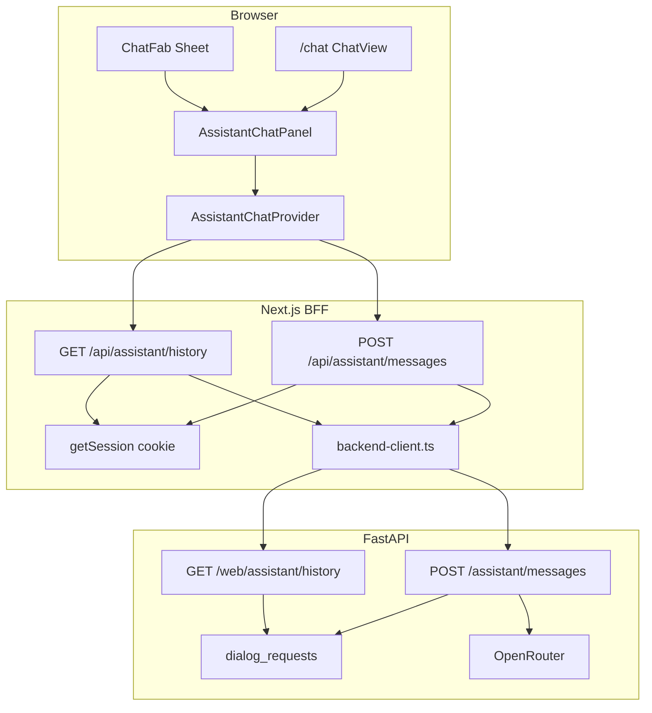

# Итерация frontend 5: Чат с ассистентом (FAB + `/chat`)

Опирается на [tasklist-frontend.md](../../../tasklist-frontend.md) · [impl/frontend/plan.md](../plan.md) · [frontend-requirements.md](../../../../spec/frontend-requirements.md) · [frontend-design-system.md](../../../../spec/frontend-design-system.md) · [frontend-contract.md](../../../../api/frontend-contract.md)

Skills: [shadcn](../../../../.agents/skills/shadcn/SKILL.md) · [vercel-react-best-practices](../../../../.agents/skills/vercel-react-best-practices/SKILL.md) · [nextjs-app-router-patterns](../../../../.agents/skills/nextjs-app-router-patterns/SKILL.md)

**Статус:** ✅ Done · [summary](summary.md)

---

## Цель

Живой чат с ассистентом (зона 3, D2): **FAB** на всех authenticated-страницах и **маршрут `/chat`** из sidebar. История из PG, отправка текста, ответ LLM. Роли **doctor** и **diabetic** — чат от своего `telegram_id`.

## Ценность

- Диалог с ассистентом без выхода из приложения
- BFF скрывает `BACKEND_SERVICE_TOKEN`
- Единое состояние чата (FAB ↔ `/chat`) через `AssistantChatProvider`
- `AssistantChatPanel` — переиспользуемый блок для iter 6 (polish)

## Зависимости

| Область | Статус | Нужно iter 5 |
|---------|--------|--------------|
| Backend `GET /web/assistant/history` | ✅ | [`assistant_history.py`](../../../../../backend/api/v1/web/assistant_history.py) |
| Backend `POST /assistant/messages` | ✅ | `OPENROUTER_API_KEY` |
| Seed v3 `dialog_requests` для `ivan_p` | ✅ | 8+ сообщений |
| Frontend iter 2 (FAB stub, session, nav `/chat`) | ✅ | Sheet + cookie |
| Frontend iter 3–4 | ✅ | shell без переделки |

**Зона работ:** `web/` + docs. **Не** backend, **не** фото в чате, **не** streaming.

## Gap analysis (iter 2 → iter 5)

| Блок | Было | Стало | Статус |
|------|------|-------|--------|
| `ChatFab` | Sheet-stub «iter 5» | history + send + errors | ✅ |
| `/chat` page | Card-placeholder | `ChatView` + `AssistantChatPanel` | ✅ |
| BFF | login/logout | `/api/assistant/history`, `/api/assistant/messages` | ✅ |
| `backend-client.ts` | dashboard + leaderboard | + assistant fetch/send | ✅ |
| Shared state FAB↔page | — | `AssistantChatProvider` в layout | ✅ |
| shadcn | нет ScrollArea | scroll-area + scroll layout | ✅ |

## Архитектура



### Ключевые решения

| # | Решение | Обоснование |
|---|---------|-------------|
| 1 | BFF proxy; `telegram_id` из httpOnly session | токен не в browser |
| 2 | `AssistantChatProvider` в `(app)/layout` | одна история FAB + `/chat` |
| 3 | Lazy load history при `active` (FAB open / page mount) | не грузить на каждой странице до открытия |
| 4 | Optimistic user msg + append `reply` | без refetch после send |
| 5 | Pagination `limit=50`, «Загрузить ещё» | offset из контракта |
| 6 | `/chat` в iter 5 (раньше iter 6) | закрыть навигацию + smoke в одной итерации |
| 7 | Обе роли пишут от своего `telegram_id` | KISS (D2) |

## Целевые endpoint'ы (BFF → backend)

| BFF | Backend | Назначение |
|-----|---------|------------|
| `GET /api/assistant/history` | `GET /api/v1/web/assistant/history?telegram_id=` | история |
| `POST /api/assistant/messages` | `POST /api/v1/assistant/messages` | send + LLM reply |

*Контракт — [frontend-contract.md § Assistant history](../../../../api/frontend-contract.md).*

## Структура `web/` (факт)

```
web/
├── app/
│   ├── (app)/
│   │   ├── layout.tsx              # AssistantChatRoot + ChatFab
│   │   └── chat/
│   │       ├── page.tsx
│   │       └── loading.tsx
│   └── api/assistant/
│       ├── history/route.ts
│       └── messages/route.ts
├── components/
│   ├── assistant/
│   │   ├── assistant-chat-provider.tsx
│   │   ├── assistant-chat-root.tsx
│   │   ├── assistant-chat-panel.tsx
│   │   ├── chat-view.tsx
│   │   ├── chat-message.tsx
│   │   ├── chat-message-list.tsx
│   │   └── chat-input.tsx
│   ├── chat-fab.tsx
│   └── ui/scroll-area.tsx
└── lib/
    ├── types/assistant-chat.ts
    └── backend-client.ts           # fetchAssistantHistory, sendAssistantMessage
```

## Задачи

| Task | Описание | Документ |
|------|----------|----------|
| 05 | BFF + FAB + `/chat` + provider | [task-05 plan](tasks/task-05-assistant-chat/plan.md) · [summary](tasks/task-05-assistant-chat/summary.md) |

## Отклонения от первоначального плана

| Отклонение | Причина |
|------------|---------|
| `/chat` реализован в iter 5 | запрос на проверку навигации и согласованности с FAB |
| `AssistantChatProvider` вместо локального hook | единая история FAB ↔ page |

## Definition of Done

**Self-check (агент):**

- [x] `make web-lint && make web-build`
- [x] BFF не утекает service token
- [x] History load + scroll; send → reply
- [x] Error states: history retry, send error message
- [x] `503` при остановленном backend — понятное сообщение

**User-check:**

```bash
make db-reset && make backend-run   # OPENROUTER_API_KEY в .env
make web-dev
# ivan_p → Chat в sidebar ИЛИ FAB → seed history
# отправить вопрос → ответ ассистента
# сообщение из FAB видно на /chat без reload
# doctor_ivanov → FAB / chat (свой telegram_id)
```

## Out of scope (iter 6+)

- Скрытие FAB на `/chat`, `error.tsx` для route — iter 6 polish
- Фото (`image_base64`), streaming, WebSocket

## Следующий шаг

[iteration-6-main-chat](../iteration-6-main-chat/plan.md) — закрытие остатка tasklist iter 6 (polish, docs).
