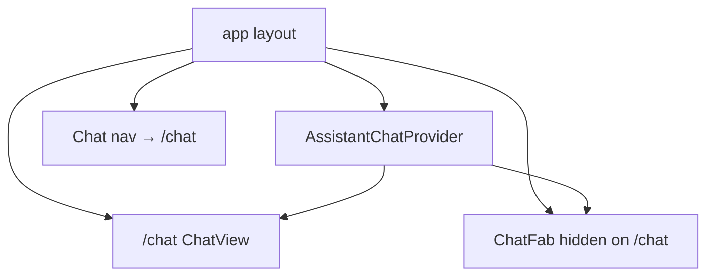

# Итерация frontend 6: Чат в основной области (polish)

Опирается на [tasklist-frontend.md](../../../tasklist-frontend.md) · [impl/frontend/plan.md](../plan.md) · [iteration-5-assistant-chat](../iteration-5-assistant-chat/plan.md)

Skills: [shadcn](../../../../.agents/skills/shadcn/SKILL.md) · [vercel-react-best-practices](../../../../.agents/skills/vercel-react-best-practices/SKILL.md) · [nextjs-app-router-patterns](../../../../.agents/skills/nextjs-app-router-patterns/SKILL.md)

**Статус:** ✅ Done · [summary](summary.md)

---

## Цель

Закрыть formal DoD [tasklist iter 6](../../../tasklist-frontend.md) для `/chat`: polish UX без новых API. **Ядро реализовано в iter 5.**

## Ценность

- `/chat` без дублирования FAB
- Error boundary как у dashboard/leaderboard
- Закрытие iter 6 → 7/10

## Зависимости

| Область | Статус |
|---------|--------|
| iter 5: `/chat`, `AssistantChatProvider`, FAB | ✅ |
| Backend assistant API | ✅ |

**Зона работ:** `web/` polish + docs. **Не** backend, **не** mobile sidebar.

## Gap analysis

| Блок | Было (iter 5) | Целевое iter 6 |
|------|---------------|----------------|
| FAB на `/chat` | показывается | скрыть |
| `chat/error.tsx` | нет | Card + retry |
| Layout full height | базовый | flex min-h-0 chain |
| Docs | draft | plan + summary |

## Архитектура

## Задачи

| Task | Описание | Документ |
|------|----------|----------|
| 06 | Polish `/chat` + FAB UX | [task-06 plan](tasks/task-06-main-chat/plan.md) |

## Definition of Done

**Self-check:** FAB hidden on `/chat`; `error.tsx`; `make web-build` green; FAB ↔ `/chat` regression.

**User-check:** `ivan_p` → FAB send → `/chat` same history; no FAB on `/chat`.

## Out of scope

- Mobile hamburger nav, фото, streaming, iter 7 review

## Следующий шаг

[iteration-7-quality-review](../iteration-7-quality-review/plan.md)
