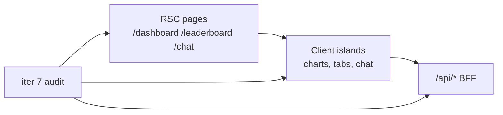

# Итерация frontend 7: Ревью качества

Опирается на [tasklist-frontend.md](../../../tasklist-frontend.md) · [impl/frontend/plan.md](../plan.md) · [iteration-6-main-chat](../iteration-6-main-chat/plan.md)

Skills: [vercel-react-best-practices](../../../../.agents/skills/vercel-react-best-practices/SKILL.md) · [nextjs-app-router-patterns](../../../../.agents/skills/nextjs-app-router-patterns/SKILL.md) · [shadcn](../../../../.agents/skills/shadcn/SKILL.md)

**Статус:** ✅ Done · [summary](summary.md)

---

## Цель

Аудит frontend по best practices; исправление критичных замечаний; отчёт `docs/tech/frontend-review.md`.

## Ценность

- Стабильные графики (recharts) без dev-warnings
- Меньший initial bundle (lazy scatter, optimizePackageImports)
- Зафиксированный baseline качества перед iter 8–9

## Зависимости

| Область | Статус |
|---------|--------|
| iter 0–6: все экраны + чат | ✅ |
| `make web-lint` / `make web-build` | baseline green |

**Зона работ:** audit `web/` + docs. **Не** новые фичи, **не** backend.

## Gap analysis

| Блок | Было | Целевое iter 7 |
|------|------|----------------|
| Recharts sizing | warning `width(-1) height(-1)` | explicit min dimensions в `ChartContainer` |
| Bundle | recharts на leaderboard сразу | `next/dynamic` scatter по табу |
| next.config | пустой | `optimizePackageImports` |
| Документация | нет review | `docs/tech/frontend-review.md` |

## Архитектура (audit scope)

## Задачи

| Task | Описание | Документ |
|------|----------|----------|
| 07 | Audit + fixes + review doc | [task-07 plan](tasks/task-07-quality-review/plan.md) |

## Definition of Done

**Self-check:** `frontend-review.md`; нет open **Fix**; `make web-lint` + `make web-build` green.

**User-check:** прочитать review; smoke всех страниц.

## Out of scope

- Voice (iter 8), Text-to-SQL (iter 9)
- Bundle analyzer CI, E2E tests
- Mobile hamburger nav (backlog iter 2)

## Следующий шаг

[iteration-8-voice-chat](../iteration-8-voice-chat/plan.md)
