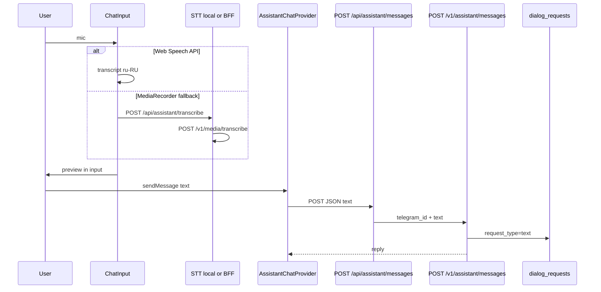

# Итерация frontend 8: Голосовой режим чата

Опирается на [tasklist-frontend.md](../../../tasklist-frontend.md) · [impl/frontend/plan.md](../plan.md) · [data-requirements.md](../../../../spec/data-requirements.md) · [api-contracts.md](../../../../tech/api-contracts.md) · [frontend-contract.md](../../../../api/frontend-contract.md)

Skills: [shadcn](../../../../.agents/skills/shadcn/SKILL.md) · [vercel-react-best-practices](../../../../.agents/skills/vercel-react-best-practices/SKILL.md) · [nextjs-app-router-patterns](../../../../.agents/skills/nextjs-app-router-patterns/SKILL.md)

**Статус:** ✅ Done · [summary](summary.md)

---

## Цель

Голосовой ввод в web-чате (FAB + `/chat`) и voice-сообщения в Telegram bot. STT → текст → **существующий** assistant pipeline (D2). Ответ ассистента — через тот же `POST /assistant/messages` и историю `GET /assistant/history`.

## Ценность

- Голос — канал ввода, не новая сущность в БД
- Единый STT на backend для bot и web-fallback
- Контракт чата (iter 5) **не меняется** для send/history

---

## 1. Выбор реализации голосового режима (web)

| Вариант | Плюсы | Минусы | Решение iter 8 |
|---------|-------|--------|----------------|
| **A. Web Speech API** (primary) | без backend latency; KISS; ru-RU в Chrome/Edge | нет в Safari/Firefox | ✅ primary |
| **B. MediaRecorder → backend transcribe** (fallback) | единый Whisper; работает в Safari/Firefox | roundtrip + base64; до 8 с записи | ✅ fallback |
| C. Только backend transcribe | один STT-путь | latency на каждый ввод в Chrome | ❌ избыточно для A |
| D. Сторонний SDK (Deepgram и т.п.) | качество | новый провайдер, ключи в browser или новый сервис | ❌ out of scope |

**TTS (озвучивание ответа):** client-only `speechSynthesis` + toggle в panel — **не** backend; опционально для DoD.

**UX после STT:** transcript в поле input (preview) → пользователь редактирует → **Send** → `AssistantChatProvider.sendMessage(text)` — без auto-send.

Детали браузеров: [voice-limitations.md](../../../../spec/voice-limitations.md).

---

## 2. Потоковая передача аудио на backend

| Подход | Описание | Решение iter 8 |
|--------|----------|----------------|
| **Batch base64** | запись/файл → один POST `{ audio_base64, media_type }` | ✅ реализовано |
| **Streaming STT** | WebSocket/chunked upload + partial transcript | ❌ out of scope |
| **Streaming TTS** | потоковое озвучивание ответа LLM | ❌ out of scope |

**Обоснование:** MVP iter 8 — короткие вопросы (≤8 с web, voice Telegram ≤ ~1 мин); batch проще, покрывает bot (ogg целиком) и web fallback. Streaming — backlog post-MVP при росте длины сообщений.

**Лимиты batch:** decoded audio ≤ 5 MB (как `image_base64` в assistant); timeout `STT_TIMEOUT_SECONDS` (default 60).

---

## 3. Согласование с API чата (без изменения контракта send/history)

Сценарий **D2** ([data-requirements.md](../../../../spec/data-requirements.md)): write `Dialog` + `Request` через assistant. Голос **не** добавляет полей в history/send.

### Цепочка web (после STT)

### Таблица endpoint'ов

| Шаг | BFF (web) | Backend | Изменён iter 8? |
|-----|-----------|---------|-----------------|
| История чата | `GET /api/assistant/history` | `GET /v1/web/assistant/history` | нет |
| Отправка | `POST /api/assistant/messages` | `POST /v1/assistant/messages` | нет (body `{ text }`) |
| STT (новый) | `POST /api/assistant/transcribe` | `POST /v1/media/transcribe` | **да** |
| TTS | — (browser) | — | — |

**Не меняется:** `request_type` в PG остаётся `text`; в history — `role` + `text` + `created_at` ([frontend-contract.md](../../../../api/frontend-contract.md) § Assistant).

**Новый endpoint только для STT** — не часть «чатового» контракта, вызывается до send.

---

## 4. Изменения в Telegram-боте

| Компонент | Было (iter 3) | Стало (iter 8) |
|-----------|---------------|----------------|
| `handlers.py` | `F.text`, `F.photo` | + `F.voice` |
| `backend_client.py` | `send_assistant_message` | + `transcribe_audio` |
| Pipeline | text/photo → assistant | voice → transcribe → text → assistant |
| Fallback | BackendClientError message | + «Не удалось распознать. Отправьте текстом.» |

Bot **не** вызывает OpenRouter напрямую; STT-ключи только на backend ([integrations.md](../../../../integrations.md)).

Документ bot-области: [tasklist-bot.md](../../../tasklist-bot.md) iter 4.

---

## Зависимости

| Область | Статус |
|---------|--------|
| iter 5–7 chat (provider, BFF, FAB) | ✅ |
| `POST /assistant/messages`, history | ✅ без изменений |
| Backend transcribe | ✅ iter 8 |
| Bot voice handler | ✅ iter 8 |
| `OPENROUTER_API_KEY`, `STT_MODEL` | env |

## Gap analysis

| Блок | Было | Целевое iter 8 |
|------|------|----------------|
| Web STT | нет | Web Speech + batch fallback |
| Streaming audio | — | batch only (решение §2) |
| Chat API | text send/history | без изменений body |
| Bot | text + photo | + voice handler |
| Docs | нет | voice-limitations |

## Задачи

| Task | Описание | Документ |
|------|----------|----------|
| 08 | Voice web + bot + backend STT | [task-08 plan](tasks/task-08-voice-chat/plan.md) |

## Definition of Done

**Self-check:** web mic → preview → send → reply; bot voice roundtrip; `make test`; `make web-lint && make web-build`.

**User-check:** голос в web (Chrome); voice в Telegram; fallback текст при ошибке STT.

## Out of scope

- Streaming STT/TTS, wake word, audio в history, `request_type=voice`, iter 9 Text-to-SQL

## Следующий шаг

[iteration-9-text-to-sql](../iteration-9-text-to-sql/plan.md)
