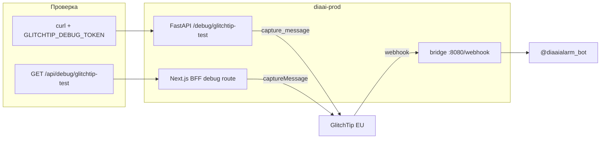

# Итерация 1 — отслеживание ошибок + алерты в Telegram

Опирается на [tasklist-observability.md](../../../tasklist-observability.md) · [ADR-005](../../../../adr/adr-005-observability.md) · [architecture.md](../../../../architecture.md)

## Цель и ценность

Узнавать о сбоях backend/web **до** пользователей: события в **GlitchTip EU**, алерт в **@diaaialarm_bot** через webhook-bridge.

**Граница ответственности:**

| Кто | Что |
|-----|-----|
| **Пользователь** | DSN, Telegram tokens, prod `.env`, GlitchTip UI (alert receivers), ufw :8080, `make monitoring-up` на VPS |
| **Агент** | Код, compose, docs, тесты; **без** записи секретов в git |

DSN для `diaai-backend` и `diaai-web` **у пользователя уже есть** — task 01 не включает регистрацию в GlitchTip.

## Baseline (уже в репо)

| Компонент | Статус |
|-----------|--------|
| `sentry-sdk` + `init_sentry` | ✅ [`backend/sentry_setup.py`](../../../../../backend/sentry_setup.py) |
| `@sentry/nextjs` + `GLITCHTIP_*` | ✅ [`web/sentry.*.config.ts`](../../../../../web/sentry.client.config.ts) |
| `glitchtip-telegram-bridge` + Dozzle | ✅ [`devops/monitoring/compose.yml`](../../../../../devops/monitoring/compose.yml) · prod `:8080` + Dozzle |
| env `GLITCHTIP_*`, `TELEGRAM_ALARM_*` | ✅ `.env.example` |
| Безопасный smoke endpoint | ✅ [`backend/debug_glitchtip.py`](../../../../../backend/debug_glitchtip.py), [`web/app/api/debug/glitchtip-test/route.ts`](../../../../../web/app/api/debug/glitchtip-test/route.ts) |

## Архитектура (iter 1)

## Безопасность `/debug/glitchtip-test`

| Правило | Реализация |
|---------|------------|
| Не публичный без секрета | Эндпоинт **не регистрируется**, если `GLITCHTIP_DEBUG_TOKEN` пуст |
| Аутентификация | `Authorization: Bearer <GLITCHTIP_DEBUG_TOKEN>` |
| Нет утечки DSN | Ответ только `{ "ok": true }`; DSN не в логах и не в response |
| Prod | Допустим с длинным random token; не использовать `change-me` |
| Web | Server-only route; тот же `GLITCHTIP_DEBUG_TOKEN` (не `NEXT_PUBLIC_*`) |

## Задачи

| # | Задача | Агент | Пользователь | Skill |
|---|--------|-------|--------------|-------|
| 01 | GlitchTip ingest + debug endpoints | код backend/web, env example, тесты, docs | DSN в `.env` / prod `.env`, smoke в UI | `sharp-edges` |
| 02 | Bridge + monitoring на prod | docs, compose override, deploy checklist | `TELEGRAM_ALARM_*`, `make monitoring-up`, ufw :8080 | `docker-expert` · `sharp-edges` |
| 03 | GlitchTip alert receivers | docs/checklist | webhook URL в eu.glitchtip.com | — |
| 04 | E2E ingest → Telegram | опционально test note в docs | debug curl + issue + Telegram | `sharp-edges` |

## Env (справочник, значения — у пользователя)

| Variable | Где | Назначение |
|----------|-----|------------|
| `GLITCHTIP_DSN` | корень `.env` | backend ingest |
| `GLITCHTIP_WEB_DSN` | корень `.env` | web server (docker) |
| `NEXT_PUBLIC_GLITCHTIP_DSN` | корень `.env`, build web | browser ingest |
| `GLITCHTIP_ENVIRONMENT` | `.env` | `development` / `production` |
| `GLITCHTIP_TRACES_SAMPLE_RATE` | `.env` | default `0.01` |
| `GLITCHTIP_DEBUG_TOKEN` | `.env`, `web/.env.local` | Bearer для debug routes |
| `TELEGRAM_ALARM_BOT_TOKEN` | `.env` | bridge |
| `TELEGRAM_ALARM_CHAT_ID` | `.env` | bridge |
| `GLITCHTIP_WEBHOOK_SECRET` | `.env` | опционально |

## Definition of Done (итерация)

- [x] **Агент:** task 01 `plan.md` → реализация → `summary.md`
- [x] Backend: `GET /debug/glitchtip-test` + Bearer → issue в GlitchTip `diaai-backend`
- [x] Web: `GET /api/debug/glitchtip-test` + Bearer → issue в GlitchTip `diaai-web`
- [ ] Prod: bridge healthy; GlitchTip webhook → Telegram
- [ ] [deploy/README.md §9](../../../../devops/deploy/README.md) пункты 1–3 ✅

## Документы задач

| Task | Plan | Summary |
|------|------|---------|
| 01 | [task-01/plan.md](tasks/task-01-glitchtip-prod/plan.md) | [summary.md](tasks/task-01-glitchtip-prod/summary.md) |
| 02 | [task-02/plan.md](tasks/task-02-bridge-prod/plan.md) | [summary.md](tasks/task-02-bridge-prod/summary.md) |
| 03 | [task-03/plan.md](tasks/task-03-glitchtip-webhook/plan.md) | [summary.md](tasks/task-03-glitchtip-webhook/summary.md) |
| 04 | [task-04/plan.md](tasks/task-04-error-alert-e2e/plan.md) | [summary.md](tasks/task-04-error-alert-e2e/summary.md) |
