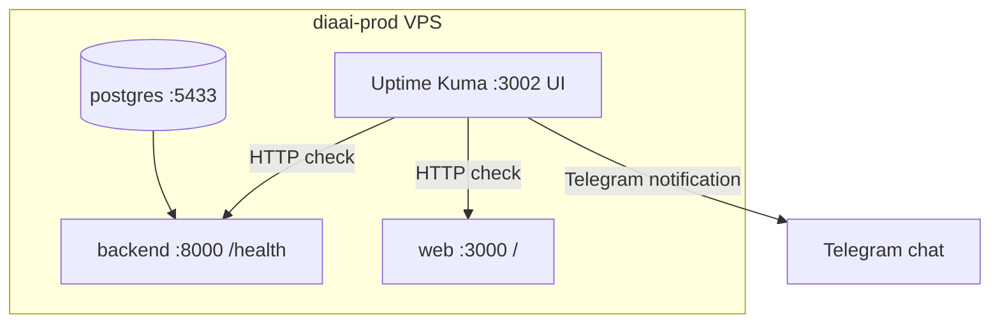

# Итерация 2 — мониторинг доступности (Uptime Kuma)

Опирается на [tasklist-observability.md](../../../tasklist-observability.md) · [architecture.md](../../../architecture.md) · [ADR-005](../../../../adr/adr-005-observability.md) · [docker-compose.yml](../../../../../docker-compose.yml)

## Цель и ценность

Знать, что **backend и web не отвечают** (в т.ч. при недоступной БД), и получать **Telegram-алерт** без ручного `make stack-health`.

**Отклонение от ADR-005:** вместо SaaS **UptimeRobot** — self-hosted **Uptime Kuma** в profile `monitoring` (решение пользователя; ~150 MB RAM). ADR обновить в task 06.

## Baseline

| Компонент | Статус |
|-----------|--------|
| `GET /health` | ✅ 200, **без** проверки БД — [`backend/main.py`](../../../../../backend/main.py) |
| Docker healthcheck backend | ✅ `curl -f …/health` — [`docker-compose.yml`](../../../../../docker-compose.yml) |
| `make stack-health` | ✅ postgres + `/health` + web `/` |
| Monitoring stack | ✅ Dozzle + bridge — [`devops/monitoring/compose.yml`](../../../../../devops/monitoring/compose.yml) |
| Uptime Kuma | 📋 нет в compose |

## Архитектура (iter 2)

Kuma работает **на том же VPS** — не заменяет внешний ping из интернета (ограничение vs UptimeRobot), но закрывает: зависший backend, 503 при мёртвой БД, падение web, историю инцидентов в UI.

## Карта портов (без конфликтов)

| Порт (host) | Сервис | Bind prod |
|-------------|--------|-----------|
| 3000 | web | `0.0.0.0` |
| **3002** | **uptime-kuma** (→ container 3001) | **`127.0.0.1`** (SSH tunnel, как Dozzle) |
| 5433 | postgres | `127.0.0.1` |
| 8000 | backend | `0.0.0.0` (host network) |
| 8080 | glitchtip-telegram-bridge | `0.0.0.0` |
| 8081 | glitchtip-email-bridge | local dev |
| 8888 | dozzle | `127.0.0.1` |
| 9090 | smtp relay | optional |

**3001** зарезервирован под Grafana (iter 3) — Kuma **не** использует 3001 на host.

Env: `UPTIME_KUMA_BIND=127.0.0.1:3002:3001` в `.env.example`.

## Задачи

| # | Задача | Агент | Пользователь |
|---|--------|-------|--------------|
| 05 | `/health` + SELECT 1; Uptime Kuma в compose | код, тесты, compose, runbook | `make monitoring-up`; первый вход в Kuma UI |
| 06 | Мониторы + Telegram в Kuma; acceptance §9 п.4–5 | docs, ADR note, summaries | 2 monitor'а Up; тест Down → alert |

## `/health` — контракт (task 05)

| Условие | HTTP | Body |
|---------|------|------|
| `SELECT 1` OK | **200** | `{"status":"ok","version":"…","database":"ok"}` |
| БД недоступна / timeout | **503** | `{"status":"unavailable","database":"down"}` |
| `DATABASE_URL` не задан | **503** | `database: down` |

- Без auth (как сейчас).
- Keyword для Kuma: `"status":"ok"` (как в [uptimerobot.md](../../../../../devops/monitoring/uptimerobot.md)).
- Docker healthcheck (`curl -f`) при 503 → container **unhealthy** — ожидаемое поведение.

Реализация: [`backend/health.py`](../../../../../backend/health.py) — `probe_database()` + router; mount в `main.py`.

## Uptime Kuma — мониторы (task 06, пользователь в UI)

| Monitor | URL (prod) | URL (local compose) | Ожидание |
|---------|------------|---------------------|----------|
| `diaai-backend-health` | `http://172.18.0.1:8000/health` | `http://backend:8000/health` | 200 + keyword `"status":"ok"` |
| `diaai-web` | `http://web:3000/` | `http://web:3000/` | 200 или 307 |

> Backend на prod — `network_mode: host` ([`compose.server.override.yml`](../../../../../devops/deploy/compose.server.override.yml)); из контейнера Kuma — **`172.18.0.1`**, не `backend:8000`.

**Telegram:** Settings → Notifications → Telegram → token + chat_id (пользователь добавляет сам в UI Kuma).

Interval: 60–300 s; retries — по умолчанию Kuma.

## Definition of Done (итерация)

- [ ] `GET /health` проверяет БД; pytest + `make lint`
- [ ] `uptime-kuma` в `devops/monitoring/compose.yml`; порт **3002**; `monitoring-up` поднимает сервис
- [ ] Runbook [`devops/monitoring/uptime-kuma.md`](../../../../../devops/monitoring/uptime-kuma.md)
- [ ] 2 monitor'а green; тест Pause → Telegram alert
- [ ] [deploy/README.md §9](../../../../../devops/deploy/README.md) пункты 4–5 ✅
- [ ] `architecture.md` — Uptime Kuma вместо UptimeRobot
- [ ] task 05–06 + iteration `summary.md`

## Документы задач

| Task | Plan | Summary |
|------|------|---------|
| 05 | [task-05/plan.md](tasks/task-05-health-kuma/plan.md) | [summary.md](tasks/task-05-health-kuma/summary.md) |
| 06 | [task-06/plan.md](tasks/task-06-uptime-verify/plan.md) | [summary.md](tasks/task-06-uptime-verify/summary.md) |
